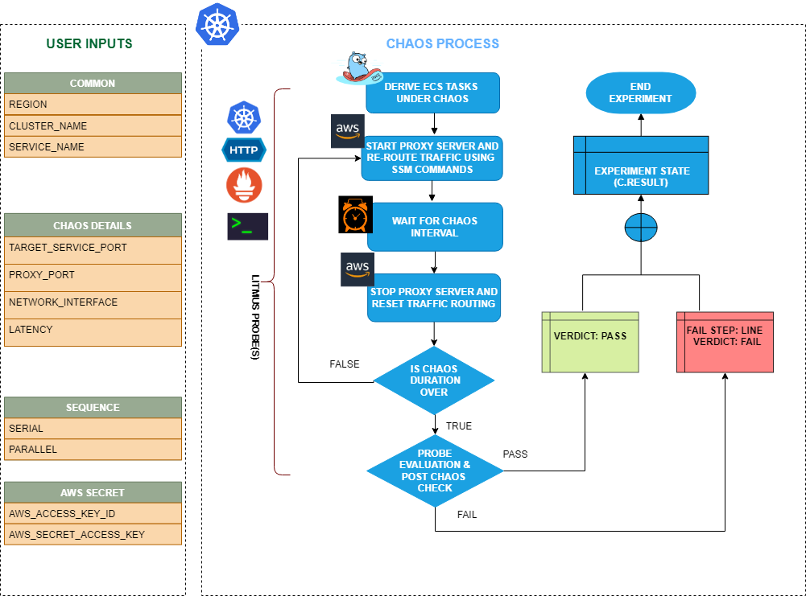

ECS container HTTP latency induces HTTP chaos on containers running in an Amazon ECS (Elastic Container Service) task. This fault introduces latency in the HTTP responses of containers of a specific service using a proxy server, simulating delays in network connectivity or slow responses from the dependent services.



## Use cases

ECS container HTTP latency:
- Modifies the HTTP responses of containers in a specified ECS service by starting a proxy server and redirecting traffic through the proxy server. 
- Simulates scenarios where containers experience delays in network connectivity or slow responses from dependent services, which may impact the behavior of your application.
- Validates the behavior of your application and infrastructure during simulated HTTP latency, such as:
  - Testing how your application handles delays in network connectivity from containers to dependent services.
  - Verifying the resilience of your system when containers experience slow responses from dependent services.
  - Evaluating the impact of HTTP latency on the performance and availability of your application.


## Prerequisites
- Kubernetes >= 1.17
- ECS container metadata is enabled (disabled by default). To enable it, go to [container metadata](https://docs.aws.amazon.com/AmazonECS/latest/developerguide/container-metadata.html). If your task is currently running, restart it to get the metadata directory.
- ECS cluster running with the desired tasks and containers and familiarity with ECS service update and deployment concepts.
- Access to the ECS cluster instances with the necessary permissions to update the start and stop timeouts for containers. Go to [systems manager documentation](https://docs.aws.amazon.com/systems-manager/latest/userguide/setup-launch-managed-instance.html).
- Backup and recovery mechanisms in place to handle potential failures during the testing process.
- You and the ECS cluster instances have a role with the required AWS access to perform the SSM and ECS operations.
- Kubernetes secret with AWS Access Key ID and secret access key credentials in the `CHAOS_NAMESPACE`. Below is the sample secret file:

```yaml
apiVersion: v1
kind: Secret
metadata:
  name: cloud-secret
type: Opaque
stringData:
  cloud_config.yml: |-
    # Add the cloud AWS credentials respectively
    [default]
    aws_access_key_id = XXXXXXXXXXXXXXXXXXX
    aws_secret_access_key = XXXXXXXXXXXXXXXXXXXXXXXXXXXXXXXXXXXX
```

- It is recommended to use the same secret name, that is, `cloud-secret`. Else, you will need to update the `AWS_SHARED_CREDENTIALS_FILE` environment variable in the fault template and you may be unable to use the default health check probes. 


:::info note
- You can pass the VM credentials as secrets or as a `ChaosEngine` environment variable.
- The ECS task container should be in a healthy state before and after introducing chaos.
- Refer to the [superset permission or policy](./security-configurations/policy-for-all-aws-faults.md) to execute all AWS faults.
- Refer to the [common attributes](../common-tunables-for-all-faults) to tune the common tunables for all the faults.
- Refer to [AWS named rrofile for chaos](./security-configurations/aws-switch-profile.md) to use a different profile for AWS faults.
:::

## Permissions required

Here is an example AWS policy to execute the fault.

```json
{
    "Version": "2012-10-17",
    "Statement": [
        {
            "Effect": "Allow",
            "Action": [
                "ssm:GetDocument",
                "ssm:DescribeDocument",
                "ssm:GetParameter",
                "ssm:GetParameters",
                "ssm:SendCommand",
                "ssm:CancelCommand",
                "ssm:CreateDocument",
                "ssm:DeleteDocument",
                "ssm:GetCommandInvocation",          
                "ssm:UpdateInstanceInformation",
                "ssm:DescribeInstanceInformation"
            ],
            "Resource": "*"
        },
        {
            "Effect": "Allow",
            "Action": [
                "ec2messages:AcknowledgeMessage",
                "ec2messages:DeleteMessage",
                "ec2messages:FailMessage",
                "ec2messages:GetEndpoint",
                "ec2messages:GetMessages",
                "ec2messages:SendReply"
            ],
            "Resource": "*"
        },
        {
            "Effect": "Allow",
            "Action": [
                "ec2:DescribeInstanceStatus",
                "ec2:DescribeInstances"
            ],
            "Resource": [
                "*"
            ]
        }
    ]
}
```

   <h3>Mandatory tunables</h3>
    <table>
        <tr>
            <th> Tunable </th>
            <th> Description </th>
            <th> Notes </th>
        </tr>
        <tr>
          <td> REGION </td>
          <td> The AWS region ID where the ECS container has been created. </td>
          <td> For example, <code>us-east-1</code>. </td>
        </tr>
        <tr>
            <td> LATENCY </td>
            <td> Provide latency to be added to request in milliseconds.</td>
            <td> For example, 2000</td>
        </tr>
        <tr>
            <td> TARGET_SERVICE_PORT </td>
            <td> Port of the service to target </td>
            <td> Defaults to port 80. </td>
        </tr>
    </table>
    <h3>Optional tunables</h3>
    <table>
        <tr>
            <th> Tunable </th>
            <th> Description </th>
            <th> Notes </th>
        </tr>
        <tr>
            <td> TOTAL_CHAOS_DURATION </td>
            <td> Duration that you specify, through which chaos is injected into the target resource (in seconds). </td>
            <td> Defaults to 30s. </td>
        </tr>
        <tr>
            <td> CHAOS_INTERVAL </td>
            <td> Time interval between two successive instance terminations (in seconds). </td>
            <td> Defaults to 30s. </td>
        </tr>
        <tr>
            <td> AWS_SHARED_CREDENTIALS_FILE </td>
            <td> Provide the path for AWS secret credentials.</td>
            <td> Defaults to <code>/tmp/cloud_config.yml</code>. </td>
          </tr>
        <tr>
            <td> SEQUENCE </td>
            <td> It defines a sequence of chaos execution for multiple instances. </td>
            <td> Defaults to parallel. Supports serial sequence as well. </td>
        </tr>
        <tr>
            <td> RAMP_TIME </td>
            <td> Period to wait before and after injection of chaos (in seconds). </td>
            <td> For example, 30s. </td>
        </tr>
        <tr>
            <td> INSTALL_DEPENDENCY </td>
            <td> Specify the dependencies to be installed to run the network chaos. If the dependency exists, it can be turned off. </td>
            <td> If the dependency already exists, you can turn it off. Defaults to True.</td>
        </tr>
        <tr>
            <td> PROXY_PORT  </td>
            <td> Port where the proxy listens to requests.</td>
            <td> Defaults to 20000. </td>
        </tr>
        <tr>
          <td> NETWORK_INTERFACE  </td>
          <td> Network interface used for the proxy. </td>
          <td> Defaults to `eth0`. </td>
        </tr>
    </table>


### Target service port

Service port that is targeted. Tune it by using the `TARGET_SERVICE_PORT` environment variable.

The following YAML snippet illustrates the use of this environment variable:

[embedmd]:# (./static/manifests/ecs-container-http-latency/target-service-port.yaml yaml)
```yaml
## provide the port of the targeted service
apiVersion: litmuschaos.io/v1alpha1
kind: ChaosEngine
metadata:
  name: aws-nginx
spec:
  engineState: "active"
  chaosServiceAccount: litmus-admin
  experiments:
  - name: ecs-container-http-latency
    spec:
      components:
        env:
        # provide the port of the targeted service
        - name: TARGET_SERVICE_PORT
          value: "80"
```

### Proxy port

Port where the proxy server listens to the requests. Tune it by using the `PROXY_PORT` environment variable.

The following YAML snippet illustrates the use of this environment variable:

[embedmd]:# (./static/manifests/ecs-container-http-latency/proxy-port.yaml yaml)
```yaml
# provide the port for proxy server
apiVersion: litmuschaos.io/v1alpha1
kind: ChaosEngine
metadata:
  name: engine-nginx
spec:
  engineState: "active"
  chaosServiceAccount: litmus-admin
  experiments:
  - name: ecs-container-http-latency
    spec:
      components:
        env:
        # provide the port for proxy server
        - name: PROXY_PORT
          value: '8080'
        # provide the port of the targeted service
        - name: TARGET_SERVICE_PORT
          value: "80"
```

### Network latency

Delay added to the HTTP request. Tune it by using the `LATENCY` environment variable.

The following YAML snippet illustrates the use of this environment variable:

[embedmd]:# (./static/manifests/ecs-container-http-latency/latency.yaml yaml)
```yaml
## provide the latency value
apiVersion: litmuschaos.io/v1alpha1
kind: ChaosEngine
metadata:
  name: engine-nginx
spec:
  engineState: "active"
  chaosServiceAccount: litmus-admin
  experiments:
  - name: ecs-container-http-latency
    spec:
      components:
        env:
        # provide the latency value
        - name: LATENCY
          value: '2000'
        # provide the port of the targeted service
        - name: TARGET_SERVICE_PORT
          value: "80"
```

### Network interface

Network interface used for the proxy. Tune it by using the `NETWORK_INTERFACE` environment variable.

The following YAML snippet illustrates the use of this environment variable:

[embedmd]:# (./static/manifests/ecs-container-http-latency/network-interface.yaml yaml)
```yaml
## provide the network interface for proxy
apiVersion: litmuschaos.io/v1alpha1
kind: ChaosEngine
metadata:
  name: engine-nginx
spec:
  engineState: "active"
  chaosServiceAccount: litmus-admin
  experiments:
  - name: ecs-container-http-latency
    spec:
      components:
        env:
        # provide the network interface for proxy
        - name: NETWORK_INTERFACE
          value: "eth0"
        # provide the port of the targeted service
        - name: TARGET_SERVICE_PORT
          value: '80'
```
