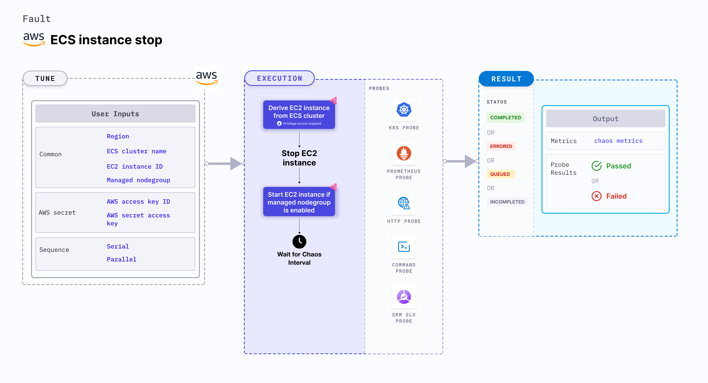

ECS instance stop induces stress on an AWS ECS cluster. It derives the instance under chaos from the ECS cluster.
- It causes EC2 instance to stop and get deleted from the ECS cluster for a specific duration.




## Usage

<details>
<summary>View fault usage</summary>
<div>
EC2 instance stop breaks the agent that manages the task container on ECS cluster, thereby impacting its delivery. Killing the EC2 instance disrupts the performance of the task container.
</div>
</details>

## Prerequisites

- Kubernetes >= 1.17
- Adequate AWS access to stop and start an EC2 instance.
- Create a Kubernetes secret that has the AWS access configuration(key) in the `CHAOS_NAMESPACE`. Below is a sample secret file:

```yaml
apiVersion: v1
kind: Secret
metadata:
  name: cloud-secret
type: Opaque
stringData:
  cloud_config.yml: |-
    # Add the cloud AWS credentials respectively
    [default]
    aws_access_key_id = XXXXXXXXXXXXXXXXXXX
    aws_secret_access_key = XXXXXXXXXXXXXXX
```

- It is recommended to use the same secret name, i.e. `cloud-secret`. Otherwise, you will need to update the `AWS_SHARED_CREDENTIALS_FILE` environment variable in the fault template and you may be unable to use the default health check probes. 

- Refer to [AWS Named Profile For Chaos](./security-configurations/aws-switch-profile.md) to know how to use a different profile for AWS faults.

## Permissions required

Here is an example AWS policy to execute the fault.

<details>
<summary>View policy for the fault</summary>

```json
{
    "Version": "2012-10-17",
    "Statement": [
        {
            "Sid": "VisualEditor0",
            "Effect": "Allow",
            "Action": [
                "ecs:ListContainerInstances",
                "ecs:DescribeContainerInstances"

            ],
            "Resource": "*"
        },
        {
            "Effect": "Allow",
            "Action": [
                "ec2:StartInstances",
                "ec2:StopInstances",
                "ec2:DescribeInstanceStatus",
                "ec2:DescribeInstances"
            ],
            "Resource": "*"
        },
        {
            "Effect": "Allow",
            "Action": [
                "autoscaling:DescribeAutoScalingInstances"
            ],
            "Resource": "*"
        }
    ]
}
```
</details>

Refer to the [superset permission/policy](./security-configurations/policy-for-all-aws-faults.md) to execute all AWS faults.

## Default validations

The ECS container instance should be in a healthy state.

## Fault tunables

<details>
    <summary>Fault tunables</summary>
    <h2>Mandatory fields</h2>
    <table>
        <tr>
        <th> Variables </th>
        <th> Description </th>
        <th> Notes </th>
        </tr>
        <tr> 
        <td> CLUSTER_NAME </td>
        <td> Name of the target ECS cluster</td>
        <td> For example, cluster-1 </td>
        </tr>
        <tr>
        <td> REGION </td>
        <td> The region name of the target ECS cluster</td>
        <td> For example, us-east-1 </td>
        </tr>
    </table>
    <h2>Optional fields</h2>
    <table>
      <tr>
        <th> Variables </th>
        <th> Description </th>
        <th> Notes </th>
      </tr>
      <tr>
        <td> TOTAL_CHAOS_DURATION </td>
        <td> Duration that you specify, through which chaos is injected into the target resource (in seconds). </td>
        <td> Defaults to 30s. </td>
      </tr>
      <tr>
        <td> CHAOS_INTERVAL </td>
        <td> The interval (in sec) between successive instance termination.</td>
        <td> Defaults to 30s </td>
      </tr>
      <tr> 
        <td> AWS_SHARED_CREDENTIALS_FILE </td>
        <td> Provide the path for aws secret credentials</td>
        <td> Defaults to <code>/tmp/cloud_config.yml</code> </td>
      </tr>
      <tr> 
        <td> EC2_INSTANCE_ID </td>
        <td> Provide the target instance ID from ECS cluster</td>
        <td> If not provided will select randomly </td>
      </tr>
      <tr>
        <td> SEQUENCE </td>
        <td> It defines sequence of chaos execution for multiple instance</td>
        <td> Defaults to parallel. Supports serial sequence as well. </td>
      </tr>
      <tr>
        <td> RAMP_TIME </td>
        <td> Period to wait before and after injecting chaos (in seconds).  </td>
        <td> For example, 30 </td>
      </tr>
    </table>
</details>

## Fault examples

### Common and AWS-specific tunables

Refer to the [common attributes](../common-tunables-for-all-faults) and [AWS-specific tunables](./aws-fault-tunables) to tune the common tunables for all faults and aws specific tunables.

### ECS Instance Stop

It stops the instance of an ECS cluster for a certain chaos duration. We can provide the EC2 instance ID using `EC2_INSTANCE_ID` ENVs as well. If not provided it will select randomly.

Use the following example to tune it:

[embedmd]:# (./static/manifests/ecs-instance-stop/instance-stop.yaml yaml)
```yaml
# stops the agent of an ECS cluster
apiVersion: litmuschaos.io/v1alpha1
kind: ChaosEngine
metadata:
  name: engine-nginx
spec:
  engineState: "active"
  annotationCheck: "false"
  chaosServiceAccount: litmus-admin
  experiments:
  - name: ecs-instance-stop
    spec:
      components:
        env:
        # provide the name of ECS cluster
        - name: CLUSTER_NAME
          value: 'demo'
        - name: EC2_INSTANCE_ID
          value: 'us-east-2'
        - name: TOTAL_CHAOS_DURATION
          VALUE: '60'
```
