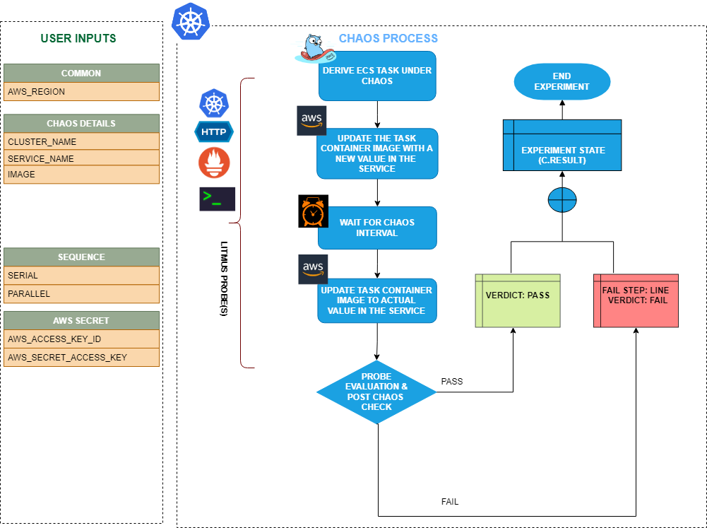

ECS invalid container image allows you to update the Docker image used by a container in an Amazon ECS (Elastic Container Service) task. This fault helps test the behavior of your ECS tasks when the container images are updated, and validates the resilience and performance of your ECS tasks during image updates.



## Use cases

This fault updates the Docker image of a container by modifying the task definition associated with the ECS service or task. It allows you to simulate scenarios where container images are updated, which may impact the behavior of your application or infrastructure. For example, you can update the Docker image of a container to a newer version or a different image to test how your application handles image updates.
The fault can be used to validate the behavior of your application and infrastructure during simulated container image updates, such as:

1. Testing the resilience of your system during image updates, including verifying if the updated image is pulled successfully and if the container starts with the new image.
2. Validating the performance and availability of your application after container image updates, including checking if the updated image performs as expected and if there are any issues with the new image.

## Prerequisites

- Kubernetes >= 1.17
- ECS cluster running with the desired tasks and containers and familiarity with ECS service update and deployment concepts.
- Create a Kubernetes secret that has the AWS access configuration(key) in the `CHAOS_NAMESPACE`. Below is a sample secret file:

```yaml
apiVersion: v1
kind: Secret
metadata:
  name: cloud-secret
type: Opaque
stringData:
  cloud_config.yml: |-
    # Add the cloud AWS credentials respectively
    [default]
    aws_access_key_id = XXXXXXXXXXXXXXXXXXX
    aws_secret_access_key = XXXXXXXXXXXXXXX
```

- It is recommended to use the same secret name, i.e. `cloud-secret`. Otherwise, you will need to update the `AWS_SHARED_CREDENTIALS_FILE` environment variable in the fault template and you may be unable to use the default health check probes. 

- Refer to [AWS Named Profile For Chaos](./security-configurations/aws-switch-profile.md) to know how to use a different profile for AWS faults.

## Default validations

The ECS containers should be in a healthy state.

## Fault tunables

<details>
    <summary>Fault tunables</summary>
    <h2>Mandatory fields</h2>
    <table>
        <tr>
          <th> Variables </th>
          <th> Description </th>
          <th> Notes </th>
        </tr>
        <tr> 
          <td> CLUSTER_NAME </td>
          <td> Name of the target ECS cluster. </td>
          <td> For example, <code>cluster-1</code>. </td>
        </tr>
        <tr> 
          <td> SERVICE_NAME </td>
          <td> Name of the ECS service under chaos. </td>
          <td> For example, <code>nginx-svc</code>. </td>
        </tr>
        <tr>
          <td> REGION </td>
          <td> Region name of the target ECS cluster</td>
          <td> For example, <code>us-east-1</code>. </td>
        </tr>
    </table>
    <h2>Optional fields</h2>
    <table>
      <tr>
        <th> Variables </th>
        <th> Description </th>
        <th> Notes </th>
      </tr>
      <tr>
        <td> TOTAL_CHAOS_DURATION </td>
        <td> Duration that you specify, through which chaos is injected into the target resource (in seconds). </td>
        <td> Defaults to 30s. </td>
      </tr>
      <tr>
        <td> CHAOS_INTERVAL </td>
        <td> Interval between successive instance terminations (in seconds).</td>
        <td> Defaults to 30s. </td>
      </tr>
      <tr> 
        <td> AWS_SHARED_CREDENTIALS_FILE </td>
        <td> Path to the AWS secret credentials.</td>
        <td> Defaults to <code>/tmp/cloud_config.yml</code>. </td>
      </tr>
      <tr> 
        <td> IMAGE </td>
        <td> Provide the invalid image to be updated in the ECS container. </td>
        <td> Default to 'nginx' </td>
      </tr>
      <tr>
        <td> RAMP_TIME </td>
        <td> Period to wait before and after injecting chaos (in seconds).  </td>
        <td> For example, 30s. </td>
      </tr>
    </table>
</details>


### Common and AWS-specific tunables

Refer to the [common attributes](../common-tunables-for-all-faults) and [AWS-specific tunables](./aws-fault-tunables) to tune the common tunables for all faults and aws specific tunables.

### Invalid ECS conatiner image

It specifies the invalid image for the ECS task containers. You can tune it using the `IMAGE` environment variable.

Use the following example to tune it:

[embedmd]:# (./static/manifests/ecs-invalid-container-image/image.yaml yaml)
```yaml
# Set container image for the target ECS task
apiVersion: litmuschaos.io/v1alpha1
kind: ChaosEngine
metadata:
  name: aws-nginx
spec:
  engineState: "active"
  annotationCheck: "false"
  chaosServiceAccount: litmus-admin
  experiments:
  - name: ecs-invalid-container-image
    spec:
      components:
        env:
        - name: IMAGE
          value: 'nginx'
        - name: REGION
          value: 'us-east-2'
        - name: TOTAL_CHAOS_DURATION
          VALUE: '60'
```
