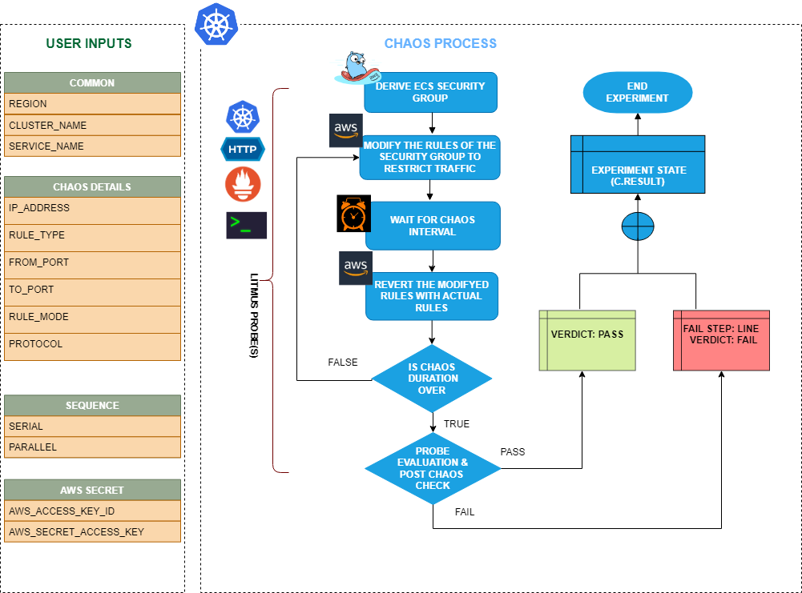

ECS network restrict allows you to restrict the network connectivity of containers in an Amazon ECS (Elastic Container Service) task by modifying the container security rules. 



## Use cases
ECS network restrict:
- Tests the resilience and performance of your ECS tasks when network access is restricted.
- Validates the behavior of your application in a restricted networking environment.
- Restricts the network connectivity of containers by modifying the container security rules associated with the ECS task. 
- Simulates scenarios where network access is restricted, which may impact the behavior of your application or infrastructure. For example, you can restrict outgoing internet access from containers to test how your application handles restricted networking environments or to validate the behavior of your application when certain network resources are not accessible.
- Validates the behavior of your application and infrastructure during simulated network restrictions, such as:
  - Testing the resilience of your system when network access is restricted, including verifying if the containers can communicate with each other or with external resources when certain network restrictions are in place.
  - Validating the performance and availability of your application in a restricted networking environment, including checking if the application can continue to function properly with limited network access.


## Prerequisites

- Kubernetes >= 1.17
- ECS cluster running with the desired tasks and containers and familiarity with ECS service update and deployment concepts.
- Create a Kubernetes secret that has the AWS access configuration(key) in the `CHAOS_NAMESPACE`. Below is a sample secret file:

```yaml
apiVersion: v1
kind: Secret
metadata:
  name: cloud-secret
type: Opaque
stringData:
  cloud_config.yml: |-
    # Add the cloud AWS credentials respectively
    [default]
    aws_access_key_id = XXXXXXXXXXXXXXXXXXX
    aws_secret_access_key = XXXXXXXXXXXXXXX
```

:::tip
It is recommended to use the same secret name, that is, `cloud-secret`. Otherwise, you will need to update the `AWS_SHARED_CREDENTIALS_FILE` environment variable in the fault template and you may be unable to use the default health check probes. 
:::

## Permissions required

Here is an example AWS policy to execute the fault.

```json
{
    "Version": "2012-10-17",
    "Statement": [
        {
            "Effect": "Allow",
            "Action": [
              "ec2:AuthorizeSecurityGroupEgress",
              "ec2:RevokeSecurityGroupEgress",
              "ec2:RevokeSecurityGroupIngress",
              "ec2:DescribeSecurityGroups"
            ],
            "Resource": "*"
        },
        {
            "Effect": "Allow",
            "Action": [
              "ecs:DescribeServices"
            ],
            "Resource": "*"
        }
    ]
}
```

:::info note
- The ECS containers should be in a healthy state before and after introducing chaos.
- Refer to [AWS named profile for chaos](./security-configurations/aws-switch-profile.md) to know how to use a different profile for AWS faults.
Refer to the [common attributes](../common-tunables-for-all-faults) and [AWS-specific tunables](./aws-fault-tunables) to tune the common tunables for all faults and AWS-specific tunables.
- Refer to the [superset permission/policy](./security-configurations/policy-for-all-aws-faults.md) to execute all AWS faults.
:::

   <h3>Mandatory tunables</h3>
    <table>
        <tr>
          <th> Tunable </th>
          <th> Description </th>
          <th> Notes </th>
        </tr>
        <tr> 
          <td> CLUSTER_NAME </td>
          <td> Name of the target ECS cluster. </td>
          <td> For example, <code>cluster-1</code>. </td>
        </tr>
        <tr> 
          <td> SERVICE_NAME </td>
          <td> Name of the ECS service under chaos. </td>
          <td> For example, <code>nginx-svc</code>. </td>
        </tr>
        <tr>
          <td> REGION </td>
          <td> Region name of the target ECS cluster</td>
          <td> For example, <code>us-east-1</code>. </td>
        </tr>
    </table>
    <h3>Optional tunables</h3>
    <table>
      <tr>
        <th> Tunable </th>
        <th> Description </th>
        <th> Notes </th>
      </tr>
      <tr>
        <td> TOTAL_CHAOS_DURATION </td>
        <td> Duration that you specify, through which chaos is injected into the target resource (in seconds). </td>
        <td> Defaults to 30s. </td>
      </tr>
      <tr>
        <td> CHAOS_INTERVAL </td>
        <td> Interval between successive instance terminations (in seconds).</td>
        <td> Defaults to 30s. </td>
      </tr>
      <tr> 
        <td> IP_ADDRESS </td>
        <td> Provide the IP address/CIRD range. If no IP/CIRD range is provided then it will remove all the rules from the security group for a specified chaos interval.</td>
        <td> Defaults to '' </td>
      </tr>
      <tr> 
        <td> RULE_TYPE </td>
        <td> Provide the rule type either <code>outbound</code> or <code>inbound</code> rule </td>
        <td> Default to 'outbound' </td>
      </tr>
      <tr> 
        <td> RULE_MODE </td>
        <td> Provide the mode to modify, <code>add</code> means add a new rule and <code>remove</code> means removing the existing rule. To remove a rule please provide the exact rule details. </td>
        <td> Defaults to <code>remove</code>. </td>
      </tr>
      <tr> 
        <td> PROTOCOL </td>
        <td> Provide the protocol of the rule. </td>
        <td> Default to 'tcp' </td>
      </tr>
      <tr> 
        <td> FROM_PORT </td>
        <td> Provide the from port of the rule.</td>
        <td> Defaults to <code>80</code>. </td>
      </tr>
      <tr> 
        <td> TO_PORT </td>
        <td> Provide the to port of the rule. </td>
        <td> Default to '80' </td>
      </tr>
      <tr>
        <td> RAMP_TIME </td>
        <td> Period to wait before and after injecting chaos (in seconds).  </td>
        <td> For example, 30s. </td>
      </tr>
    </table>

### IP Address or CIDR range

IP address or the CIDR range. Tune it by using the `IP_ADDRESS` environment variable. If no IP address or CIDR range is provided, the fault detaches all the available rules from inbound or outbound traffic from the target security group.

The following YAML snippet illustrates the use of this environment variable:

[embedmd]:# (./static/manifests/ecs-network-restrict/ip-address.yaml yaml)
```yaml
# Set container ip-address for the target ECS task
apiVersion: litmuschaos.io/v1alpha1
kind: ChaosEngine
metadata:
  name: aws-nginx
spec:
  engineState: "active"
  annotationCheck: "false"
  chaosServiceAccount: litmus-admin
  experiments:
  - name: ecs-network-restrict
    spec:
      components:
        env:
        - name: IP_ADDRESS
          value: ''
        - name: REGION
          value: 'us-east-2'
        - name: TOTAL_CHAOS_DURATION
          VALUE: '60'
```

### Rule type

Rule type associated with inbound or outbound traffic from the target security group. Tune it by using the `RULE_TYPE` environment variable.

The following YAML snippet illustrates the use of this environment variable:

[embedmd]:# (./static/manifests/ecs-network-restrict/rule-type.yaml yaml)
```yaml
# Set container rule-type for the target ECS task
apiVersion: litmuschaos.io/v1alpha1
kind: ChaosEngine
metadata:
  name: aws-nginx
spec:
  engineState: "active"
  annotationCheck: "false"
  chaosServiceAccount: litmus-admin
  experiments:
  - name: ecs-network-restrict
    spec:
      components:
        env:
        - name: RULE_TYPE
          value: 'outbound'
        - name: REGION
          value: 'us-east-2'
        - name: TOTAL_CHAOS_DURATION
          VALUE: '60'
```

### Rule mode

Outbound traffic rule associated with the target security group. Tune it by using the `RULE_MODE` environment variable.

The following YAML snippet illustrates the use of this environment variable:

[embedmd]:# (./static/manifests/ecs-network-restrict/rule-mode.yaml yaml)
```yaml
# Set container rule-mode for the target ECS task
apiVersion: litmuschaos.io/v1alpha1
kind: ChaosEngine
metadata:
  name: aws-nginx
spec:
  engineState: "active"
  annotationCheck: "false"
  chaosServiceAccount: litmus-admin
  experiments:
  - name: ecs-network-restrict
    spec:
      components:
        env:
        - name: RULE_MODE
          value: 'remove'
        - name: REGION
          value: 'us-east-2'
        - name: TOTAL_CHAOS_DURATION
          VALUE: '60'
```

### Protocol

Network protocol associated with the rule. Tune it by using the `PROTOCOL` environment variable.

The following YAML snippet illustrates the use of this environment variable:

[embedmd]:# (./static/manifests/ecs-network-restrict/protocol.yaml yaml)
```yaml
# Set container protocol for the target ECS task
apiVersion: litmuschaos.io/v1alpha1
kind: ChaosEngine
metadata:
  name: aws-nginx
spec:
  engineState: "active"
  annotationCheck: "false"
  chaosServiceAccount: litmus-admin
  experiments:
  - name: ecs-network-restrict
    spec:
      components:
        env:
        - name: PROTOCOL
          value: 'tcp'
        - name: REGION
          value: 'us-east-2'
        - name: TOTAL_CHAOS_DURATION
          VALUE: '60'
```

### From port and to port

The port from which traffic arrives (host) and the port to which the traffic is routed (destination). Tune it by using the `FROM_PORT` and `TO_PORT` environment variable.

The following YAML snippet illustrates the use of this environment variable:

[embedmd]:# (./static/manifests/ecs-network-restrict/from-and-to-port.yaml yaml)
```yaml
# Set container protocol for the target ECS task
apiVersion: litmuschaos.io/v1alpha1
kind: ChaosEngine
metadata:
  name: aws-nginx
spec:
  engineState: "active"
  annotationCheck: "false"
  chaosServiceAccount: litmus-admin
  experiments:
  - name: ecs-network-restrict
    spec:
      components:
        env:
        - name: FROM_PORT
          value: '80'
        - name: TO_PORT
          value: '80'
        - name: REGION
          value: 'us-east-2'
        - name: TOTAL_CHAOS_DURATION
          VALUE: '60'
```
