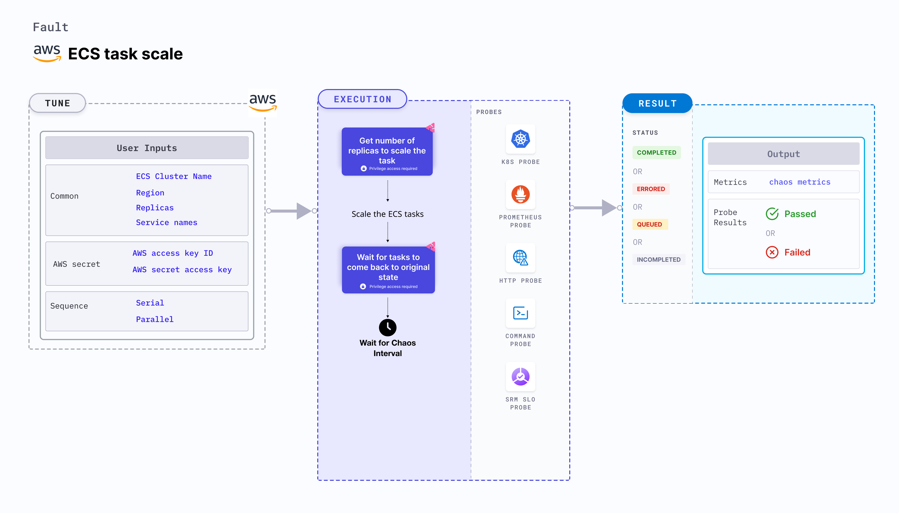

ECS task scale is an AWS fault that injects chaos to scale (up or down) the ECS tasks based on the services or task replica ID and checks the task availability. This fault makes the tasks unreachable when all the tasks in the service are scaled down in the application.



## Use cases

This fault determines the resilience of an application when ECS tasks are unexpectedly scaled up (or down) making the task unreachable.

## Prerequisites

- Kubernetes >= 1.17
- Sufficient AWS access to scale the ECS tasks.
- The target ECS tasks should be in a healthy state.
- Kubernetes secret that has the AWS access configuration (key) in the `CHAOS_NAMESPACE`. Below is a sample secret file:

```yaml
apiVersion: v1
kind: Secret
metadata:
  name: cloud-secret
type: Opaque
stringData:
  cloud_config.yml: |-
    # Add the cloud AWS credentials respectively
    [default]
    aws_access_key_id = XXXXXXXXXXXXXXXXXXX
    aws_secret_access_key = XXXXXXXXXXXXXXX
```

- It is recommended to use the same secret name, that is, `cloud-secret`. Otherwise, you will need to update the `AWS_SHARED_CREDENTIALS_FILE` environment variable in the fault template and you may be unable to use the default health check probes. 
- Refer to [AWS Named Profile For Chaos](./security-configurations/aws-switch-profile.md) to know how to use a different profile for AWS faults.
- Refer to the [superset permission (or policy)](./security-configurations/policy-for-all-aws-faults.md) to execute all AWS faults.
- Refer to the [common attributes](../common-tunables-for-all-faults) and [AWS-specific tunables](./aws-fault-tunables) to tune the common tunables for all faults and aws specific tunables.

## Permissions required

Here is an example AWS policy to help execute the fault.

```json
{
    "Version": "2012-10-17",
    "Statement": [
        {
            "Sid": "VisualEditor0",
            "Effect": "Allow",
            "Action": [
                "ecs:ListServices",
                "ecs:ListTasks",
                "ecs:StopTask",
                "ecs:DescribeServices",
                "ecs:DescribeTasks"
            ],
            "Resource": "*"
        }
    ]
}
```

## Fault tunables   

  <h3>Mandatory tunables</h3>
    <table>
        <tr>
        <th> Variables </th>
        <th> Description </th>
        <th> Notes </th>
        </tr>
        <tr> 
        <td> CLUSTER_NAME </td>
        <td> Name of the target ECS cluster.</td>
        <td> For example, <code>cluster-1</code>. For more information, go to <a href="#ecs-service-name"> ECS cluster name.</a></td>
        </tr>
        <tr>
        <td> REGION </td>
        <td> Region name of the target ECS cluster. </td>
        <td> For example, <code>us-east-1</code>. For more information, go to <a href="#ecs-service-name"> region.</a></td>
        </tr>
        <tr>
        <td> SERVICE_NAMES </td>
        <td> Target ECS service name. </td>
        <td> For example, <code>app-svc</code>. For more information, go to <a href="#ecs-service-name"> ECS service name.</a></td>
        </tr>
        <tr>
        <td> REPLICAS </td>
        <td> Number of replicas to scale up or down to. </td>
        <td> Default: 5. For more information, go to <a href="#ecs-task-replicas"> task replicas.</a></td>
        </tr>
    </table>
    <h3>Optional tunables</h3>
    <table>
      <tr>
        <th> Variables </th>
        <th> Description </th>
        <th> Notes </th>
      </tr>
      <tr>
        <td> TOTAL_CHAOS_DURATION </td>
        <td> Duration that you specify, through which chaos is injected into the target resource (in seconds). </td>
        <td> Default: 30 s. For more information, go to <a href="../common-tunables-for-all-faults#duration-of-the-chaos"> duration of the chaos.</a> </td>
      </tr>
      <tr>
        <td> SEQUENCE </td>
        <td> Sequence of chaos execution for multiple instances. </td>
        <td> Default: parallel. Supports parallel and serial sequences. For example, 30 s. For more information, go to <a href="../common-tunables-for-all-faults#sequence-of-chaos-execution">sequence of chaos execution. </a></td>
      </tr>
      <tr>
        <td> RAMP_TIME </td>
        <td> Period to wait before and after injecting chaos (in seconds).</td>
        <td> For example, 30 s. For more information, go to <a href="../common-tunables-for-all-faults#ramp-time"> ramp time.</a> </td>
      </tr>
      <tr> 
        <td> AWS_SHARED_CREDENTIALS_FILE </td>
        <td> Path to the AWS secret credentials. </td>
        <td> Defaults to <code>/tmp/cloud_config.yml</code>. </td>
      </tr>
    </table>


### ECS service name

Tasks that are a part of the particular service, that are stopped. Tune it by using the `SERVICE_NAME` environment variable. 

The following YAML snippet illustrates the use of this environment variable:

[embedmd]:# (./static/manifests/ecs-task-scale/task-stop-svc.yaml yaml)
```yaml
# scale the tasks of an ECS cluster
apiVersion: litmuschaos.io/v1alpha1
kind: ChaosEngine
metadata:
  name: engine-nginx
spec:
  engineState: "active"
  annotationCheck: "false"
  chaosServiceAccount: litmus-admin
  experiments:
  - name: ecs-task-scale
    spec:
      components:
        env:
        # provide the name of ECS cluster
        - name: CLUSTER_NAME
          value: 'demo'
        - name: SERVICE_NAME
          vale: 'test-svc'
        - name: REGION
          value: 'us-east-1'
        - name: TOTAL_CHAOS_DURATION
          VALUE: '60'
```

### ECS task replicas

Number of replicas to scale up (or down) to. Tune it by using the `REPLICAS` environment variable.

The following YAML snippet illustrates the use of this environment variable:

[embedmd]:# (./static/manifests/ecs-task-scale/task-stop-task.yaml yaml)
```yaml
# scale the tasks of an ECS cluster
apiVersion: litmuschaos.io/v1alpha1
kind: ChaosEngine
metadata:
  name: engine-nginx
spec:
  engineState: "active"
  annotationCheck: "false"
  chaosServiceAccount: litmus-admin
  experiments:
  - name: ecs-task-scale
    spec:
      components:
        env:
        # provide the name of ECS cluster
        - name: CLUSTER_NAME
          value: 'demo'
        - name: REPLICAS
          vale: '5'
        - name: REGION
          value: 'us-east-1'
        - name: TOTAL_CHAOS_DURATION
          VALUE: '60'
```