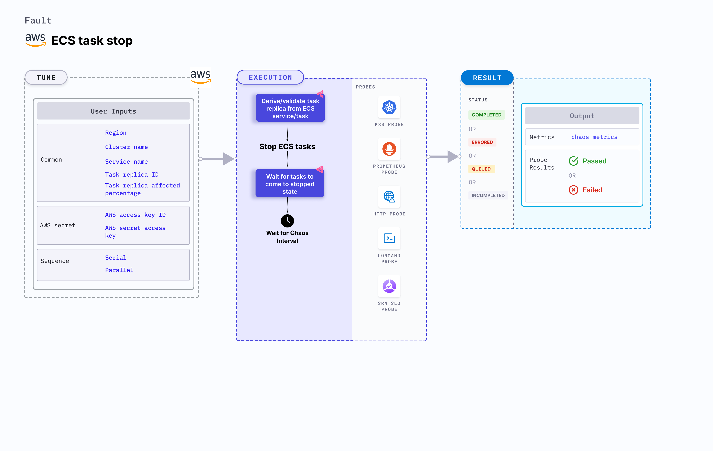

ECS task stop is an AWS fault that injects chaos to stop the ECS tasks based on the services or task replica ID and checks the task availability.
- This fault results in the unavailability of the application running on the tasks.




## Usage

<details>
<summary>View fault usage</summary>
<div>
This fault determines the resilience of an application when ECS tasks unexpectedly stop due to task being unavailable.
</div>
</details>

## Prerequisites

- Kubernetes >= 1.17
- Sufficient AWS access to stop the ECS tasks.
- Kubernetes secret that has the AWS access configuration (key) in the `CHAOS_NAMESPACE`. Below is a sample secret file:

```yaml
apiVersion: v1
kind: Secret
metadata:
  name: cloud-secret
type: Opaque
stringData:
  cloud_config.yml: |-
    # Add the cloud AWS credentials respectively
    [default]
    aws_access_key_id = XXXXXXXXXXXXXXXXXXX
    aws_secret_access_key = XXXXXXXXXXXXXXX
```

- It is recommended to use the same secret name, i.e. `cloud-secret`. Otherwise, you will need to update the `AWS_SHARED_CREDENTIALS_FILE` environment variable in the fault template and you may be unable to use the default health check probes. 

- Refer to [AWS Named Profile For Chaos](./security-configurations/aws-switch-profile.md) to know how to use a different profile for AWS faults.

## Permissions required

Here is an example AWS policy to help execute the fault.

<details>
<summary>View policy for this fault</summary>

```json
{
    "Version": "2012-10-17",
    "Statement": [
        {
            "Sid": "VisualEditor0",
            "Effect": "Allow",
            "Action": [
                "ecs:ListServices",
                "ecs:ListTasks",
                "ecs:StopTask",
                "ecs:DescribeServices",
                "ecs:DescribeTasks"
            ],
            "Resource": "*"
        }
    ]
}
```
</details>

Refer to the [superset permission (or policy)](./security-configurations/policy-for-all-aws-faults.md) to execute all AWS faults.

## Default validations

The target ECS tasks should be in a healthy state.

## Fault tunables   

<details>
    <summary>Fault tunables</summary>
    <h2>Mandatory fields</h2>
    <table>
        <tr>
        <th> Variables </th>
        <th> Description </th>
        <th> Notes </th>
        </tr>
        <tr> 
        <td> CLUSTER_NAME </td>
        <td> Name of the target ECS cluster.</td>
        <td> For example, <code>cluster-1</code>. </td>
        </tr>
        <tr>
        <td> REGION </td>
        <td> Region name of the target ECS cluster. </td>
        <td> For example, <code>us-east-1</code>. </td>
        </tr>
        <tr>
        <td> SERVICE_NAME </td>
        <td> Target ECS service name. </td>
        <td> For example, <code>app-svc</code>. </td>
        </tr>
        <tr>
        <td> TASK_REPLICA_ID </td>
        <td> Comma-separated target task replica IDs. </td>
        <td> `SERVICE_NAME` and `TASK_REPLICA_ID` are mutually exclusive. If both the values are provided, `SERVICE_NAME` takes precedence. </td>
        </tr>
    </table>
    <h2>Optional Fields</h2>
    <table>
      <tr>
        <th> Variables </th>
        <th> Description </th>
        <th> Notes </th>
      </tr>
      <tr>
        <td> TOTAL_CHAOS_DURATION </td>
        <td> Duration to insert chaos (in seconds). </td>
        <td> Defaults to 30s. </td>
      </tr>
      <tr>
        <td> CHAOS_INTERVAL </td>
        <td> Time interval between two successive instance terminations (in seconds). </td>
        <td> Defaults to 30s. </td>
      </tr>
      <tr>
        <td> TASK_REPLICA_AFFECTED_PERC </td>
        <td> Percentage of total tasks that are targeted. </td>
        <td> Defaults to 100. </td>
      </tr>
      <tr>
        <td> SEQUENCE </td>
        <td> Sequence of chaos execution for multiple instances. </td>
        <td> Defaults to parallel. Supports serial sequence as well. </td>
      </tr>
      <tr>
        <td> RAMP_TIME </td>
        <td> Period to wait before and after injecting chaos (in seconds).</td>
        <td> For example, 30s. </td>
      </tr>
      <tr> 
        <td> AWS_SHARED_CREDENTIALS_FILE </td>
        <td> Path to the AWS secret credentials. </td>
        <td> Defaults to <code>/tmp/cloud_config.yml</code>. </td>
      </tr>
    </table>
</details>

## Fault examples

### Common and AWS-specific tunables

Refer to the [common attributes](../common-tunables-for-all-faults) and [AWS-specific tunables](./aws-fault-tunables) to tune the common tunables for all faults and aws specific tunables.

### ECS service name

It stops the tasks that are a part of the particular service using the `SERVICE_NAME` environment variable. 

Use the following example to tune it:

[embedmd]:# (./static/manifests/ecs-task-stop/task-stop-svc.yaml yaml)
```yaml
# stop the tasks of an ECS cluster
apiVersion: litmuschaos.io/v1alpha1
kind: ChaosEngine
metadata:
  name: engine-nginx
spec:
  engineState: "active"
  annotationCheck: "false"
  chaosServiceAccount: litmus-admin
  experiments:
  - name: ecs-task-stop
    spec:
      components:
        env:
        # provide the name of ECS cluster
        - name: CLUSTER_NAME
          value: 'demo'
        - name: SERVICE_NAME
          vale: 'test-svc'
        - name: REGION
          value: 'us-east-1'
        - name: TOTAL_CHAOS_DURATION
          VALUE: '60'
```

### ECS task replica IDs

It stops all the tasks that are set using the `TASK_REPLICA_ID` environment variable.

Use the following example to tune it:

[embedmd]:# (./static/manifests/ecs-task-stop/task-stop-task.yaml yaml)
```yaml
# stop the tasks of an ECS cluster
apiVersion: litmuschaos.io/v1alpha1
kind: ChaosEngine
metadata:
  name: engine-nginx
spec:
  engineState: "active"
  annotationCheck: "false"
  chaosServiceAccount: litmus-admin
  experiments:
  - name: ecs-task-stop
    spec:
      components:
        env:
        # provide the name of ECS cluster
        - name: CLUSTER_NAME
          value: 'demo'
        - name: TASK_REPLICA_ID
          vale: '1b751cf956e34e54b9d83b6a5c067f60,20d5041c044941dfb2126f1722d10558'
        - name: REGION
          value: 'us-east-1'
        - name: TOTAL_CHAOS_DURATION
          VALUE: '60'
```

### ECS task replica affected percentage

It selects the number of tasks to be targeted (in percentage) using the `TASK_REPLICA_AFFECTED_PERC` environment variable.

Use the following example to tune it:

[embedmd]:# (./static/manifests/ecs-task-stop/task-stop-task-affected.yaml yaml)
```yaml
# stop the tasks of an ECS cluster
apiVersion: litmuschaos.io/v1alpha1
kind: ChaosEngine
metadata:
  name: engine-nginx
spec:
  engineState: "active"
  annotationCheck: "false"
  chaosServiceAccount: litmus-admin
  experiments:
  - name: ecs-task-stop
    spec:
      components:
        env:
        # provide the name of ECS cluster
        - name: CLUSTER_NAME
          value: 'demo'
        - name: SERVICE_NAME
          vale: 'test-svc'
        - name: TASK_REPLICA_AFFECTED_PERC
          vale: '100'
        - name: REGION
          value: 'us-east-1'
        - name: TOTAL_CHAOS_DURATION
          VALUE: '60'
```