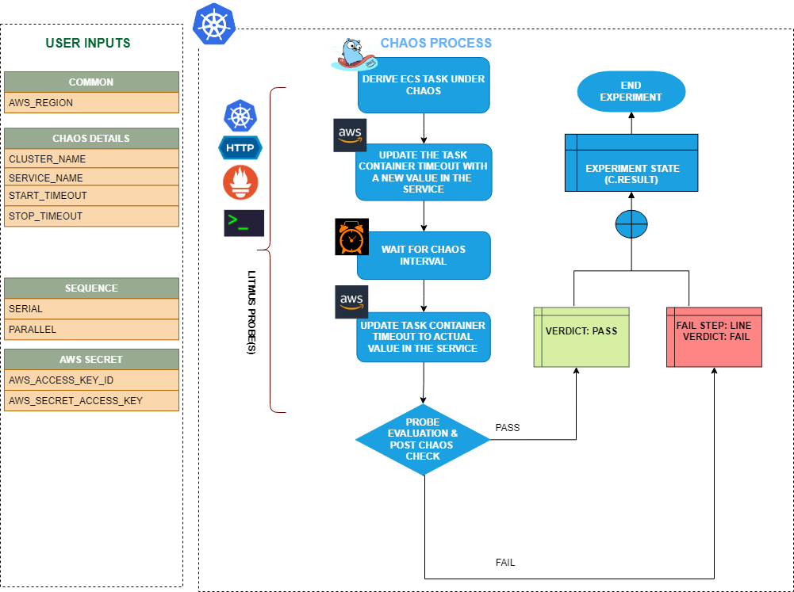

ECS update container timeout modifies the start and stop timeouts for ECS containers in Amazon ECS clusters. The fault allows you to specify the duration for which the containers should be allowed to start or stop before they are considered failed.




## Use cases
ECS update container timeout:
- Tests the resilience of ECS tasks and their containers to timeouts during updates or deployments.
- Verifies the behavior of ECS tasks and their containers when the start or stop timeout is exceeded during updates or deployments.
- Tests the recovery mechanisms of the ECS service and container instances in case of timeouts. 
- Simulates scenarios where containers take longer than expected to start or stop. 
- Evaluates the impact of above-mentioned scenarios on the overall application availability and performance.


## Prerequisites

- Kubernetes >= 1.17
- ECS cluster running with the desired tasks and containers and familiarity with ECS service update and deployment concepts.
- Create a Kubernetes secret that has the AWS access configuration(key) in the `CHAOS_NAMESPACE`. Below is a sample secret file:

```yaml
apiVersion: v1
kind: Secret
metadata:
  name: cloud-secret
type: Opaque
stringData:
  cloud_config.yml: |-
    # Add the cloud AWS credentials respectively
    [default]
    aws_access_key_id = XXXXXXXXXXXXXXXXXXX
    aws_secret_access_key = XXXXXXXXXXXXXXX
```

- It is recommended to use the same secret name, that is, `cloud-secret`. Otherwise, you will need to update the `AWS_SHARED_CREDENTIALS_FILE` environment variable in the fault template and you may be unable to use the default health check probes.

## Permissions required

Here is an example AWS policy to execute the fault.

```json
{
    "Version": "2012-10-17",
    "Statement": [
        {
            "Effect": "Allow",
            "Action": [
                "ecs:DescribeTasks",
                "ecs:DescribeServices",
                "ecs:DescribeTaskDefinition",
                "ecs:RegisterTaskDefinition",
                "ecs:UpdateService",
                "ecs:ListTasks",
                "ecs:DeregisterTaskDefinition"
            ],
            "Resource": "*"
        },
        {
            "Effect": "Allow",
            "Action": [
                "iam:PassRole"
            ],
            "Resource": "*"
        }
    ]
}
```

:::info note
- Refer to [AWS named profile for chaos](./security-configurations/aws-switch-profile.md) to use a different profile for AWS faults.
- The ECS containers should be in a healthy state before and after introducing chaos.
- Refer to the [common attributes](../common-tunables-for-all-faults) and [AWS-specific tunables](./aws-fault-tunables) to tune the common tunables for all faults and AWS-specific tunables.
- Refer to the [superset permission/policy](./security-configurations/policy-for-all-aws-faults.md) to execute all AWS faults.
:::

   <h3>Mandatory tunables</h3>
    <table>
        <tr>
          <th> Tunable </th>
          <th> Description </th>
          <th> Notes </th>
        </tr>
        <tr> 
          <td> CLUSTER_NAME </td>
          <td> Name of the target ECS cluster. </td>
          <td> For example, <code>cluster-1</code>. </td>
        </tr>
        <tr> 
          <td> SERVICE_NAME </td>
          <td> Name of the ECS service under chaos. </td>
          <td> For example, <code>nginx-svc</code>. </td>
        </tr>
        <tr>
          <td> REGION </td>
          <td> Region name of the target ECS cluster</td>
          <td> For example, <code>us-east-1</code>. </td>
        </tr>
    </table>
    <h3>Optional tunables</h3>
    <table>
      <tr>
        <th> Tunable </th>
        <th> Description </th>
        <th> Notes </th>
      </tr>
      <tr>
        <td> TOTAL_CHAOS_DURATION </td>
        <td> Duration that you specify, through which chaos is injected into the target resource (in seconds). </td>
        <td> Defaults to 30s. </td>
      </tr>
      <tr>
        <td> CHAOS_INTERVAL </td>
        <td> Interval between successive instance terminations (in seconds).</td>
        <td> Defaults to 30s. </td>
      </tr>
      <tr> 
        <td> AWS_SHARED_CREDENTIALS_FILE </td>
        <td> Path to the AWS secret credentials.</td>
        <td> Defaults to <code>/tmp/cloud_config.yml</code>. </td>
      </tr>
      <tr> 
        <td> START_TIMEOUT </td>
        <td> This is the maximum amount of time that ECS allows for a container to start successfully. If the container fails to start within this timeout period, ECS marks the task as failed and may trigger a restart or rescheduling of the task.</td>
        <td> It is specified in seconds, and its default value is set to 3,600 seconds if not provided.  </td>
      </tr>
      <tr> 
        <td> STOP_TIMEOUT </td>
        <td> This is the maximum amount of time that ECS allows for a container to stop gracefully. If the container does not stop within the <code>STOP_TIMEOUT</code> period, ECS forcefully terminates the container, which may result in data loss or other undesirable consequen</td>
        <td> It is specified in seconds, and its default value is set to 3,600 seconds if not provided.  </td>
      </tr>
      <tr>
        <td> RAMP_TIME </td>
        <td> Period to wait before and after injecting chaos (in seconds).  </td>
        <td> For example, 30s. </td>
      </tr>
    </table>

### Start and stop timeout

The start and stop timeout for the task containers. Tune it by using the `START_TIMEOUT` and `STOP_TIMEOUT` environment variable. Its default value is set to 3,600 seconds.

The following YAML snippet illustrates the use of this environment variable:

[embedmd]:# (./static/manifests/ecs-update-container-timeout/start-and-stop-timeout.yaml yaml)
```yaml
# set start and stop timeout for the target container
apiVersion: litmuschaos.io/v1alpha1
kind: ChaosEngine
metadata:
  name: aws-nginx
spec:
  engineState: "active"
  annotationCheck: "false"
  chaosServiceAccount: litmus-admin
  experiments:
  - name: ecs-update-container-timeout
    spec:
      components:
        env:
        # Provide the start and stop timeout for the ecs container
        - name: START_TIMEOUT
          value: '30'
        - name: STOP_TIMEOUT
          value: '30'
        - name: REGION
          value: 'us-east-2'
        - name: TOTAL_CHAOS_DURATION
          VALUE: '60'
```
