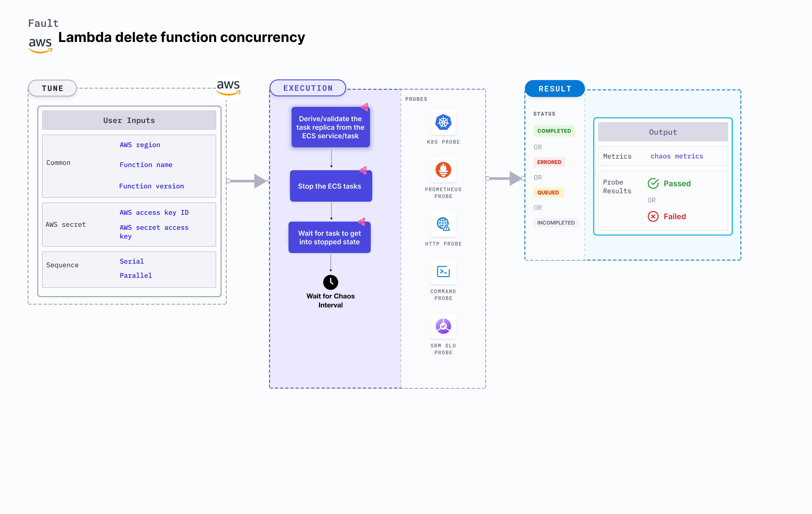

## Introduction

Lambda delete function concurrency is an AWS fault that deletes the Lambda function's reserved concurrency, thereby ensuring that the function has adequate unreserved concurrency to run.




## Use cases
Lambda delete function concurrency examines the performance of the running Lambda application, if the Lambda function lacks sufficient concurrency.

:::info note
- Kubernetes version 1.17 or later is required to execute this fault.
- Reserved concurrency must be set on the target Lambda function.
- Lambda function must be up and running.
- Kubernetes secret must have the AWS access configuration (key) in the `CHAOS_NAMESPACE`. Below is a sample secret file:
  ```yaml
  apiVersion: v1
  kind: Secret
  metadata:
    name: cloud-secret
  type: Opaque
  stringData:
    cloud_config.yml: |-
      # Add the cloud AWS credentials respectively
      [default]
      aws_access_key_id = XXXXXXXXXXXXXXXXXXX
      aws_secret_access_key = XXXXXXXXXXXXXXX
  ```
- Harness recommends using the same secret name, that is, `cloud-secret`. Otherwise, you must update the `AWS_SHARED_CREDENTIALS_FILE` environment variable in the fault template and you won't be able to use the default health check probes. 
- Go to [AWS named profile for chaos](./security-configurations/aws-switch-profile.md) to use a different profile for AWS faults.
- Go to the [superset permission/policy](./security-configurations/policy-for-all-aws-faults.md) to execute all AWS faults.
- Go to [common tunables](../common-tunables-for-all-faults) and [AWS-specific tunables](./aws-fault-tunables) to tune the common tunables for all faults and AWS-specific tunables.
:::

Below is an example AWS policy to execute the fault.

```json
{
    "Version": "2012-10-17",
    "Statement": [
        {
            "Effect": "Allow",
            "Action": [
                "lambda:UpdateFunctionConfiguration",
                "lambda:GetFunctionConcurrency",
                "lambda:GetFunction",
                "lambda:DeleteFunctionConcurrency",
                "lambda:PutFunctionConcurrency"
            ],
            "Resource": "*"
        }
    ]
}
```

## Fault tunables

  <h3>Mandatory tunables</h3>
    <table>
      <tr>
        <th> Tunable </th>
        <th> Description </th>
        <th> Notes </th>
      </tr>
      <tr>
        <td> FUNCTION_NAME </td>
        <td> Name of the target Lambda function. It supports a single function name.</td>
        <td> For example, <code>test-function</code>. </td>
      </tr>
      <tr>
        <td> FUNCTION_VERSION </td>
        <td> Specifies the version of the function. </td>
        <td> Default: <code>$LATEST</code>. </td>
      </tr>
      <tr>
        <td> REGION </td>
        <td> Region name of the target Lambda function. </td>
        <td> For example, <code>us-east-2</code>. </td>
      </tr>
    </table>
    <h3>Optional tunables</h3>
    <table>
      <tr>
        <th> Tunable </th>
        <th> Description </th>
        <th> Notes </th>
      </tr>
      <tr>
        <td> TOTAL_CHAOS_DURATION </td>
        <td> Duration that you specify, through which chaos is injected into the target resource (in seconds).</td>
        <td> Default: 30 s </td>
      </tr>
      <tr>
        <td> CHAOS_INTERVAL </td>
        <td> Time interval between two successive deletions of reserved concurrency (in seconds).</td>
        <td> Default: 30 s </td>
      </tr>
      <tr>
        <td> RAMP_TIME </td>
        <td> Period to wait before and after injecting chaos (in seconds). </td>
        <td> For example, 30 s. </td>
      </tr>
    </table>
