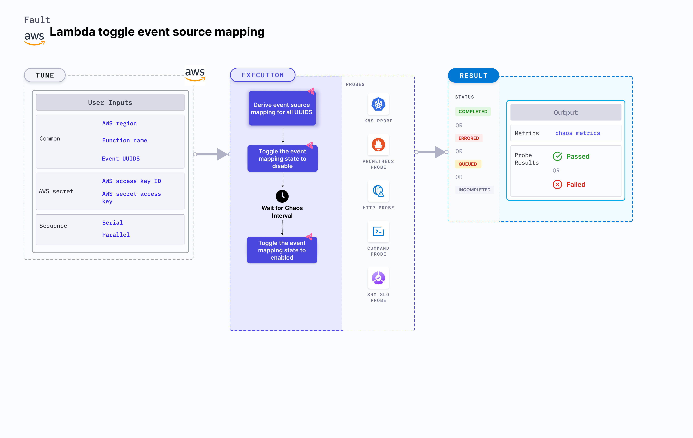

## Introduction

Lambda toggle event mapping state toggles (or sets) the event source mapping state to `disable` for a Lambda function during a specific duration. Toggling between different states of event source mapping from a Lambda function may lead to failures when updating the database on an event trigger. This can break the service and impact its delivery. 




## Use cases
Lambda toggle event mapping:
- Checks the performance of the running application when the event source mapping is not enabled. This may cause missing entries in a database.
- Determines if the application has proper error handling or auto recovery actions configured.


:::info note
- Kubernetes version 1.17 or later is required to execute this fault.
- AWS Lambda event source mapping must be healthy and attached to the Lambda function.
- Kubernetes secret must have the AWS access configuration(key) in the `CHAOS_NAMESPACE`. A secret file looks like this:
  ```yaml
  apiVersion: v1
  kind: Secret
  metadata:
    name: cloud-secret
  type: Opaque
  stringData:
    cloud_config.yml: |-
      # Add the cloud AWS credentials respectively
      [default]
      aws_access_key_id = XXXXXXXXXXXXXXXXXXX
      aws_secret_access_key = XXXXXXXXXXXXXXX
  ```
- Harness recommends using the same secret name, that is, `cloud-secret`. Otherwise, you must update the `AWS_SHARED_CREDENTIALS_FILE` environment variable in the fault template and you won't be able to use the default health check probes. 
- Go to [AWS named profile for chaos](./security-configurations/aws-switch-profile.md) to use a different profile for AWS faults.
- Go to [superset permission/policy](./security-configurations/policy-for-all-aws-faults.md) to execute all AWS faults.
- Go to [common tunables](../common-tunables-for-all-faults) and [AWS-specific tunables](./aws-fault-tunables) to tune the common tunables for all faults and AWS-specific tunables.
:::

Below is an example AWS policy to execute the fault.

```json
{
    "Version": "2012-10-17",
    "Statement": [
        {
            "Effect": "Allow",
            "Action": [
                "lambda:ListEventSourceMappings",
                "lambda:DeleteEventSourceMapping",
                "lambda:UpdateEventSourceMapping",
                "lambda:CreateEventSourceMapping",
                "lambda:UpdateFunctionConfiguration",
                "lambda:GetFunctionConcurrency",
                "lambda:GetFunction",
                "lambda:DeleteFunctionConcurrency",
                "lambda:PutFunctionConcurrency"
            ],
            "Resource": "*"
        }
    ]
}
```

## Fault tunables

   <h3>Mandatory tunables</h3>
    <table>
      <tr>
        <th> Tunable </th>
        <th> Description </th>
        <th> Notes </th>
      </tr>
      <tr>
        <td> FUNCTION_NAME </td>
        <td> Function name of the target lambda function. It supports single function name.</td>
        <td> For example, <code>test-function</code> </td>
      </tr>
      <tr>
        <td> EVENT_UUIDS </td>
        <td> Provide the UUID for the target event source mapping.</td>
        <td> You can provide multiple values as comma-separated values. For example, <code>id1,id2</code> </td>
      </tr>
      <tr>
        <td> REGION </td>
        <td> The region name of the target lambda function</td>
        <td> For example, <code>us-east-2</code></td>
      </tr>
    </table>
    <h2>Optional tunables</h2>
    <table>
      <tr>
        <th> Tunable </th>
        <th> Description </th>
        <th> Notes </th>
      </tr>
      <tr>
        <td> TOTAL_CHAOS_DURATION </td>
        <td> Duration that you specify, through which chaos is injected into the target resource (in seconds). </td>
        <td> Default: 30 s.</td>
      </tr>
      <tr>
        <td> SEQUENCE </td>
        <td> It defines sequence of chaos execution for multiple instance</td>
        <td> Default value: parallel. Supported: serial, parallel </td>
      </tr>
      <tr>
        <td> RAMP_TIME </td>
        <td> Period to wait before and after injection of chaos in sec </td>
        <td> For example, 30 s. </td>
      </tr>
    </table>


### Multiple event source mapping

Toggle between multiple event source mapping for a specific duration. Tune it by using `EVENT_UUIDS` environment variable that takes the UUID of the events as a comma-separated value.

The following YAML snippet illustrates the use of this environment variable:

[embedmd]:# (./static/manifests/lambda-toggle-event-mapping-state/multiple-events.yaml yaml)
```yaml
# contains the removal of multiple event source mapping
apiVersion: litmuschaos.io/v1alpha1
kind: ChaosEngine
metadata:
  name: engine-nginx
spec:
  engineState: "active"
  chaosServiceAccount: litmus-admin
  experiments:
  - name: lambda-toggle-event-mapping-state
    spec:
      components:
        env:
        # provide UUIDS of event source mapping
        - name: EVENT_UUIDS
          value: 'id1,id2'
        # provide the function name for the chaos
        - name: FUNCTION_NAME
          value: 'chaos-function'
```
