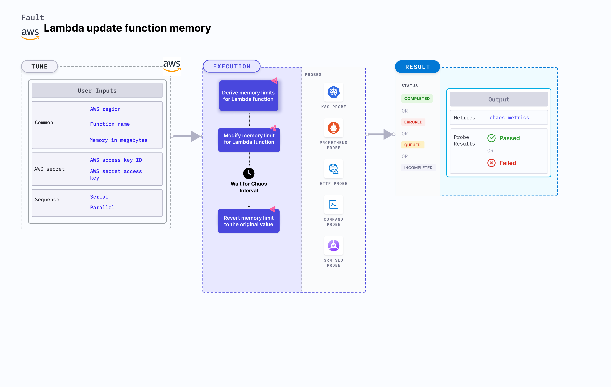

## Introduction

Lambda update function memory causes the memory of a Lambda function to update to a specific value for a certain duration. This fault:
- Determines a safe overall memory limit value for the function. Smaller the memory limit, higher will be the time taken by the Lambda function under load.




## Use cases
Lambda update function memory:
- Helps build resilience to unexpected scenarios such as hitting a memory limit with the Lambda function, that slows down the service and impacts its delivery. Running out of memory due to smaller limits interrupts the flow of the given function.
- Checks the performance of the application (or service) running with a new memory limit.

:::info note
- Kubernetes version 1.17 or later is required to execute this fault.
- Access to operate AWS Lambda functions.
- Lambda function must be up and running.
- Kubernetes secret must have the AWS access configuration(key) in the `CHAOS_NAMESPACE`. A secret file looks like this:
  ```yaml
  apiVersion: v1
  kind: Secret
  metadata:
    name: cloud-secret
  type: Opaque
  stringData:
    cloud_config.yml: |-
      # Add the cloud AWS credentials respectively
      [default]
      aws_access_key_id = XXXXXXXXXXXXXXXXXXX
      aws_secret_access_key = XXXXXXXXXXXXXXX
  ```
- Harness recommends using the same secret name, that is, `cloud-secret`. Otherwise, you must update the `AWS_SHARED_CREDENTIALS_FILE` environment variable in the fault template and you won't be able to use the default health check probes. 
- Go to [AWS named profile for chaos](./security-configurations/aws-switch-profile.md) to use a different profile for AWS faults.
- Go to [superset permission/policy](./security-configurations/policy-for-all-aws-faults.md) to execute all AWS faults.
- Go to [common tunables](../common-tunables-for-all-faults) and [AWS-specific tunables](./aws-fault-tunables) to tune the common tunables for all faults and AWS-specific tunables.
:::


Below is an example AWS policy to execute the fault.

```json
{
    "Version": "2012-10-17",
    "Statement": [
        {
            "Effect": "Allow",
            "Action": [
                "lambda:UpdateFunctionConfiguration",
                "lambda:GetFunctionConcurrency",
                "lambda:GetFunction",
                "lambda:DeleteFunctionConcurrency",
                "lambda:PutFunctionConcurrency"
            ],
            "Resource": "*"
        }
    ]
}
```


## Fault tunables

   <h3>Mandatory tunables</h3>
    <table>
      <tr>
        <th> Tunable </th>
        <th> Description </th>
        <th> Notes </th>
      </tr>
      <tr>
        <td> FUNCTION_NAME </td>
        <td> Function name of the target Lambda function. It supports single function name.</td>
        <td> For example, <code>test-function</code> </td>
      </tr>
      <tr>
        <td> MEMORY_IN_MEGABYTES </td>
        <td> Provide the value of the memory limit of a function in megabytes.</td>
        <td> Minimum memory limit on a Lambda function is 128Mb and the maximum is 10240 Mb. </td>
      </tr>
      <tr>
        <td> REGION </td>
        <td> Region name of the target Lambda function</td>
        <td> For example, <code>us-east-2</code> </td>
      </tr>
    </table>
    <h3>Optional tunables</h3>
    <table>
      <tr>
        <th> Tunable </th>
        <th> Description </th>
        <th> Notes </th>
      </tr>
      <tr>
        <td> TOTAL_CHAOS_DURATION </td>
        <td> Duration that you specify, through which chaos is injected into the target resource (in seconds). </td>
        <td> Default: 30 s. </td>
      </tr>
      <tr>
        <td> CHAOS_INTERVAL </td>
        <td> The interval (in seconds) between successive instance termination.</td>
        <td> Default: 30 s. </td>
      </tr>
      <tr>
        <td> SEQUENCE </td>
        <td> It defines sequence of chaos execution for multiple instance</td>
        <td> Default value: parallel. Supported: serial, parallel </td>
      </tr>
      <tr>
        <td> RAMP_TIME </td>
        <td> Period to wait before and after injection of chaos in seconds </td>
        <td> For example, 30 s. </td>
      </tr>
    </table>


### Memory limit

Updates the Lambda function memory limit to a different value. Tune it by using `MEMORY_IN_MEGABYTES` environment variable.

The following YAML snippet illustrates the use of this environment variable:

[embedmd]:# (./static/manifests/lambda-update-function-memory/function-memory.yaml yaml)
```yaml
# contains the memory limit value for the lambda function
apiVersion: litmuschaos.io/v1alpha1
kind: ChaosEngine
metadata:
  name: engine-nginx
spec:
  engineState: "active"
  chaosServiceAccount: litmus-admin
  experiments:
  - name: lambda-update-function-memory
    spec:
      components:
        env:
        # provide the function memory limit
        - name: MEMORY_IN_MEGABYTES
          value: '10'
        # provide the function name for memory limit chaos
        - name: FUNCTION_NAME
          value: 'chaos-function'
```
