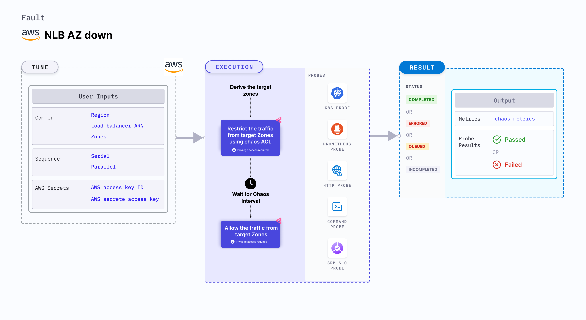

The NLB (Network Load Balancer) AZ (Availability Zone) down fault triggers the unavailability of an AZ on a target network load balancer, resulting in potential disruptions to service delivery. This fault deliberately restricts access to specific availability zones by blocking the subnet ACL (Access Control List) for a defined duration. By simulating this scenario, you can assess the resilience and performance of your system when faced with an inaccessible AZ.



## Use cases

- With this experiment, you can evaluate the application's behavior and assess its ability to handle and recover from a scenario where traffic from a particular AZ is blocked.
- It conducts an application test by deliberately blocking traffic originating from a specific AZ on the network load balancer. This experiment involves intentionally preventing incoming and outgoing traffic from the designated AZ from reaching the application through the load balancer.

## Prerequisites

- Kubernetes >= 1.17
- ECS cluster running with the desired tasks and containers and familiarity with ECS service update and deployment concepts.
- Create a Kubernetes secret that has the AWS access configuration(key) in the `CHAOS_NAMESPACE`. Below is a sample secret file:

```yaml
apiVersion: v1
kind: Secret
metadata:
  name: cloud-secret
type: Opaque
stringData:
  cloud_config.yml: |-
    # Add the cloud AWS credentials respectively
    [default]
    aws_access_key_id = XXXXXXXXXXXXXXXXXXX
    aws_secret_access_key = XXXXXXXXXXXXXXX
```

:::tip
It is recommended to use the same secret name, that is, `cloud-secret`. Otherwise, you will need to update the `AWS_SHARED_CREDENTIALS_FILE` environment variable in the fault template and you may be unable to use the default health check probes. 
:::

## Permissions required

Here is an example AWS policy to execute the fault.

```json
{
    "Version": "2012-10-17",
    "Statement": [
        {
            "Effect": "Allow",
            "Action": [
                "elasticloadbalancing:DescribeLoadBalancers",
                "ec2:DescribeSubnets",
                "ec2:CreateNetworkAcl",
                "ec2:CreateNetworkAclEntry",
                "ec2:DescribeNetworkAcls",
                "ec2:ReplaceNetworkAclAssociation",
                "ec2:DeleteNetworkAcl"
            ],
            "Resource": "*"
        }
    ]
}
```

## Fault tunables

   <h3>Mandatory tunables</h3>
    <table>
      <tr>
        <th> Tunable </th>
        <th> Description </th>
        <th> Notes </th>
      </tr>
      <tr>
        <td> LOAD_BALANCER_ARN </td>
        <td> Target load balancer ARN whose AZ should be detached </td>
        <td> For example, <code>arn:aws:elasticloadbalancing:us-east-2:11111111111:loadbalancer/app/test-nlb/09121290906ffab7</code>. </td>
      </tr>
      <tr>
        <td> ZONES </td>
        <td> Target zones that should be detached from the NLB </td>
        <td> For example, <code>us-east-1a</code>. </td>
      </tr>
      <tr>
        <td> REGION </td>
        <td> Region name for the target volumes </td>
        <td> For example, <code>us-east-1</code>. </td>
      </tr>
    </table>
    <h3>Optional tunables</h3>
    <table>
      <tr>
        <th> Tunable </th>
        <th> Description </th>
        <th> Notes </th>
      </tr>
      <tr>
        <td> TOTAL_CHAOS_DURATION </td>
        <td> Duration to insert chaos (in seconds) </td>
        <td> Default: 30 s. For more information, go to <a href="https://developer.harness.io/docs/chaos-engineering/chaos-faults/common-tunables-for-all-faults#duration-of-the-chaos"> duration of the chaos.</a></td>
      </tr>
      <tr>
        <td> CHAOS_INTERVAL </td>
        <td> Duration between the attachment and detachment of the volumes (in seconds) </td>
        <td> Default: 30 s. For more information, go to <a href="https://developer.harness.io/docs/chaos-engineering/chaos-faults/common-tunables-for-all-faults#chaos-interval"> chaos interval.</a></td>
      </tr>
      <tr>
        <td> SEQUENCE </td>
        <td> Sequence of chaos execution for multiple volumes </td>
        <td> Default: parallel. Supports serial and parallel. For more information, go to <a href="https://developer.harness.io/docs/chaos-engineering/chaos-faults/common-tunables-for-all-faults#sequence-of-chaos-execution"> sequence of chaos execution.</a></td>
      </tr>
      <tr>
        <td> RAMP_TIME </td>
        <td> Duration to wait before and after injecting chaos (in seconds) </td>
        <td> For example, 30 s. For more information, go to <a href="https://developer.harness.io/docs/chaos-engineering/chaos-faults/common-tunables-for-all-faults#ramp-time"> ramp time.</a></td>
      </tr>
    </table>

### Target zones

Comma-separated list of target zones. Tune it by using the `ZONES` environment variable.

The following YAML snippet illustrates the use of this environment variable:

[embedmd]:# (./static/manifests/nlb-az-down/target-zones.yaml yaml)
```yaml
# contains nlb az down for given zones
apiVersion: litmuschaos.io/v1alpha1
kind: ChaosEngine
metadata:
  name: engine-nginx
spec:
  engineState: "active"
  chaosServiceAccount: litmus-admin
  experiments:
  - name: nlb-az-down
    spec:
      components:
        env:
        # load balancer arn for chaos
        - name: LOAD_BALANCER_ARN
          value: 'arn:aws:elasticloadbalancing:us-east-2:11111111111:loadbalancer/app/test-nlb/09121290906ffab7'
        # target zones for the chaos
        - name: ZONES
          value: 'us-east-1a,us-east-1b'
        # region for chaos
        - name: REGION
          value: 'us-east-1'
```
