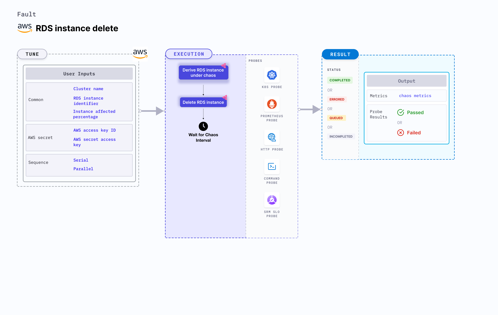

## Introduction

RDS instance delete removes an instances from AWS RDS cluster. This makes the cluster unavailable for a specific duration.




## Use cases
RDS instance delete determines how quickly an application can recover from an unexpected RDS cluster deletion. 


:::info note
- Kubernetes version 1.17 or later is required to execute this fault.
- AWS access to delete RDS instances.
- The RDS instance must be in a healthy state.
- Kubernetes secret must have the AWS access configuration(key) in the `CHAOS_NAMESPACE`. A sample secret file looks like:
  ```yaml
  apiVersion: v1
  kind: Secret
  metadata:
    name: cloud-secret
  type: Opaque
  stringData:
    cloud_config.yml: |-
      # Add the cloud AWS credentials respectively
      [default]
      aws_access_key_id = XXXXXXXXXXXXXXXXXXX
      aws_secret_access_key = XXXXXXXXXXXXXXX
  ```
- Harness recommends using the same secret name, that is, `cloud-secret`. Otherwise, you must update the `AWS_SHARED_CREDENTIALS_FILE` environment variable in the fault template and you won't be able to use the default health check probes. 
- Go to [superset permission/policy](./security-configurations/policy-for-all-aws-faults.md) to execute all AWS faults.
- Go to the [common tunables](../common-tunables-for-all-faults) and [AWS-specific tunables](./aws-fault-tunables) to tune the common tunables for all faults and AWS-specific tunables.
- Go to [AWS named profile for chaos](./security-configurations/aws-switch-profile.md) to use a different profile for AWS faults.
:::

Below is an example AWS policy to execute the fault.

```json
{
    "Version": "2012-10-17",
    "Statement": [
        {
            "Effect": "Allow",
            "Action": [
                "ec2:DescribeInstanceStatus",
                "ec2:DescribeInstances",
                "rds:DescribeDBClusters",
                "rds:DescribeDBInstances",
                "rds:DeleteDBInstance"
            ],
            "Resource": "*"
        }
    ]
}
```

## Fault tunables


   <h3>Mandatory tunables</h3>
    <table>
        <tr>
        <th> Tunable </th>
        <th> Description </th>
        <th> Notes </th>
        </tr>
        <tr> 
        <td> CLUSTER_NAME </td>
        <td> Name of the target RDS cluster</td>
        <td> For example, rds-cluster-1 </td>
        </tr>
        <tr> 
        <td> RDS_INSTANCE_IDENTIFIER </td>
        <td> Name of the target RDS Instances</td>
        <td> For example, rds-cluster-1-instance </td>
        </tr>
        <tr>
        <td> REGION </td>
        <td> The region name of the target RDS cluster</td>
        <td> For example, us-east-1 </td>
        </tr>
    </table>
    <h3>Optional tunables</h3>
    <table>
      <tr>
        <th> Tunable </th>
        <th> Description </th>
        <th> Notes </th>
      </tr>
      <tr>
        <td> TOTAL_CHAOS_DURATION </td>
        <td> Duration that you specify, through which chaos is injected into the target resource (in seconds).</td>
        <td> Default: 30 s </td>
      </tr>
      <tr>
        <td> INSTANCE_AFFECTED_PERC </td>
        <td> The Percentage of total RDS instance that are part of RDS cluster to target </td>
        <td> Default: 0 (corresponds to 1 instance). Provide numeric values only. </td>
      </tr>
      <tr>
        <td> SEQUENCE </td>
        <td> It defines sequence of chaos execution for multiple instance</td>
        <td> Default value: parallel. Supported: serial, parallel </td>
      </tr>
      <tr> 
        <td> AWS_SHARED_CREDENTIALS_FILE </td>
        <td> Provide the path for AWS secret credentials</td>
        <td> Default: <code>/tmp/cloud_config.yml</code> </td>
      </tr>
      <tr>
        <td> RAMP_TIME </td>
        <td> Period to wait before and after injection of chaos in sec </td>
        <td> For example, 30 s </td>
      </tr>
    </table>

### RDS cluster name

Cluster name of the target RDS cluster. Tune it by using the `CLUSTER_NAME` environment variable. If this variable is not provided, the fault selects the Instance Identifier.

The following YAML snippet illustrates the use of this environment variable:

[embedmd]:# (./static/manifests/rds-instance-delete/instance-delete-cluster.yaml yaml)
```yaml
# delete the RDS instance
apiVersion: litmuschaos.io/v1alpha1
kind: ChaosEngine
metadata:
  name: engine-nginx
spec:
  engineState: "active"
  annotationCheck: "false"
  chaosServiceAccount: litmus-admin
  experiments:
  - name: rds-instance-delete
    spec:
      components:
        env:
        # provide the name of RDS cluster
        - name: CLUSTER_NAME
          value: 'rds-demo-cluster'
        - name: REGION
          value: 'us-east-2'
        - name: TOTAL_CHAOS_DURATION
          value: '60'
```
### RDS instance identifier 
 
RDS instance name. Tune it by using the `RDS_INSTANCE_IDENTIFIER` environment variable.

The following YAML snippet illustrates the use of this environment variable:

[embedmd]:# (./static/manifests/rds-instance-delete/instance-delete-instance.yaml yaml)
```yaml
# delete the RDS instance
apiVersion: litmuschaos.io/v1alpha1
kind: ChaosEngine
metadata:
  name: engine-nginx
spec:
  engineState: "active"
  annotationCheck: "false"
  chaosServiceAccount: litmus-admin
  experiments:
  - name: rds-instance-delete
    spec:
      components:
        env:
        # provide the RDS instance identifier 
        - name: RDS_INSTANCE_IDENTIFIER
          value: 'rds-demo-instance-1,rds-demo-instance-2'
        - name: INSTANCE_AFFECTED_PERC
          value: '100'
        - name: REGION
          value: 'us-east-2'
        - name: TOTAL_CHAOS_DURATION
          value: '60'
```