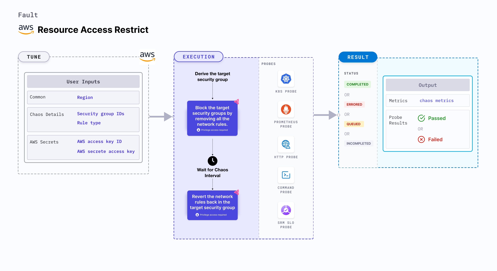

The AWS Resource Access Restrict chaos experiment allows you to create network access restrictions by selectively blocking incoming or outgoing traffic from a security group associated with a specific service.



## Use cases

- This experiment enables you to simulate scenarios where network connectivity is restricted for an AWS service, providing valuable insights into the behavior and resilience of your system in such conditions.
- By imposing these access restrictions, you can evaluate how your application and resources handle limited network access and ensure that they continue to operate effectively and securely.

## Prerequisites

- Kubernetes >= 1.17
- ECS cluster running with the desired tasks and containers and familiarity with ECS service update and deployment concepts.
- Create a Kubernetes secret that has the AWS access configuration(key) in the `CHAOS_NAMESPACE`. Below is a sample secret file:

```yaml
apiVersion: v1
kind: Secret
metadata:
  name: cloud-secret
type: Opaque
stringData:
  cloud_config.yml: |-
    # Add the cloud AWS credentials respectively
    [default]
    aws_access_key_id = XXXXXXXXXXXXXXXXXXX
    aws_secret_access_key = XXXXXXXXXXXXXXX
```

:::tip
It is recommended to use the same secret name, that is, `cloud-secret`. Otherwise, you will need to update the `AWS_SHARED_CREDENTIALS_FILE` environment variable in the fault template and you may be unable to use the default health check probes. 
:::

## Permissions required

Here is an example AWS policy to execute the fault.

```json
{
    "Version": "2012-10-17",
    "Statement": [
        {
            "Effect": "Allow",
            "Action": [
                "ec2:DescribeSecurityGroups",
                "ec2:RevokeSecurityGroupIngress",
                "ec2:AuthorizeSecurityGroupIngress",
                "ec2:RevokeSecurityGroupEgress",
                "ec2:AuthorizeSecurityGroupEgress"
            ],
            "Resource": [
                "*"
            ]
        }
    ]
}

```

:::info note
- Refer to [AWS named profile for chaos](./security-configurations/aws-switch-profile.md) to use a different profile for AWS faults.
- The ECS containers should be in a healthy state before and after introducing chaos.
- Refer to the [common attributes](../common-tunables-for-all-faults) and [AWS-specific tunables](./aws-fault-tunables) to tune the common tunables for all faults and AWS-specific tunables.
- Refer to the [superset permission/policy](./security-configurations/policy-for-all-aws-faults.md) to execute all AWS faults.
:::

   <h3>Mandatory tunables</h3>
    <table>
        <tr>
          <th> Tunable </th>
          <th> Description </th>
          <th> Notes </th>
        </tr>
        <tr> 
          <td> SECURITY_GROUP_IDS </td>
          <td> Provide all the target security groups as comma separated values.</td>
          <td> For example, <code>sg-12314,sg-2351324</code>. </td>
        </tr>
        <tr>
          <td> REGION </td>
          <td> Region name of the target ECS cluster</td>
          <td> For example, <code>us-east-1</code>. </td>
        </tr>
    </table>
    <h3>Optional tunable</h3>
    <table>
      <tr>
        <th> Tunable </th>
        <th> Description </th>
        <th> Notes </th>
      </tr>
      <tr>
        <td> TOTAL_CHAOS_DURATION </td>
        <td> Duration that you specify, through which chaos is injected into the target resource (in seconds) </td>
        <td> Defaults to 30s. </td>
      </tr>
      <tr>
        <td> CHAOS_INTERVAL </td>
        <td> Interval between successive instance terminations (in seconds)</td>
        <td> Defaults to 30s. </td>
      </tr>
      <tr> 
        <td> AWS_SHARED_CREDENTIALS_FILE </td>
        <td> Path to the AWS secret credentials</td>
        <td> Defaults to <code>/tmp/cloud_config.yml</code>. </td>
      </tr>
      <tr> 
        <td> RULE_TYPE </td>
        <td> Provide the rule type to be blocked. Supported value <code>inbound</code> and <code>outbound</code>.</td>
        <td> Defaults to <code>inbound</code>.</td>
      </tr>
      <tr>
        <td> RAMP_TIME </td>
        <td> Period to wait before and after injecting chaos (in seconds)  </td>
        <td> For example, 30s. </td>
      </tr>
    </table>

### Resouce Access Restrict

Security group for access restriction. Tune it by using the `SECURITY_GROUP_IDS` environment variable.

The following YAML snippet illustrates the use of this environment variable:

[embedmd]:# (./static/manifests/resource-access-restrict/security-group.yaml yaml)
```yaml
# Set task role resource for the target task
apiVersion: litmuschaos.io/v1alpha1
kind: ChaosEngine
metadata:
  name: aws-nginx
spec:
  engineState: "active"
  annotationCheck: "false"
  chaosServiceAccount: litmus-admin
  experiments:
  - name: resource-access-restrict
    spec:
      components:
        env:
        - name: SECURITY_GROUP_IDS
          value: 'sg-390240912830921,sg-89834791828231'
        - name: REGION
          value: 'us-east-2'
        - name: TOTAL_CHAOS_DURATION
          VALUE: '60'
```

### Rule Type

Rule type for access restriction. Tune it by using the `RULE_TYPE` environment variable.

The following YAML snippet illustrates the use of this environment variable:

[embedmd]:# (./static/manifests/resource-access-restrict/rule-type.yaml yaml)
```yaml
# Set task role resource for the target task
apiVersion: litmuschaos.io/v1alpha1
kind: ChaosEngine
metadata:
  name: aws-nginx
spec:
  engineState: "active"
  annotationCheck: "false"
  chaosServiceAccount: litmus-admin
  experiments:
  - name: resource-access-restrict
    spec:
      components:
        env:
        - name: RULE_TYPE
          value: 'inbound'
        - name: SECURITY_GROUP_IDS
          value: 'sg-390240912830921,sg-89834791828231'
        - name: REGION
          value: 'us-east-2'
        - name: TOTAL_CHAOS_DURATION
          VALUE: '60'
```
