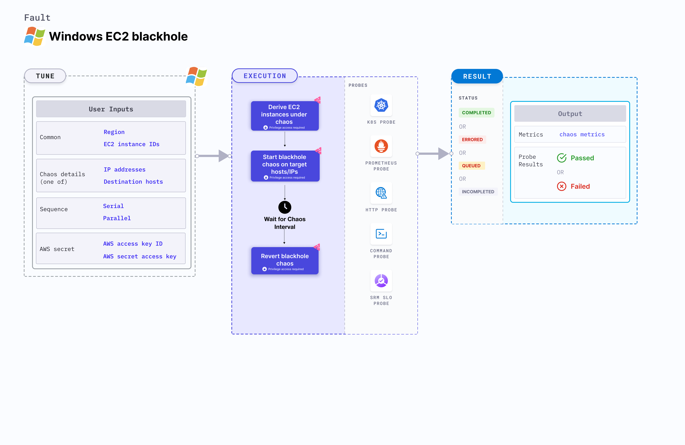

## Introduction

Windows EC2 blackhole chaos results in loss of access to the given target hosts or IPs by injecting firewall rules. This fault:
- Degrades the network without marking the EC2 instance as unhealthy (or unworthy) of traffic. This can be resolved by using a middleware that switches the traffic based on certain SLOs (performance parameters). 
- Limits the impact, that is, blast radius to only the traffic that you wish to test, by specifying the destination hosts or IP addresses. 



## Use cases

Windows EC2 blackhole chaos determines the performance of the application (or process) running on the EC2 instances.

:::info note
- Kubernetes version 1.17 or later is required to execute this fault.
- The EC2 instance must be in a healthy state.
- SSM agent must be installed and running on the target EC2 instance.
- Kubernetes secret must have the AWS Access Key ID and Secret Access Key credentials in the `CHAOS_NAMESPACE`. Below is a sample secret file:
  ```yaml
  apiVersion: v1
  kind: Secret
  metadata:
    name: cloud-secret
  type: Opaque
  stringData:
    cloud_config.yml: |-
      # Add the cloud AWS credentials respectively
      [default]
      aws_access_key_id = XXXXXXXXXXXXXXXXXXX
      aws_secret_access_key = XXXXXXXXXXXXXXXXXXXXXXXXXXXXXXXXXXXX
  ```
- Harness recommends using the same secret name, that is, `cloud-secret`. Otherwise, you must update the `AWS_SHARED_CREDENTIALS_FILE` environment variable in the fault template and you won't be able to use the default health check probes.
- Go to [AWS named profile for chaos](./security-configurations/aws-switch-profile.md) to use a different profile for AWS faults.
- Go to [superset permission/policy](./security-configurations/policy-for-all-aws-faults.md) to execute all AWS faults.
:::

Here is an example AWS policy to execute the fault.

```json
{
    "Version": "2012-10-17",
    "Statement": [
        {
            "Effect": "Allow",
            "Action": [
                "ssm:GetDocument",
                "ssm:DescribeDocument",
                "ssm:GetParameter",
                "ssm:GetParameters",
                "ssm:SendCommand",
                "ssm:CancelCommand",
                "ssm:CreateDocument",
                "ssm:DeleteDocument",
                "ssm:GetCommandInvocation",          
                "ssm:UpdateInstanceInformation",
                "ssm:DescribeInstanceInformation"
            ],
            "Resource": "*"
        },
        {
            "Effect": "Allow",
            "Action": [
                "ec2messages:AcknowledgeMessage",
                "ec2messages:DeleteMessage",
                "ec2messages:FailMessage",
                "ec2messages:GetEndpoint",
                "ec2messages:GetMessages",
                "ec2messages:SendReply"
            ],
            "Resource": "*"
        },
        {
            "Effect": "Allow",
            "Action": [
                "ec2:DescribeInstanceStatus",
                "ec2:DescribeInstances"
            ],
            "Resource": [
                "*"
            ]
        }
    ]
}
```

## Fault tunables

  <h3>Mandatory tunables</h3>
    <table>
      <tr>
        <th> Tunable </th>
        <th> Description </th>
        <th> Notes </th>
      </tr>
      <tr>
        <td> EC2_INSTANCE_ID </td>
        <td> ID of the target EC2 instance. </td>
        <td> For example, <code>i-044d3cb4b03b8af1f</code>. Provide any one value either instance id or tag.</td>
      </tr>
      <tr>
        <td> EC2_INSTANCE_TAGS </td>
        <td> Tag of the target EC2 instances. Provide any one value, either the instance Id or the tag.</td>
        <td> For example, <code>type:chaos</code>. </td>
      </tr>
      <tr>
        <td> REGION </td>
        <td> AWS region ID where the EC2 instance has been created. </td>
        <td> For example, <code>us-east-1</code>. </td>
      </tr>
    </table>
    <h3>Optional tunables</h3>
    <table>
        <tr>
            <th> Tunable </th>
            <th> Description </th>
            <th> Notes </th>
        </tr>
        <tr>
            <td> TOTAL_CHAOS_DURATION </td>
            <td> Duration that you specify, through which chaos is injected into the target resource (in seconds).</td>
        <td> Default: 30 s </td>
        </tr>
        <tr>
            <td> AWS_SHARED_CREDENTIALS_FILE </td>
            <td> Path to the AWS secret credentials.</td>
            <td> Default: <code>/tmp/cloud_config.yml</code>.</td>
        </tr>
        <tr>
            <td> IP_ADDRESSES </td>
            <td> IP addresses of the services whose accessibility is impacted. </td>
            <td> Comma-separated IP(s) can be provided. </td>
        </tr>
        <tr>
            <td> DESTINATION_HOSTS </td>
            <td> DNS Names of the services whose accessibility is impacted. </td>
            <td> If this value is not provided, the fault induces network chaos for all IPs or destinations or IP_ADDRESSES if already defined. </td>
        </tr>
        <tr>
            <td> SEQUENCE </td>
            <td> Sequence of chaos execution for multiple instances. </td>
            <td> Default: parallel. Supports serial and parallel. </td>
        </tr>
        <tr>
            <td> RAMP_TIME </td>
            <td> Period to wait before and after injecting chaos (in seconds).  </td>
            <td> For example, 30 s. </td>
        </tr>
    </table>


### Run with destination IPs

IP addresses of the services that interrupt the traffic. Tune it by using the `IP_ADDRESSES` environment variable.

The following YAML snippet illustrates the use of this environment variable:

[embedmd]:# (./static/manifests/windows-ec2-blackhole-chaos/destination-ip.yaml yaml)
```yaml
# it injects the chaos into the egress traffic for specific IPs/hosts
apiVersion: litmuschaos.io/v1alpha1
kind: ChaosEngine
metadata:
  name: engine-nginx
spec:
  engineState: "active"
  chaosServiceAccount: litmus-admin
  experiments:
  - name: windows-ec2-blackhole-chaos
    spec:
      components:
        env:
        # supports comma-separated destination ips
        - name: IP_ADDRESSES
          value: '8.8.8.8,192.168.5.6'
        - name: EC2_INSTANCE_ID
          value: 'instance-1'
        - name: REGION
          value: 'us-west-2'
```

### Run with destination hosts

Hosts that interrupt the traffic by default. These are the DNS names of the services whose accessibility is impacted. Tune it by using the `DESTINATION_HOSTS` environment variable.

The following YAML snippet illustrates the use of this environment variable:

[embedmd]:# (./static/manifests/windows-ec2-blackhole-chaos/destination-host.yaml yaml)
```yaml
# it injects the chaos into the egress traffic for specific IPs/hosts
apiVersion: litmuschaos.io/v1alpha1
kind: ChaosEngine
metadata:
  name: engine-nginx
spec:
  engineState: "active"
  chaosServiceAccount: litmus-admin
  experiments:
  - name: windows-ec2-blackhole-chaos
    spec:
      components:
        env:
        # supports comma-separated destination hosts
        - name: DESTINATION_HOSTS
          value: 'google.com'
        - name: EC2_INSTANCE_ID
          value: 'instance-1'
        - name: REGION
          value: 'us-west-2'
```