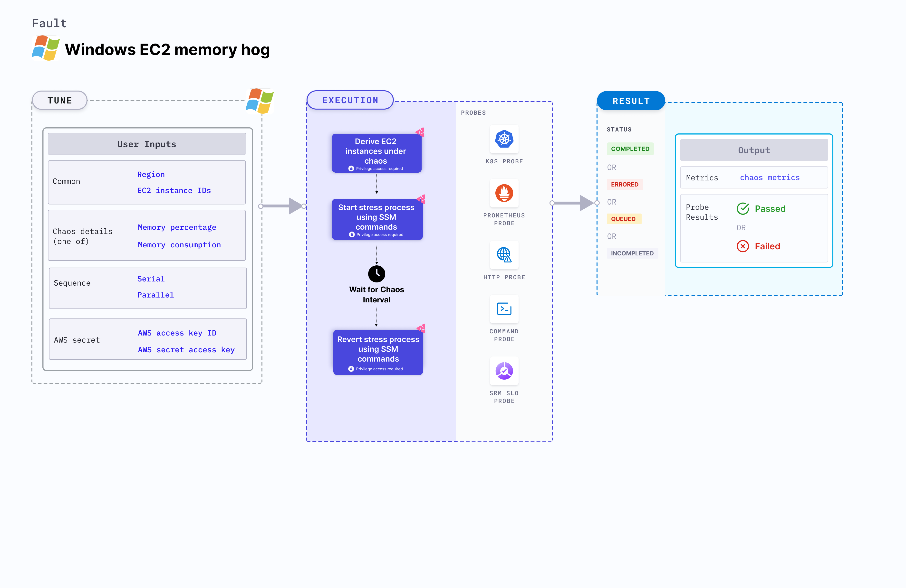

## Introduction

Windows EC2 memory hog induces memory stress on the target AWS Windows EC2 instance using Amazon SSM Run command. The SSM Run command is executed using SSM documentation that is built into the fault. This fault causes memory exhaustion on the target Windows EC2 instance for a specific duration.




## Use cases

Windows EC2 memory hog:
- Causes memory stress on the target AWS EC2 instance(s).
- Simulates the situation of memory leaks in the deployment of microservices.
- Simulates application slowness due to memory starvation, and noisy neighbour problems due to hogging.

:::info note
- Kubernetes version 1.17 or later is required to execute this fault.
- The EC2 instance must be in a healthy state.
- SSM agent must be installed and running on the target EC2 Windows instance in the admin mode.
- SSM IAM role must be attached to the target EC2 instance(s).
- Kubernetes secret must have the AWS Access Key ID and Secret Access Key credentials in the `CHAOS_NAMESPACE`. Below is a sample secret file:
    ```yaml
    apiVersion: v1
    kind: Secret
    metadata:
      name: cloud-secret
    type: Opaque
    stringData:
      cloud_config.yml: |-
        # Add the cloud AWS credentials respectively
        [default]
        aws_access_key_id = XXXXXXXXXXXXXXXXXXX
        aws_secret_access_key = XXXXXXXXXXXXXXXXXXXXXXXXXXXXXXXXXXXX
    ```
- Harness recommends using the same secret name, that is, `cloud-secret`. Otherwise, you will must update the `AWS_SHARED_CREDENTIALS_FILE` environment variable in the fault template and you won't be able to use the default health check probes.
- Go to [AWS named profile for chaos](./security-configurations/aws-switch-profile.md) to use a different profile for AWS faults.
:::

Here is an example AWS policy to execute the fault.

```json
{
    "Version": "2012-10-17",
    "Statement": [
        {
            "Effect": "Allow",
            "Action": [
                "ssm:GetDocument",
                "ssm:DescribeDocument",
                "ssm:GetParameter",
                "ssm:GetParameters",
                "ssm:SendCommand",
                "ssm:CancelCommand",
                "ssm:CreateDocument",
                "ssm:DeleteDocument",
                "ssm:GetCommandInvocation",          
                "ssm:UpdateInstanceInformation",
                "ssm:DescribeInstanceInformation"
            ],
            "Resource": "*"
        },
        {
            "Effect": "Allow",
            "Action": [
                "ec2messages:AcknowledgeMessage",
                "ec2messages:DeleteMessage",
                "ec2messages:FailMessage",
                "ec2messages:GetEndpoint",
                "ec2messages:GetMessages",
                "ec2messages:SendReply"
            ],
            "Resource": "*"
        },
        {
            "Effect": "Allow",
            "Action": [
                "ec2:DescribeInstanceStatus",
                "ec2:DescribeInstances"
            ],
            "Resource": [
                "*"
            ]
        }
    ]
}
```


## Fault tunables

<h3>Mandatory tunables</h3>
<table>
    <tr>
        <th> Tunable </th>
        <th> Description </th>
        <th> Notes </th>
    </tr>
    <tr>
        <td> EC2_INSTANCE_ID </td>
        <td> ID of the target EC2 instance. </td>
        <td> For example, <code>i-044d3cb4b03b8af1f</code>. </td>
    </tr>
    <tr>
        <td> REGION </td>
        <td> AWS region ID where the EC2 instance has been created. </td>
        <td> For example, <code>us-east-1</code>. </td>
    </tr>
</table>
<h3>Optional tunables</h3>
<table>
    <tr>
        <th> Tunable </th>
        <th> Description </th>
        <th> Notes </th>
    </tr>
    <tr>
        <td> TOTAL_CHAOS_DURATION </td>
        <td> Duration that you specify, through which chaos is injected into the target resource (in seconds).</td>
        <td> Default: 30 s </td>
    </tr>
    <tr>
        <td> AWS_SHARED_CREDENTIALS_FILE </td>
        <td> Path to the AWS secret credentials.</td>
        <td> Defaults to <code>/tmp/cloud_config.yml</code>. </td>
    </tr>
    <tr>
        <td> INSTALL_DEPENDENCIES </td>
        <td> Install dependencies to run the network chaos. It can be 'True' or 'False'. </td>
        <td> If the dependency already exists, you can turn it off. Default: True.</td>
    </tr>
    <tr>
        <td> MEMORY_CONSUMPTION </td>
        <td> Amount of memory to be consumed by the EC2 instance (in megabytes). </td>
        <td> Default: 0 MB. </td>
    </tr>
    <tr>
        <td> MEMORY_PERCENTAGE </td>
        <td> Amount of memory to be consumed by the EC2 instance (in percentage).</td>
        <td> Default: 50. </td>
    </tr>
    <tr>
        <td> SEQUENCE </td>
        <td> Sequence of chaos execution for multiple instances.</td>
        <td> Default: parallel. Supports serial and parallel. </td>
    </tr>
    <tr>
        <td> RAMP_TIME </td>
        <td> Period to wait before and after injecting chaos (in seconds).  </td>
        <td> For example, 30 s. </td>
    </tr>
</table>

### Memory consumption in megabytes

Memory utilized on the EC2 instance (in megabytes). Tune it by using the `MEMORY_CONSUMPTION` environment variable.

The following YAML snippet illustrates the use of this environment variable:

[embedmd]:# (./static/manifests/windows-ec2-memory-hog/memory-bytes.yaml yaml)
```yaml
# memory in mb to utilize
apiVersion: litmuschaos.io/v1alpha1
kind: ChaosEngine
metadata:
  name: engine-nginx
spec:
  engineState: "active"
  chaosServiceAccount: litmus-admin
  experiments:
  - name: windows-ec2-memory-hog
    spec:
      components:
        env:
        - name: MEMORY_CONSUMPTION
          VALUE: '1024'
        # ID of the EC2 instance
        - name: EC2_INSTANCE_ID
          value: 'instance-1'
        # region for the EC2 instance
        - name: REGION
          value: 'us-east-1'
```

### Memory consumption by percentage

Memory utilized on the EC2 instance (in percentage). Tune it by using the `MEMORY_PERCENTAGE` environment variable.

The following YAML snippet illustrates the use of this environment variable:

[embedmd]:# (./static/manifests/windows-ec2-memory-hog/memory-percentage.yaml yaml)
```yaml
# memory percentage to utilize
apiVersion: litmuschaos.io/v1alpha1
kind: ChaosEngine
metadata:
  name: engine-nginx
spec:
  engineState: "active"
  chaosServiceAccount: litmus-admin
  experiments:
  - name: windows-ec2-memory-hog
    spec:
      components:
        env:
        - name: MEMORY_PERCENTAGE
          value: '50'
        - name: MEMORY_CONSUMPTION
          value: '0'
        # ID of the EC2 instance
        - name: EC2_INSTANCE_ID
          value: 'instance-1'
        # region for the EC2 instance
        - name: REGION
          value: 'us-east-1'
```

### Multiple EC2 instances

Multiple EC2 instances specified as comma-separated IDs targeted in one chaos run. Tune it by using the `EC2_INSTANCE_ID` environment variable.

The following YAML snippet illustrates the use of this environment variable:

[embedmd]:# (./static/manifests/windows-ec2-memory-hog/multiple-instances.yaml yaml)
```yaml
# multiple instance targets
apiVersion: litmuschaos.io/v1alpha1
kind: ChaosEngine
metadata:
  name: engine-nginx
spec:
  engineState: "active"
  chaosServiceAccount: litmus-admin
  experiments:
  - name: windows-ec2-memory-hog
    spec:
      components:
        env:
        # ids of the EC2 instances
        - name: EC2_INSTANCE_ID
          value: 'instance-1,instance-2,instance-3'
        # region for the EC2 instance
        - name: REGION
          value: 'us-east-1'
```