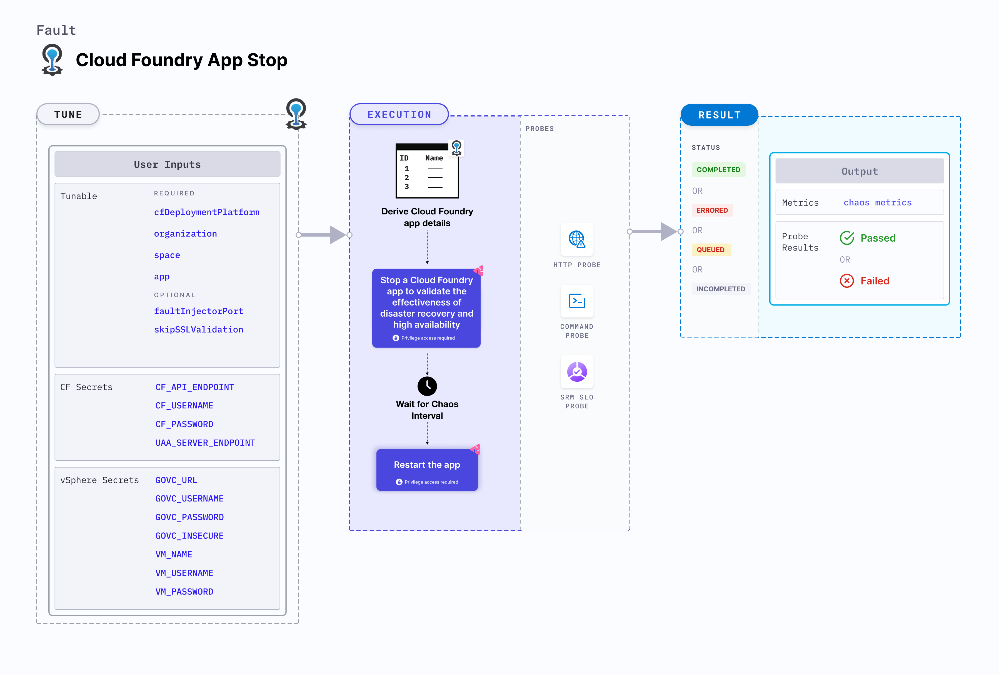

CF app stop fault stops a Cloud Foundry app and later starts it.



## Use cases
CF app stop fault:
- Checks app resilience against abrupt stopping.
- Validates the effectiveness of disaster recovery and high availability of the app.

## Fault tunables
<h3>Mandatory fields</h3>
<table>
  <tr>
    <th> Tunable </th>
    <th> Description </th>
    <th> Notes </th>
  </tr>
  <tr>
    <td> cfDeploymentPlatform </td>
    <td> Deployment platform used for cloud foundry, with respect to where the infrastructure is executing </td>
    <td> Supports <code>local</code> and <code>vSphere</code> </td>
  </tr>
  <tr>
    <td> organization </td>
    <td> Organization where the target app resides </td>
    <td> For example, <code>dev-org</code> </td>
  </tr>
  <tr>
    <td> space </td>
    <td> Space where the target app resides </td>
    <td> The space must reside within the given organization. For example, <code>dev-space</code> </td>
  </tr>
  <tr>
    <td> app </td>
    <td> The app to be stopped </td>
    <td> The app must reside within the given organization and space. For example, <code>cf-app</code> </td>
  </tr>
</table>

<h3>Optional fields</h3>
<table>
  <tr>
    <th> Tunable </th>
    <th> Description </th>
    <th> Notes </th>
  </tr>
  <tr>
    <td> faultInjectorPort </td>
    <td> Local server port used by the fault-injector utility </td>
    <td> Default: <code>50320</code>. If the default port is unavailable, a random port in the range of <code>50320-51320</code> is selected. </td>
  </tr>
  <tr>
    <td> duration </td>
    <td> Duration through which chaos is injected into the target resource (in seconds). </td>
    <td> Default: 30 </td>
  </tr>
  <tr>
    <td> skipSSLValidation </td>
    <td> Skip SSL validation while invoking CF APIs </td>
    <td> Supports <code>true</code> and <code>false</code>. Default: <code>false</code> </td>
  </tr>
  <tr>
    <td> duration </td>
    <td> Duration through which chaos is injected into the target resource (in seconds). </td>
    <td> Defaults to 30. </td>
  </tr>
  <tr>
    <td> rampTime </td>
    <td> Period to wait before and after injecting chaos (in seconds). </td>
    <td> Defaults to 0. </td>
  </tr>
</table>

## CF secrets
The following Cloud Foundry secrets reside on the same machine where the chaos infrastructure is executed. These secrets are provided in the `/etc/linux-chaos-infrastructure/cf.env` file in the following format:

```env
CF_API_ENDPOINT=XXXXXXXXXXXXXXXXXXX
CF_USERNAME=XXXXXXXXXXXXXXXXXXXXXXX
CF_PASSWORD=XXXXXXXXXXXXXXXXXXXXXXX
UAA_SERVER_ENDPOINT=XXXXXXXXXXXXXXX
```

:::note
If the secrets file is not provided, the secrets are attempted to be derived as environment variables by the fault-injector utility.
:::

<table>
  <tr>
    <th> ENV Name </th>
    <th> Description </th>
    <th> Notes </th>
  </tr>
  <tr>
    <td> CF_API_ENDPOINT </td>
    <td> API endpoint for the CF setup </td>
    <td> For example, <code>https://api.system.cf-setup.com</code> </td>
  </tr>
  <tr>
    <td> CF_USERNAME </td>
    <td> Username for the CF user </td>
    <td> For example, <code>username</code> </td>
  </tr>
  <tr>
    <td> CF_PASSWORD </td>
    <td> Password for the CF user </td>
    <td> For example, <code>password</code> </td>
  </tr>
  <tr>
    <td> UAA_SERVER_ENDPOINT </td>
    <td> API endpoint for the UAA server for the CF setup </td>
    <td> For example, <code>https://uaa.system.cf-setup.com</code> </td>
  </tr>
</table>

## vSphere secrets
These secrets are provided only if vSphere is used as the deployment platform for CF.

The following vSphere secrets reside on the same machine where the chaos infrastructure is executed. These secrets are provided in the `/etc/linux-chaos-infrastructure/vsphere.env` file in the following format:

```env
GOVC_URL=XXXXXXXXXXXXXXXXXXXXXX
GOVC_USERNAME=XXXXXXXXXXXXXXXXX
GOVC_PASSWORD=XXXXXXXXXXXXXXXXX
GOVC_INSECURE=XXXXXXXXXXXXXXXXX
VM_NAME=XXXXXXXXXXXXXXXXXXXXXXX
VM_USERNAME=XXXXXXXXXXXXXXXXXXX
VM_PASSWORD=XXXXXXXXXXXXXXXXXXX
```

<table>
  <tr>
    <th> ENV Name </th>
    <th> Description </th>
    <th> Notes </th>
  </tr>
  <tr>
    <td> GOVC_URL </td>
    <td> Endpoint for vSphere </td>
    <td> For example, <code>192.168.214.244</code> </td>
  </tr>
  <tr>
    <td> GOVC_USERNAME </td>
    <td> Username for the vSphere user </td>
    <td> For example, <code>username</code> </td>
  </tr>
  <tr>
    <td> GOVC_PASSWORD </td>
    <td> Password for the vSphere user </td>
    <td> For example, <code>password</code> </td>
  </tr>
  <tr>
    <td> GOVC_INSECURE </td>
    <td> Skip SSL validation for govc commands </td>
    <td> For example, <code>true</code> </td>
  </tr>
  <tr>
    <td> VM_NAME </td>
    <td> Name of the vSphere VM where the fault-injector utility is installed </td>
    <td> For example, <code>cf-vm</code> </td>
  </tr>
  <tr>
    <td> VM_USERNAME </td>
    <td> Username for the VM guest user </td>
    <td> For example, <code>root</code> </td>
  </tr>
  <tr>
    <td> VM_PASSWORD </td>
    <td> Password for the VM guest user </td>
    <td> For example, <code>password</code> </td>
  </tr>
</table>

### CF deployment platform
The `cfDeploymentPlatform` input variable determines the deployment platform used for CF with respect to the infrastructure.
- The deployment platform can be local, that is, the same environment used by the infrastructure, or a remote machine.
- The deployment platform is where the fault-injector utility executes.

The following YAML snippet illustrates the use of this environment variable:

[embedmd]:# (./static/manifests/cf-app-stop/cfDeploymentPlatform.yaml yaml)
```yaml
# cf deployment platform
apiVersion: litmuchaos.io/v1alpha1
kind: LinuxFault
metadata:
  name: cf-app-stop
  labels:
    name: app-stop
spec:
  cfAppStop/inputs:
    duration: 30
    cfDeploymentPlatform: vSphere
    app: cf-app
    organization: dev-org
    space: dev-space
```

### Skip SSL validation
The `skipSSLValidation` input variable determines whether to skip SSL validation for calling the CF APIs.

The following YAML snippet illustrates the use of this environment variable:

[embedmd]:# (./static/manifests/cf-app-stop/skipSSLValidation.yaml yaml)
```yaml
# skip ssl validation for cf
apiVersion: litmuchaos.io/v1alpha1
kind: LinuxFault
metadata:
  name: cf-app-stop
  labels:
    name: app-stop
spec:
  cfAppStop/inputs:
    duration: 30
    cfDeploymentPlatform: vSphere
    app: cf-app
    organization: dev-org
    space: dev-space
    skipSSLValidation: true
```

### Fault injector port
The `faultInjectorPort` input variable determines the port used for the fault-injector local server.

The following YAML snippet illustrates the use of this environment variable:

[embedmd]:# (./static/manifests/cf-app-stop/faultInjectorPort.yaml yaml)
```yaml
# fault injector port
apiVersion: litmuchaos.io/v1alpha1
kind: LinuxFault
metadata:
  name: cf-app-stop
  labels:
    name: app-stop
spec:
  cfAppStop/inputs:
    duration: 30
    cfDeploymentPlatform: local
    app: cf-app
    organization: dev-org
    space: dev-space
    faultInjectorPort: 50331
```
