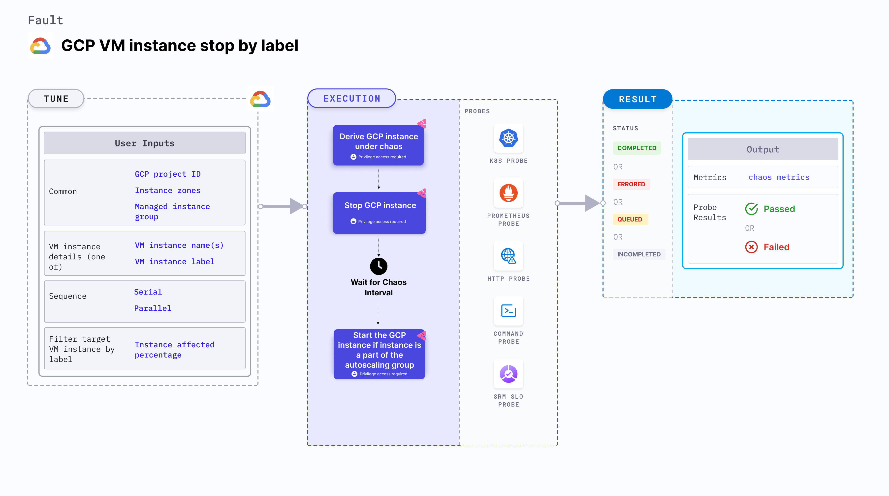

GCP VM instance stop by label powers off from the GCP VM instances (filtered by a label before) for a specific duration.



## Use cases

- GCP VM instance stop by label fault determines the resilience of an application that runs on a VM instance when a VM instance unexpectedly stops (or fails).

:::info note
- Kubernetes > 1.16 is required to execute this fault.
- Adequate GCP permissions to stop and start the GCP VM instances.
- The VM instances with the target label should be in a healthy state.
- Kubernetes secret should have the GCP service account credentials in the default namespace. Refer [generate the necessary credentials in order to authenticate your identity with the Google Cloud Platform (GCP)](/docs/chaos-engineering/technical-reference/chaos-faults/gcp/security-configurations/prepare-secret-for-gcp) docs for more information.

```yaml
apiVersion: v1
kind: Secret
metadata:
  name: cloud-secret
type: Opaque
stringData:
  type:
  project_id:
  private_key_id:
  private_key:
  client_email:
  client_id:
  auth_uri:
  token_uri:
  auth_provider_x509_cert_url:
  client_x509_cert_url:
```
:::

## Fault tunables
  <h3>Mandatory fields</h3>
    <table>
      <tr>
        <th> Variables </th>
        <th> Description </th>
        <th> Notes </th>
      </tr>
      <tr>
        <td> GCP_PROJECT_ID </td>
        <td> Id of the GCP project that belong to the VM instances. </td>
        <td> All the VM instances should belong to a single GCP project. For more information, go to <a href="/docs/chaos-engineering/technical-reference/chaos-faults/gcp/gcp-vm-disk-loss-by-label/#gcp-project-id">GCP project ID.</a></td>
      </tr>
      <tr>
        <td> INSTANCE_LABEL </td>
        <td> Name of the target VM instances. </td>
        <td> This value is provided as <code>key:value</code> pair or as a <code>key</code> if the corresponding value is empty. For example, <code>vm:target-vm</code>. For more information, go to <a href="/docs/chaos-engineering/technical-reference/chaos-faults/gcp/gcp-vm-instance-stop-by-label/#target-gcp-instances">target GCP instances. </a></td>
      </tr>
      <tr>
        <td> ZONES </td>
        <td> The zone of the target VM instances. </td>
        <td> Only one zone is provided, that is, all the target instances should reside in the same zone. For more information, go to <a href="/docs/chaos-engineering/technical-reference/chaos-faults/gcp/gcp-vm-disk-loss-by-label/#zones">zones. </a></td>
      </tr>
    </table>
    <h3>Optional fields</h3>
    <table>
      <tr>
        <th> Variables </th>
        <th> Description </th>
        <th> Notes </th>
      </tr>
      <tr>
        <td> TOTAL_CHAOS_DURATION </td>
        <td> Duration that you specify, through which chaos is injected into the target resource (in seconds). </td>
        <td> Defaults to 30s. For more information, go to <a href="/docs/chaos-engineering/technical-reference/chaos-faults/common-tunables-for-all-faults/#duration-of-the-chaos">duration of the chaos.</a></td>
      </tr>
       <tr>
        <td> CHAOS_INTERVAL </td>
        <td> Time interval between two successive instance terminations (in seconds). </td>
        <td> Defaults to 30s. For more information, go to <a href="/docs/chaos-engineering/technical-reference/chaos-faults/common-tunables-for-all-faults#chaos-interval">chaos interval. </a></td>
      </tr>
      <tr>
        <td> MANAGED_INSTANCE_GROUP </td>
        <td> It is set to <code>enable</code> if the target instance is a part of the managed instance group. The fault doesn't start the VM instances after the duration when this variable is set. Instead, the fault checks the instance group for new instances.</td> 
        <td> Defaults to <code>disable</code>. For more information, go to <a href="/docs/chaos-engineering/technical-reference/chaos-faults/gcp/gcp-vm-instance-stop#managed-instance-group">managed instance group. </a></td>
      </tr>
      <tr>
        <td> INSTANCE_AFFECTED_PERC </td>
        <td> Percentage of the total VMs filtered using the target label (specify numeric values only). </td>
        <td> Defaults to 0 (corresponds to 1 instance). For more information, go to <a href="/docs/chaos-engineering/technical-reference/chaos-faults/gcp/gcp-vm-instance-stop/#managed-instance-group">instance affected percentage. </a></td>
      </tr>
      <tr>
        <td> SEQUENCE </td>
        <td> Sequence of chaos execution for multiple target instances. </td>
        <td> Defaults to parallel. It supports serial sequence as well. For more information, go to <a href="/docs/chaos-engineering/technical-reference/chaos-faults/common-tunables-for-all-faults/#sequence-of-chaos-execution">sequence of chaos execution.</a></td>
      </tr>
      <tr>
        <td> RAMP_TIME </td>
        <td> Period to wait before and after injecting chaos (in seconds). </td>
        <td> For example, 30s. For more information, go to <a href="/docs/chaos-engineering/technical-reference/chaos-faults/common-tunables-for-all-faults/#ramp-time">ramp time.</a></td>
      </tr>
    </table>

### Instance affected percentage

It specifies the number of VMs filtered using the target label. It defaults to 0 that corresponds to a single instance. Tune it by using the `INSTANCE_AFFECTED_PERC` environment variable. 

### Target GCP instances

It stops all the instances that are filtered using the `INSTANCE_LABEL` label in the `ZONES` zone in the `GCP_PROJECT_ID` project.

**Note:** `INSTANCE_LABEL` environment variable accepts only one label and `ZONES` accepts only one zone name. Therefore, all the instances must reside in the same zone.

Use the following example to tune it:

[embedmd]:# (./static/manifests/gcp-vm-instance-stop-by-label/gcp-instance.yaml yaml)
```yaml
apiVersion: litmuschaos.io/v1alpha1
kind: ChaosEngine
metadata:
  name: engine-nginx
spec:
  engineState: "active"
  chaosServiceAccount: litmus-admin
  experiments:
  - name: gcp-vm-instance-stop-by-label
    spec:
      components:
        env:
        - name: INSTANCE_LABEL
          value: 'vm:target-vm'
        - name: ZONES
          value: 'us-east1-b'
        - name: GCP_PROJECT_ID
          value: 'my-project-4513'
        - name: TOTAL_CHAOS_DURATION
          VALUE: '60'
```

### Managed instance group

If the VM instances belong to a managed instance group set the `MANAGED_INSTANCE_GROUP` environment variable to `enable` , otherwise set it `disable` (the default value).

Use the following example to tune it:

[embedmd]:# (./static/manifests/gcp-vm-instance-stop-by-label/managed-instance-group.yaml yaml)
```yaml
apiVersion: litmuschaos.io/v1alpha1
kind: ChaosEngine
metadata:
  name: engine-nginx
spec:
  engineState: "active"
  chaosServiceAccount: litmus-admin
  experiments:
  - name: gcp-vm-instance-stop-by-label
    spec:
      components:
        env:
        - name: MANAGED_INSTANCE_GROUP
          value: 'enable'
        - name: INSTANCE_LABEL
          value: 'vm:target-vm'
        - name: ZONES
          value: 'us-east1-b'
        - name: GCP_PROJECT_ID
          value: 'my-project-4513'
        - name: TOTAL_CHAOS_DURATION
          VALUE: '60'
        - name: INSTANCE_AFFECTED_PERC
          VALUE: "0"
```
