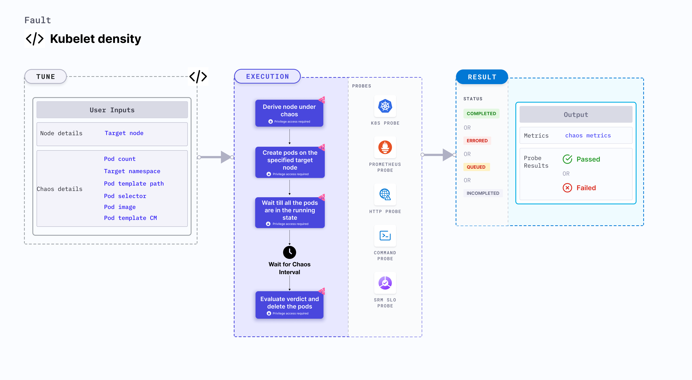

Kubelet density determines the resilience of the kubelet by creating pods on a specific node.
- In distributed systems like Kube resilience, application replicas might not be sufficient to manage the traffic (indicated by SLIs) during system (or application) failures. 
- A common application failure occurs when the pressure on other replicas increases, and the horizontal pod autoscaler (HPA) scales based on the observed resource utilization, and the amount of time it takes the persistent volume to mount on rescheduling.
- In case of failures, the application needs to meet the SLOs (service level objectives) by making a minimum number of replicas available.



## Use cases

- Kubelet density determines how resilient an application is to unplanned scaling of Kubernetes pods.
- It simulates pod-storm (due to autoscale) on high traffic conditions.
- It verifies functioning of the application services from latency and availability standpoint.
- It ensures that the topology constraints are adhered to on pod scale (node selectors, tolerations, zone distribution, affinity or anti-affinity policies). 
- It also verifies pod creation and scheduling SLIs on the cluster nodes.
- It also helps determine the performance of the kubelet for a specific node.

:::note
- Kubernetes > 1.16 is required to execute this fault.
- The target nodes should be in the healthy state before and after injecting chaos.
:::

## Fault tunables

   <h3>Mandatory fields</h3>
    <table>
      <tr>
        <th> Variables </th>
        <th> Description </th>
        <th> Notes </th>
      </tr>
      <tr>
        <td> TARGET_NODE </td>
        <td> Name of the target node. </td>
        <td> If this environment variable isn't set, a random target node is selected. For more information, go to <a href = "https://developer.harness.io/docs/chaos-engineering/chaos-faults/kubernetes/node/common-tunables-for-node-faults#target-single-node"> target node. </a></td>
      </tr>
    </table>
    <h3>Optional fields</h3>
    <table>
      <tr>
        <th> Variables </th>
        <th> Description </th>
        <th> Notes </th>
      </tr>
      <tr>
        <td> TOTAL_CHAOS_DURATION </td>
        <td> Duration that you specify, through which chaos is injected into the target resource (in seconds). </td>
        <td> Defaults to 90s. For more information, go to <a href="https://developer.harness.io/docs/chaos-engineering/chaos-faults/common-tunables-for-all-faults/#duration-of-the-chaos"> duration of the chaos.</a></td>
      </tr>
      <tr>
        <td> POD_COUNT </td>
        <td> Total number of pods that are created during chaos. </td>
        <td> Defaults to 50. For more information, go to <a href="https://developer.harness.io/docs/chaos-engineering/chaos-faults/kube-resilience/kubelet-density/#pod-count"> pod count. </a></td>
      </tr>
      <tr>
        <td> TARGET_NAMESPACE </td>
        <td> Namespace where the pods will be created. </td>
        <td> Defaults to the namespace specified in <code>CHAOS_NAMESPACE</code>. For more information, go to <a href="https://developer.harness.io/docs/chaos-engineering/chaos-faults/kube-resilience/kubelet-density/#target-namespace"> target namespace. </a></td>
      </tr>
      <tr>
        <td> POD_TEMPLATE_CM </td>
        <td> Name of the config map that contains the pod template. </td>
        <td> For example: <code>stress-app-manifest</code>. For more information, go to <a href="https://developer.harness.io/docs/chaos-engineering/chaos-faults/kube-resilience/kubelet-density/#pod-template-provided-as-configmap"> pod template provided as a configmap. </a></td>
      </tr>
      <tr>
        <td> POD_TEMPLATE_PATH </td>
        <td> Path to the pod template configMap mount. </td>
        <td> Defaults to <code>/templates/pod.yml</code>. For more information, go to <a href="https://developer.harness.io/docs/chaos-engineering/chaos-faults/kube-resilience/kubelet-density/#pod-template-provided-as-configmap"> pod template provided as a configmap</a></td>
      </tr>
      <tr>
        <td> POD_SELECTOR </td>
        <td> Labels of destination pods.</td>
        <td> Defaults to <code>&#123;name: kubelet-density-app&#125;</code>. For more information, go to <a href="https://developer.harness.io/docs/chaos-engineering/chaos-faults/kube-resilience/kubelet-density#pod-image-and-pod-selectors">pod selector.</a> </td>
      </tr>
      <tr>
        <td> POD_IMAGE </td>
        <td> Pod image used to create multiple pods. </td>
        <td> Defaults to <code>gcr.io/google_containers/pause-amd64:3.0</code>. For more information, go to <a href="https://developer.harness.io/docs/chaos-engineering/chaos-faults/kube-resilience/kubelet-density#pod-image-and-pod-selectors">pod image.</a> </td>
      </tr>
      <tr>
        <td> RAMP_TIME </td>
        <td> Period to wait before and after injecting chaos (in seconds). </td>
        <td> For example, 30s. For more information, go to <a href= "https://developer.harness.io/docs/chaos-engineering/chaos-faults/common-tunables-for-all-faults#ramp-time">ramp time.</a></td>
      </tr>
    </table>

### Pod template provided as a configmap

A chaos experiment creates pods on the target node during execution. The template for the pod is provided by mounting the pod template using the configmap and passing the name and `mountPath` of the pod using the `POD_TEMPLATE_CM` and `POD_TEMPLATE_PATH` environment variables, respectively.

Use the following example to tune it:

[embedmd]: # "./static/manifests/kubelet-density/pod-template.yaml yaml"

```yaml
# defines pod template cm and its mount path
apiVersion: litmuschaos.io/v1alpha1
kind: ChaosEngine
metadata:
  name: engine-nginx
spec:
  engineState: "active"
  annotationCheck: "false"
  chaosServiceAccount: litmus-admin
  experiments:
    - name: kubelet-density
      spec:
        components:
          env:
            # name of the pod template cm
            - name: POD_TEMPLATE_CM
              value: "pod-template-cm"
              # mount path of the cm
            - name: POD_TEMPLATE_PATH
              VALUE: "/templates/pod.yml"
            - name: TARGET_NODE
              value: "node1"
```

### Pod count

It specifies the number of the pods that will be created on the target node. Tune it by using the `POD_COUNT` environment variable.

Use the following example to tune it:

[embedmd]: # "./static/manifests/kubelet-density/pod-count.yaml yaml"

```yaml
# defines count of the pod
apiVersion: litmuschaos.io/v1alpha1
kind: ChaosEngine
metadata:
  name: engine-nginx
spec:
  engineState: "active"
  annotationCheck: "false"
  chaosServiceAccount: litmus-admin
  experiments:
    - name: kubelet-density
      spec:
        components:
          env:
            # number of pods, which needs to be created
            - name: POD_COUNT
              value: "50"
            - name: TARGET_NODE
              value: "node1"
```

### Target namespace

It specifies the namespace where the pods are created. Tune it by using the `TARGET_NAMESPACE` environment variable.

Use the following example to tune it:

[embedmd]: # "./static/manifests/kubelet-density/target-namespace.yaml yaml"

```yaml
# defines pod namespace
apiVersion: litmuschaos.io/v1alpha1
kind: ChaosEngine
metadata:
  name: engine-nginx
spec:
  engineState: "active"
  annotationCheck: "false"
  chaosServiceAccount: litmus-admin
  experiments:
    - name: kubelet-density
      spec:
        components:
          env:
            # namespace where pods need to be created
            - name: TARGET_NAMESPACE
              value: "litmus"
            - name: TARGET_NODE
              value: "node1"
```

### Pod image and pod selectors

Tune the pod image and label selectors by using the `POD_IMAGE` and `POD_SELECTOR` environment variables, respectively.

Use the following example to tune it:

[embedmd]: # "./static/manifests/kubelet-density/pod-image-and-selectors.yaml yaml"

```yaml
# defines pod image and label selectors
apiVersion: litmuschaos.io/v1alpha1
kind: ChaosEngine
metadata:
  name: engine-nginx
spec:
  engineState: "active"
  annotationCheck: "false"
  chaosServiceAccount: litmus-admin
  experiments:
    - name: kubelet-density
      spec:
        components:
          env:
            # image of the pod
            - name: POD_IMAGE
              value: "nginx"
            # pod label selectors
            - name: POD_SELECTOR
              value: "{name: kubelet-density-app}"
            - name: TARGET_NODE
              value: "node1"
```
