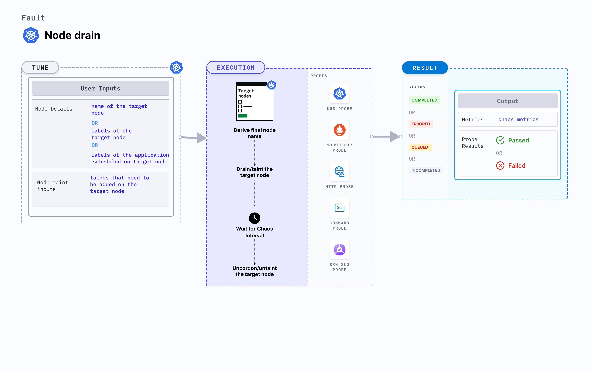

## Introduction

Node drain drains the node of all its resources running on it. Due to this, services running on the target node should be rescheduled to run on other nodes. 




## Use cases
- Node drain fault drains all the resources running on a node. 
- It determines the resilience of the application when the application replicas scheduled on a node are removed.
- It validates the application failover capabilities when a node suddenly becomes unavailable.
- It simulates node maintenance activity (hardware refresh, OS patching, Kubernetes upgrade). 
- It verifies resource budgeting on cluster nodes (whether request (or limit) settings are honored on available nodes).
- It verifies whether topology constraints are adhered to (node selectors, tolerations, zone distribution, affinity(or anti-affinity) policies) or not. 

:::info note
- Kubernetes > 1.16 is required to execute this fault.
- Node specified in the <code>TARGET_NODE</code> environment variable should be cordoned before executing the chaos fault. This ensures that the fault resources are not scheduled on it (or subject to eviction). This is achieved by the following steps:
  - Get node names against the applications pods using command <code>kubectl get pods -o wide</code>.
  - Cordon the node using command <code>kubectl cordon &lt;nodename&gt;</code>.
- The target nodes should be in the ready state before and after injecting chaos.
:::

## Fault tunables

   <h3>Mandatory tunables</h3>
    <table>
      <tr>
        <th> Tunable </th>
        <th> Description </th>
        <th> Notes </th>
      </tr>
      <tr>
        <td> TARGET_NODES </td>
        <td> Comma-separated list of nodes subject to node CPU hog. </td>
        <td> For more information, go to <a href = "https://developer.harness.io/docs/chaos-engineering/chaos-faults/kubernetes/node/common-tunables-for-node-faults#target-multiple-nodes">target nodes.</a></td>
      </tr>
      <tr>
        <td> NODE_LABEL </td>
        <td> It contains the node label that is used to filter the target nodes.</td>
        <td>It is mutually exclusive with the <code>TARGET_NODES</code> environment variable. If both are provided, <code>TARGET_NODES</code> takes precedence. For more information, go to <a href="https://developer.harness.io/docs/chaos-engineering/chaos-faults/kubernetes/node/common-tunables-for-node-faults#target-nodes-with-labels">node label.</a></td>
      </tr>
    </table>
    <h3>Optional tunables</h3>
    <table>
      <tr>
        <th> Tunable </th>
        <th> Description </th>
        <th> Notes </th>
      </tr>
      <tr>
        <td> TOTAL_CHAOS_DURATION </td>
        <td> Duration that you specify, through which chaos is injected into the target resource (in seconds). </td>
        <td> Default: 60 s. For more information, go to <a href = "https://developer.harness.io/docs/chaos-engineering/chaos-faults/common-tunables-for-all-faults#duration-of-the-chaos">duration of the chaos.</a></td>
      </tr>
      <tr>
        <td> RAMP_TIME </td>
        <td> Period to wait before and after injecting chaos (in seconds). </td>
        <td> For example, 30 s. For more information, go to <a href = "https://developer.harness.io/docs/chaos-engineering/chaos-faults/common-tunables-for-all-faults#ramp-time">ramp time.</a></td>
      </tr>
    </table>

### Drain node

Name of the target node. Tune it by using the `TARGET_NODE` environment variable.

The following YAML snippet illustrates the use of this environment variable:

[embedmd]:# (./static/manifests/node-drain/node-drain.yaml yaml)
```yaml
# drain the targeted node
apiVersion: litmuschaos.io/v1alpha1
kind: ChaosEngine
metadata:
  name: engine-nginx
spec:
  engineState: "active"
  annotationCheck: "false"
  chaosServiceAccount: litmus-admin
  experiments:
  - name: node-drain
    spec:
      components:
        env:
        # name of the target node
        - name: TARGET_NODE
          value: 'node01'
        - name: TOTAL_CHAOS_DURATION
          VALUE: '60'
```
