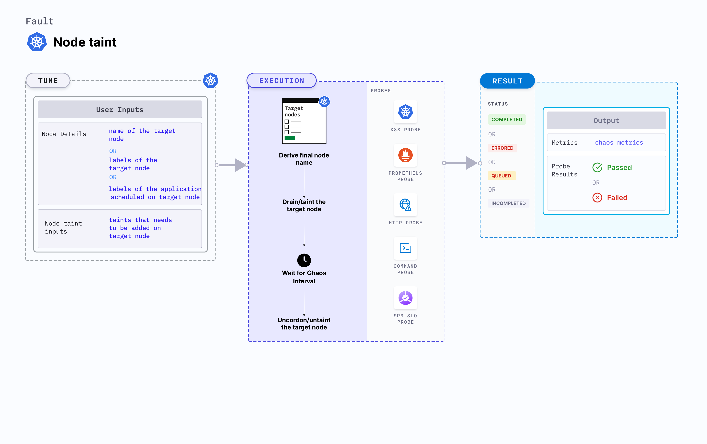

## Introduction

Node taint taints the node by applying the desired effect. Only the resources that contain the corresponding tolerations can bypass the taints.



## Use cases
- Node taint fault verifies the resilience of applications when a certain taint is added to a node. 
- It simulates loss of critical services (or node-crash). 
- It verifies resource budgeting on cluster nodes (whether request(or limit) settings are honored on the available nodes).
- It verifies whether topology constraints are adhered to (node selectors, tolerations, zone distribution, affinity(or anti-affinity) policies) or not.

:::info note
- Kubernetes > 1.16 is required to execute this fault.
- Node specified in the <code>TARGET_NODE</code> environment variable should be cordoned before executing the chaos fault. This ensures that the fault resources are not scheduled on it (or subject to eviction). This is achieved by the following steps:
  - Get node names against the applications pods using command <code>kubectl get pods -o wide</code>.
  - Cordon the node using command <code>kubectl cordon &lt;nodename&gt;</code>.
- The target nodes should be in the ready state before and after injecting chaos.
:::

## Fault tunables

   <h3>Mandatory tunables</h3>
    <table>
      <tr>
        <th> Tunable </th>
        <th> Description </th>
        <th> Notes </th>
      </tr>
      <tr>
        <td> TARGET_NODE </td>
        <td> Name of the node to be tainted. </td>
        <td> For more information, go to <a href = "https://developer.harness.io/docs/chaos-engineering/chaos-faults/kubernetes/node/common-tunables-for-node-faults#target-single-node">target node.</a></td>
      </tr>
      <tr>
         <td> NODE_LABEL </td>
        <td> It contains node label, which will be used to filter the target nodes if <code>TARGET_NODES</code> ENV is not set </td>
        <td>It is mutually exclusive with the <code>TARGET_NODES</code> environment variable. If both are provided, the fault uses the <code>TARGET_NODES</code>. For more information, go to <a href="https://developer.harness.io/docs/chaos-engineering/chaos-faults/kubernetes/node/common-tunables-for-node-faults#target-nodes-with-labels">node label.</a></td>
      </tr>
      <tr>
        <td> TAINT_LABEL </td>
        <td> Label and the effect to be tainted on the application node. </td>
        <td> For more information, go to <a href="https://developer.harness.io/docs/chaos-engineering/chaos-faults/kubernetes/node/node-taint/#taint-label"> taint label.</a></td>
      </tr>
    </table>
    <h3>Optional tunables</h3>
    <table>
      <tr>
        <th> Tunable </th>
        <th> Description </th>
        <th> Notes </th>
      </tr>
      <tr>
        <td> TOTAL_CHAOS_DURATION </td>
        <td> Duration that you specify, through which chaos is injected into the target resource (in seconds). </td>
        <td> Default: 60 s. For more information, go to <a href = "https://developer.harness.io/docs/chaos-engineering/chaos-faults/common-tunables-for-all-faults#duration-of-the-chaos">duration of the chaos.</a></td>
      </tr>
      <tr>
        <td> RAMP_TIME </td>
        <td> Period to wait before and after injecting chaos (in seconds). </td>
        <td> For example, 30 s. For more information, go to <a href = "https://developer.harness.io/docs/chaos-engineering/chaos-faults/common-tunables-for-all-faults#ramp-time">ramp time.</a></td>
      </tr>
    </table>


### Taint label

Label and the effect that is tainted on the application node. Tune it by using the `TAINT_LABEL` environment variable.

The following YAML snippet illustrates the use of this environment variable:

[embedmd]:# (./static/manifests/node-taint/taint-labels.yaml yaml)
```yaml
# node tainted with provided key and effect
apiVersion: litmuschaos.io/v1alpha1
kind: ChaosEngine
metadata:
  name: engine-nginx
spec:
  engineState: "active"
  annotationCheck: "false"
  chaosServiceAccount: litmus-admin
  experiments:
  - name: node-taint
    spec:
      components:
        env:
        # label and effect to be tainted on the targeted node
        - name: TAINT_LABEL
          value: 'key=value:effect'
        - name: TOTAL_CHAOS_DURATION
          VALUE: '60'
```
