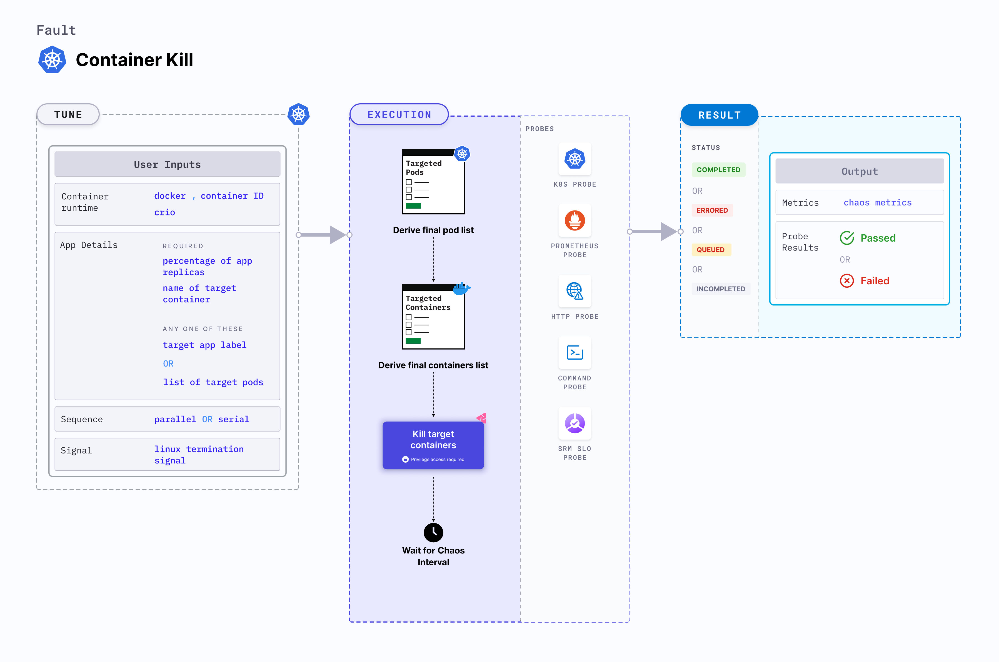

## Introduction

Container kill is a Kubernetes pod-level chaos fault that causes container failure on specific or random replicas of an application resource.



## Use cases

Container kill:
- Tests an application's deployment sanity (replica availability and uninterrupted service) and recovery workflow when certain replicas are not available.
- Tests the recovery of pods that possess sidecar containers.

:::info note
- Kubernetes > 1.16 is required to execute this fault.
- The application pods should be in the running state before and after injecting chaos.
:::

## Fault tunables

  <h3>Optional tunables</h3>
    <table>
      <tr>
        <th> Tunable </th>
        <th> Description  </th>
        <th> Notes </th>
      </tr>
      <tr>
        <td> TARGET_CONTAINER </td>
        <td> Name of the container that is killed. </td>
        <td> If it is not provided, the fault deletes the first container. For more information, go to <a href="https://developer.harness.io/docs/chaos-engineering/chaos-faults/kubernetes/pod/container-kill/#kill-specific-container">kill specific container</a></td>
      </tr>
      <tr>
        <td> CHAOS_INTERVAL </td>
        <td> Time interval between two successive container kills (in seconds). </td>
        <td> Default: 10 s. For more information, go to <a href="https://developer.harness.io/docs/chaos-engineering/chaos-faults/common-tunables-for-all-faults#chaos-interval">chaos interval </a></td>
      </tr>
      <tr>
        <td> TOTAL_CHAOS_DURATION </td>
        <td> Duration for which to insert chaos (in seconds). </td>
        <td> Default: 20 s. For more information, go to <a href="https://developer.harness.io/docs/chaos-engineering/chaos-faults/common-tunables-for-all-faults#duration-of-the-chaos">duration of the chaos </a></td>
      </tr>
      <tr>
        <td> PODS_AFFECTED_PERC </td>
        <td> Percentage of total pods to target. It takes numeric values only. </td>
        <td> Default: 0 (corresponds to 1 replica). For more information, go to <a href="https://developer.harness.io/docs/chaos-engineering/chaos-faults/kubernetes/pod/common-tunables-for-pod-faults#pod-affected-percentage">pod affected percentage </a></td>
      </tr> 
      <tr>
        <td> TARGET_PODS </td>
        <td> Comma-separated list of application pod names subject to container kill.</td>
        <td> If it is not provided, target pods are randomly based on appLabels provided. For more information, go to <a href="https://developer.harness.io/docs/chaos-engineering/chaos-faults/kubernetes/pod/common-tunables-for-pod-faults#target-specific-pods">target specific pods </a></td>
      </tr>
      <tr>
        <td> RAMP_TIME </td>
        <td> Period to wait before injecting chaos (in seconds). </td>
        <td> For example, 30 s. For more information, go to <a href="https://developer.harness.io/docs/chaos-engineering/chaos-faults/common-tunables-for-all-faults#ramp-time">ramp time </a></td>
      </tr>
      <tr>
        <td> SEQUENCE </td>
        <td> Sequence of chaos execution for multiple target pods. </td>
        <td> Default value: parallel. Supports serial and parallel. For more information, go to <a href="https://developer.harness.io/docs/chaos-engineering/chaos-faults/common-tunables-for-all-faults#sequence-of-chaos-execution">sequence of chaos execution</a></td>
      </tr>
      <tr>
        <td> SIGNAL </td>
        <td> Termination signal used for container kill. </td>
        <td> Defaults to <code>SIGKILL</code>. For more information, go to <a href="https://developer.harness.io/docs/chaos-engineering/chaos-faults/kubernetes/pod/container-kill/#signal-for-kill">signal for kill </a></td>
      </tr>
      <tr>
        <td> SOCKET_PATH </td>
        <td> Path to the <code>containerd/crio/docker</code> socket file. </td>
        <td> Default <code>/run/containerd/containerd.sock</code>. For more information, go to <a href="https://developer.harness.io/docs/chaos-engineering/chaos-faults/kubernetes/pod/container-kill/#container-runtime-and-socket-path">socket path </a></td>
      </tr>
      <tr>
        <td> CONTAINER_RUNTIME </td>
        <td> Container runtime interface for the cluster. </td>
        <td> Default: containerd. Supports docker, containerd and crio. For more information, go to <a href="https://developer.harness.io/docs/chaos-engineering/chaos-faults/kubernetes/pod/container-kill/#container-runtime-and-socket-path">container runtime</a></td>
      </tr>
    </table>


### Kill specific container

Name of the target container. Tune it by using the `TARGET_CONTAINER` environment variable. If `TARGET_CONTAINER` environment variable is set to empty, the fault uses the first container of the target pod.

The following YAML snippet illustrates the use of this environment variable:

[embedmd]: # "./static/manifests/container-kill/kill-specific-container.yaml yaml"

```yaml
# kill the specific target container
apiVersion: litmuschaos.io/v1alpha1
kind: ChaosEngine
metadata:
  name: engine-nginx
spec:
  engineState: "active"
  annotationCheck: "false"
  appinfo:
    appns: "default"
    applabel: "app=nginx"
    appkind: "deployment"
  chaosServiceAccount: litmus-admin
  experiments:
    - name: container-kill
      spec:
        components:
          env:
            # name of the target container
            - name: TARGET_CONTAINER
              value: "nginx"
            - name: TOTAL_CHAOS_DURATION
              VALUE: "60"
```

### Container runtime and socket path

The `CONTAINER_RUNTIME` and `SOCKET_PATH` environment variables to set the container runtime and socket file path, respectively.

- `CONTAINER_RUNTIME`: It supports `docker`, `containerd`, and `crio` runtimes. The default value is `containerd`.
- `SOCKET_PATH`: It contains path of containerd socket file by default(`/run/containerd/containerd.sock`). For `docker`, specify path as `/var/run/docker.sock`. For `crio`, specify path as `/var/run/crio/crio.sock`.

The following YAML snippet illustrates the use of these environment variables:

[embedmd]: # "./static/manifests/container-kill/container-runtime-and-socket-path.yaml yaml"

```yaml
## provide the container runtime and socket file path
apiVersion: litmuschaos.io/v1alpha1
kind: ChaosEngine
metadata:
  name: engine-nginx
spec:
  engineState: "active"
  annotationCheck: "false"
  appinfo:
    appns: "default"
    applabel: "app=nginx"
    appkind: "deployment"
  chaosServiceAccount: litmus-admin
  experiments:
    - name: container-kill
      spec:
        components:
          env:
            # runtime for the container
            # supports docker, containerd, crio
            - name: CONTAINER_RUNTIME
              value: "containerd"
            # path of the socket file
            - name: SOCKET_PATH
              value: "/run/containerd/containerd.sock"
            - name: TOTAL_CHAOS_DURATION
              VALUE: "60"
```

### Signal for kill

Linux signal passed when killing the container. Its default value is set to `SIGTERM`. Tune it by using the `SIGNAL` environment variable. 

The following YAML snippet illustrates the use of this environment variable:

[embedmd]: # "./static/manifests/container-kill/signal.yaml yaml"

```yaml
# specific linux signal passed while kiiling container
apiVersion: litmuschaos.io/v1alpha1
kind: ChaosEngine
metadata:
  name: engine-nginx
spec:
  engineState: "active"
  annotationCheck: "false"
  appinfo:
    appns: "default"
    applabel: "app=nginx"
    appkind: "deployment"
  chaosServiceAccount: litmus-admin
  experiments:
    - name: container-kill
      spec:
        components:
          env:
            # signal passed while killing container
            # defaults to SIGTERM
            - name: SIGNAL
              value: "SIGKILL"
            - name: TOTAL_CHAOS_DURATION
              VALUE: "60"
```