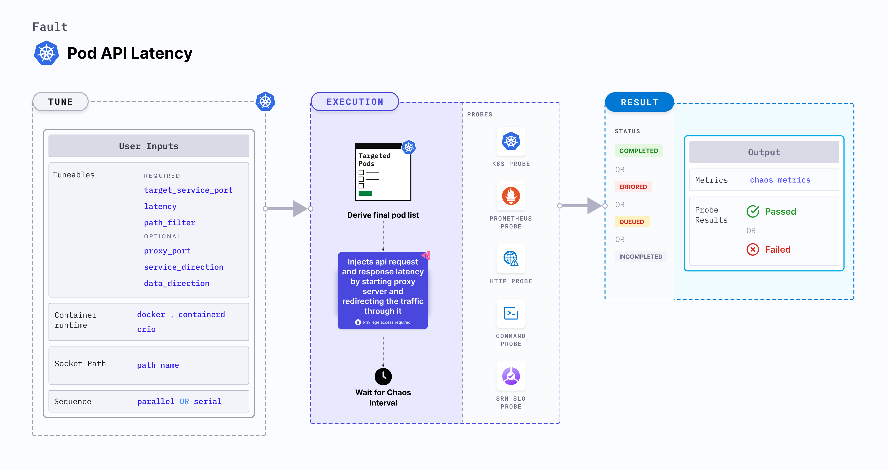

## Introduction

Pod API latency is a Kubernetes pod-level chaos fault that injects api request and response latency by starting proxy server and redirecting the traffic through it.




## Use cases
Pod API latency:
- Simulate high traffic scenarios and testing the resilience and performance of an application or API, where the API may experience delays due to heavy load.
- Simulate situations where an API request takes longer than expected to respond. By introducing latency, you can test how well your application handles timeouts and implements appropriate error handling mechanisms.
- It can be used to test, how well the application handles network delays and failures, and if it recovers gracefully when network connectivity is restored.

:::info note
- Kubernetes > 1.16 is required to execute this fault.
- The application pods should be in the running state before and after injecting chaos.
:::


## Fault tunables

  <h3>Mandatory tunables</h3>
    <table>
    <tr>
        <th> Tunable </th>
        <th> Description </th>
        <th> Notes </th>
      </tr>
      <tr>
        <td> TARGET_SERVICE_PORT </td>
        <td> Port of the target service. </td>
        <td>Default: port 80. For more information, go to <a href="https://developer.harness.io/docs/chaos-engineering/chaos-faults/kubernetes/pod/pod-api-latency#target-service-port">target service port </a> </td>
      </tr>
      <tr>
        <td> LATENCY </td>
        <td> Delay added to the api requests and responses (in seconds). </td>
        <td> Default: 2. For more information, go to <a href="https://developer.harness.io/docs/chaos-engineering/chaos-faults/kubernetes/pod/pod-api-latency#latency">latency </a></td>
      </tr>
      <tr>
        <td> PATH_FILTER </td>
        <td> Api path or route used for the filtering </td>
        <td> For more information, go to <a href="https://developer.harness.io/docs/chaos-engineering/chaos-faults/kubernetes/pod/pod-api-latency#path-filter">path filter </a></td>
      </tr>
    </table>
    <h3>Optional tunables</h3>
    <table>
      <tr>
        <th> Tunable </th>
        <th> Description </th>
        <th> Notes </th>
      </tr>
      <tr>
        <td> PROXY_PORT </td>
        <td> Port where the proxy listens for requests.</td>
        <td> Default: 20000. For more information, go to <a href="https://developer.harness.io/docs/chaos-engineering/chaos-faults/kubernetes/pod/pod-api-latency#advanced-fault-tunables">proxy port</a></td>
      </tr>
      <tr>
        <td> SERVICE_DIRECTION </td>
        <td> Direction of the flow of control, ingress or egress </td>
        <td> Default: `ingress`. For more information, go to <a href="https://developer.harness.io/docs/chaos-engineering/chaos-faults/kubernetes/pod/pod-api-latency#advanced-fault-tunables">service direction </a></td>
      </tr>
      <tr>
      <td> DATA_DIRECTION </td>
      <td> API payload type, request or response </td>
      <td> Default: `both`. For more information, go to <a href="https://developer.harness.io/docs/chaos-engineering/chaos-faults/kubernetes/pod/pod-api-latency#advanced-fault-tunables">data direction </a></td>
      </tr>
      <tr>
      <td> NETWORK_INTERFACE </td>
      <td> Network interface used for the proxy.</td>
      <td> Default: `eth0`. For more information, go to <a href="https://developer.harness.io/docs/chaos-engineering/chaos-faults/kubernetes/pod/pod-api-latency#advanced-fault-tunables">network interface </a></td>
      </tr>
      <tr>
        <td> CONTAINER_RUNTIME </td>
        <td> Container runtime interface for the cluster. </td>
        <td> Default: containerd. Supports docker, containerd and crio. For more information, go to <a href="https://developer.harness.io/docs/chaos-engineering/chaos-faults/kubernetes/pod/pod-api-latency#container-runtime-and-socket-path">container runtime </a> </td>
      </tr>
      <tr>
        <td> SOCKET_PATH </td>
        <td> Path to the containerd/crio/docker socket file. </td>
        <td> Default: <code>/run/containerd/containerd.sock</code>. For more information, go to <a href="https://developer.harness.io/docs/chaos-engineering/chaos-faults/kubernetes/pod/pod-api-latency#container-runtime-and-socket-path">socket path </a></td>
      </tr>
      <tr>
        <td> TOTAL_CHAOS_DURATION </td>
        <td> Duration to inject chaos (in seconds). </td>
        <td> Default: 60s. For more information, go to <a href="https://developer.harness.io/docs/chaos-engineering/chaos-faults/common-tunables-for-all-faults#duration-of-the-chaos">duration of the chaos </a></td>
      </tr>
      <tr>
        <td> TARGET_PODS </td>
        <td> Comma-separated list of application pod names subject to pod HTTP latency.</td>
        <td> If not provided, the fault selects target pods randomly based on provided appLabels. For more information, go to <a href="https://developer.harness.io/docs/chaos-engineering/chaos-faults/kubernetes/pod/common-tunables-for-pod-faults#target-specific-pods"> target specific pods</a></td>
      </tr>
      <tr>
        <td> PODS_AFFECTED_PERC </td>
        <td> Percentage of total pods to target. Provide numeric values. </td>
        <td> Default: 0 (corresponds to 1 replica). For more information, go to <a href="https://developer.harness.io/docs/chaos-engineering/chaos-faults/kubernetes/pod/common-tunables-for-pod-faults#pod-affected-percentage">pod affected percentage </a></td>
      </tr>
      <tr>
        <td> RAMP_TIME </td>
        <td> Period to wait before and after injecting chaos (in seconds). </td>
        <td> For example, 30 s. For more information, go to <a href="https://developer.harness.io/docs/chaos-engineering/chaos-faults/common-tunables-for-all-faults#ramp-time">ramp time</a> </td>
      </tr>
      <tr>
         <td> SEQUENCE </td>
        <td> Sequence of chaos execution for multiple target pods. </td>
        <td> Default: parallel. Supports serial and parallel. For more information, go to <a href="https://developer.harness.io/docs/chaos-engineering/chaos-faults/common-tunables-for-all-faults#sequence-of-chaos-execution">sequence of chaos execution</a></td>
      </tr>
    </table>

### Target service port

Port of the target service. Tune it by using the `TARGET_SERVICE_PORT` environment variable.

The following YAML snippet illustrates the use of this environment variable:

[embedmd]: # "./static/manifests/pod-api-latency/target-service-port.yaml yaml"

```yaml
## provide the port of the targeted service
apiVersion: litmuschaos.io/v1alpha1
kind: ChaosEngine
metadata:
  name: engine-nginx
spec:
  engineState: "active"
  annotationCheck: "false"
  appinfo:
    appns: "default"
    applabel: "app=nginx"
    appkind: "deployment"
  chaosServiceAccount: litmus-admin
  experiments:
    - name: pod-api-latency
      spec:
        components:
          env:
            # provide the port of the targeted service
            - name: TARGET_SERVICE_PORT
              value: "80"
            - name: PATH_FILTER
              value: '/status'         
```

### Latency

Delay added to the API request and response. Tune it by using the `LATENCY` environment variable.

The following YAML snippet illustrates the use of this environment variable:

[embedmd]: # "./static/manifests/pod-api-latency/latency.yaml yaml"

```yaml
## provide the latency value
apiVersion: litmuschaos.io/v1alpha1
kind: ChaosEngine
metadata:
  name: engine-nginx
spec:
  engineState: "active"
  annotationCheck: "false"
  appinfo:
    appns: "default"
    applabel: "app=nginx"
    appkind: "deployment"
  chaosServiceAccount: litmus-admin
  experiments:
    - name: pod-api-latency
      spec:
        components:
          env:
            # provide the latency value
            - name: LATENCY
              value: "2000"
            # provide the port of the targeted service
            - name: TARGET_SERVICE_PORT
              value: "80"
            - name: PATH_FILTER
              value: '/status'
```

### Path Filter

API sub path/route to filter the api calls. Tune it by using the `PATH_FILTER` environment variable.

The following YAML snippet illustrates the use of this environment variable:

[embedmd]: # "./static/manifests/pod-api-latency/path-filter.yaml yaml"

```yaml
## provide api path filter
apiVersion: litmuschaos.io/v1alpha1
kind: ChaosEngine
metadata:
  name: engine-nginx
spec:
  engineState: "active"
  annotationCheck: "false"
  appinfo:
    appns: "default"
    applabel: "app=nginx"
    appkind: "deployment"
  chaosServiceAccount: litmus-admin
  experiments:
    - name: pod-api-latency
      spec:
        components:
          env:
            # provide the api path filter
            - name: PATH_FILTER
              value: '/status'
            # provide the port of the targeted service
            - name: TARGET_SERVICE_PORT
              value: "80"        
```

### Advanced Fault Tunables

- `PROXY_PORT`: Port where the proxy listens for requests and responses
- `SERVICE_DIRECTION`: Direction of the flow of control, ingress or egress. It supports `ingress`, `egress` values.
- `DATA_DIRECTION`: API payload type, request or response. It supports `request`, `response`, and `both` values.
- `NETWORK_INTERFACE`: Network interface used for the proxy

The following YAML snippet illustrates the use of this environment variable:

[embedmd]:# (./static/manifests/pod-api-latency/advanced-fault-tunables.yaml yaml)
```yaml
# it injects the api latency fault
apiVersion: litmuschaos.io/v1alpha1
kind: ChaosEngine
metadata:
  name: engine-nginx
spec:
  engineState: "active"
  annotationCheck: "false"
  appinfo:
    appns: "default"
    applabel: "app=nginx"
    appkind: "deployment"
  chaosServiceAccount: litmus-admin
  experiments:
    - name: pod-api-latency
      spec:
        components:
          env:
            # provide the proxy port
            - name: PROXY_PORT
              value: '20000'
            # provide the connection type
            - name: SERVICE_DIRECTION
              value: 'ingress'
            # provide the payload type
            - name: DATA_DIRECTION
              value: 'both'
            # provide the network interface
            - name: NETWORK_INTERFACE
              value: 'eth0'
            # provide the api path filter
            - name: PATH_FILTER
              value: '/status'
            # provide the port of the targeted service
            - name: TARGET_SERVICE_PORT
              value: "80"
```

### Container runtime and socket path

The `CONTAINER_RUNTIME` and `SOCKET_PATH` environment variables to set the container runtime and socket file path, respectively.

- `CONTAINER_RUNTIME`: It supports `docker`, `containerd`, and `crio` runtimes. The default value is `containerd`.
- `SOCKET_PATH`: It contains path of containerd socket file by default(`/run/containerd/containerd.sock`). For `docker`, specify path as `/var/run/docker.sock`. For `crio`, specify path as `/var/run/crio/crio.sock`.

The following YAML snippet illustrates the use of these environment variables:

[embedmd]: # "./static/manifests/pod-api-latency/container-runtime-and-socket-path.yaml yaml"

```yaml
## provide the container runtime and socket file path
apiVersion: litmuschaos.io/v1alpha1
kind: ChaosEngine
metadata:
  name: engine-nginx
spec:
  engineState: "active"
  annotationCheck: "false"
  appinfo:
    appns: "default"
    applabel: "app=nginx"
    appkind: "deployment"
  chaosServiceAccount: litmus-admin
  experiments:
    - name: pod-api-latency
      spec:
        components:
          env:
            # runtime for the container
            # supports docker, containerd, crio
            - name: CONTAINER_RUNTIME
              value: "containerd"
            # path of the socket file
            - name: SOCKET_PATH
              value: "/run/containerd/containerd.sock"
            # provide the port of the targeted service
            - name: TARGET_SERVICE_PORT
              value: "80"
            - name: PATH_FILTER
              value: '/status'
```
