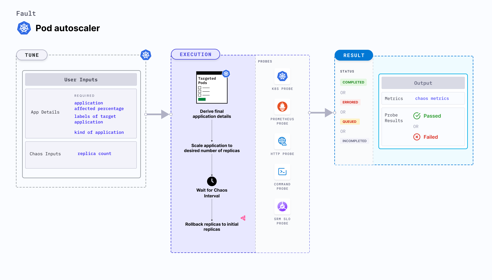

## Introduction

Pod autoscaler is a Kubernetes pod-level chaos fault that determines whether nodes can accomodate multiple replicas of a given application pod. This fault examines the node auto-scaling feature by determining whether the pods were successfully rescheduled within a specified time frame if the existing nodes are running at the specified limits.




## Use cases

Pod autoscaler determines how an application accomodates multiple replicas of a given application pod at unexpected times.

:::info note
- Kubernetes > 1.16 is required to execute this fault.
- The application pods should be in the running state before and after injecting chaos.
:::

## Fault tunables

  <h3>Mandatory tunables</h3>
    <table>
      <tr>
        <th> Tunable </th>
        <th> Description </th>
        <th> Notes </th>
      </tr>
      <tr>
        <td> REPLICA_COUNT </td>
        <td> Number of replicas you wish to scale to. </td>
        <td> <code>nil</code>. For more information, go to <a href="https://developer.harness.io/docs/chaos-engineering/chaos-faults/kubernetes/pod/pod-autoscaler#replica-counts">replica counts</a></td>
      </tr>
    </table>
    <h3>Optional tunables</h3>
    <table>
      <tr>
        <th> Tunable </th>
        <th> Description </th>
        <th> Notes </th>
      </tr>
      <tr>
        <td> TOTAL_CHAOS_DURATION </td>
        <td> Duration for which to insert chaos (in seconds).</td>
        <td> Default: 60 s. For more information, go to <a href="https://developer.harness.io/docs/chaos-engineering/chaos-faults/common-tunables-for-all-faults#duration-of-the-chaos">duration of the chaos.</a></td>
      </tr>
      <tr>
        <td> RAMP_TIME </td>
        <td> Period to wait before and after injecting chaos (in seconds). </td>
        <td> For example, 30 s. For more information, go to <a href="https://developer.harness.io/docs/chaos-engineering/chaos-faults/common-tunables-for-all-faults#ramp-time">ramp time</a></td>
      </tr>
    </table>

### Replica counts

Number of replicas that need to be present in the target application during chaos. Tune it by using the `REPLICA_COUNT` environment variable.

The following YAML snippet illustrates the use of this environment variable:

[embedmd]: # "./static/manifests/pod-autoscaler/replica-count.yaml yaml"

```yaml
# provide the number of replicas
apiVersion: litmuschaos.io/v1alpha1
kind: ChaosEngine
metadata:
  name: engine-nginx
spec:
  engineState: "active"
  annotationCheck: "false"
  appinfo:
    appns: "default"
    applabel: "app=nginx"
    appkind: "deployment"
  chaosServiceAccount: litmus-admin
  experiments:
    - name: pod-autoscaler
      spec:
        components:
          env:
            # number of replica, needs to scale
            - name: REPLICA_COUNT
              value: "3"
            - name: TOTAL_CHAOS_DURATION
              VALUE: "60"
```