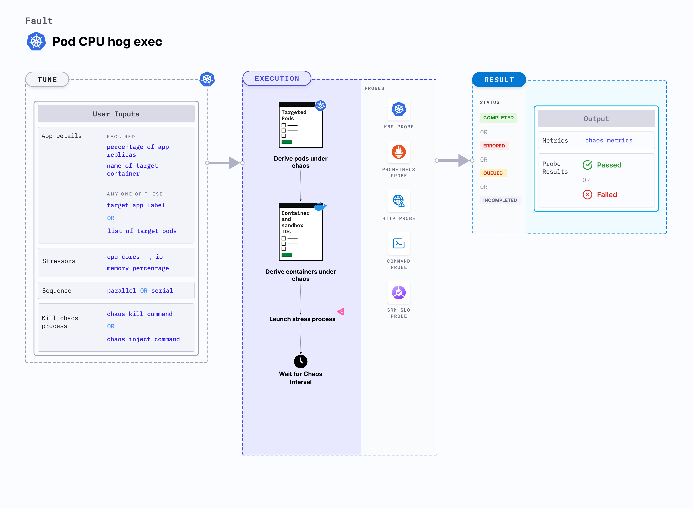

## Introduction

Pod CPU hog exec is a Kubernetes pod-level chaos fault that consumes excess CPU resources of the application container. This fault applies stress on the target pods by simulating a lack of CPU for processes running on the Kubernetes application. This degrades the performance of the application. 



## Use cases

CPU hog exec:
- Simulates conditions where the application pods experience CPU spikes due to expected (or undesired) processes thereby testing the behaviour of application stack.
- Verifies metrics-based horizontal pod autoscaling as well as vertical autoscale, that is, demand based CPU addition. 
- Facilitates scalability of nodes based on the growth beyond budgeted pods. 
- Verifies the autopilot functionality of cloud managed clusters. 
- Verifies multi-tenant load issues, that is, when the load increases on one container, this does not cause downtime in other containers. 


:::info note
- Kubernetes > 1.16 is required to execute this fault.
- The application pods should be in the running state before and after injecting chaos.
:::

## Fault tunables

  <h3>Optional tunables</h3>
    <table>
      <tr>
        <th> Tunable </th>
        <th> Description </th>
        <th> Notes </th>
      </tr>
      <tr>
        <td> CPU_CORES </td>
        <td> Number of CPU cores subject to CPU stress. </td>
        <td> Default: 1. For more information, go to <a href="https://developer.harness.io/docs/chaos-engineering/chaos-faults/kubernetes/pod/pod-cpu-hog-exec#cpu-cores">CPU cores</a> </td>
      </tr>
      <tr>
        <td> TOTAL_CHAOS_DURATION </td>
        <td> Duration for which to insert chaos (in seconds). </td>
        <td> Default: 60 s. For more information, go to <a href="https://developer.harness.io/docs/chaos-engineering/chaos-faults/common-tunables-for-all-faults#duration-of-the-chaos">duration of the chaos</a></td>
      </tr>
      <tr>
        <td> TARGET_PODS </td>
        <td> Comma-separated list of application pod names subject to pod CPU hog.</td>
        <td> If not provided, the fault selects the target pods randomly based on the provided appLabels. For more information, go to <a href="https://developer.harness.io/docs/chaos-engineering/chaos-faults/kubernetes/pod/common-tunables-for-pod-faults#target-specific-pods">target specific pods</a></td>
      </tr> 
      <tr> 
        <td> TARGET_CONTAINER </td>
        <td> Name of the target container under stress. </td>
        <td> If this value is not provided, the fault selects the first container of the target pod. For more information, go to <a href="https://developer.harness.io/docs/chaos-engineering/chaos-faults/kubernetes/pod/common-tunables-for-pod-faults#target-specific-container">target specific container</a> </td>
      </tr> 
      <tr>
        <td> PODS_AFFECTED_PERC </td>
        <td> Percentage of total pods to target. Provide numeric values. </td>
        <td> Default: 0 (corresponds to 1 replica). For more information, go to <a href="https://developer.harness.io/docs/chaos-engineering/chaos-faults/kubernetes/pod/common-tunables-for-pod-faults#pod-affected-percentage">pods affected percentage </a> </td>
      </tr>
      <tr>
        <td> CHAOS_INJECT_COMMAND </td>
        <td> Command to inject CPU chaos. </td>
        <td> Default: <code>md5sum /dev/zero</code>. For more information, go to <a href="https://developer.harness.io/docs/chaos-engineering/chaos-faults/kubernetes/pod/pod-cpu-hog-exec#chaos-inject-and-kill-commands">chaos inject command</a></td>
      </tr>
      <tr>
        <td> CHAOS_KILL_COMMAND </td>
        <td> Command to kill the chaos process. </td>
        <td> Defaults to <code>kill $(find /proc -name exe -lname '*/md5sum' 2>&1 | grep -v 'Permission denied' | awk -F/ '&#123;print $(NF-1)&#125;')</code>. Another useful one that generally works (in case the default doesn't) is <code>kill -9 $(ps afx | grep \"[md5sum] /dev/zero\" | awk '&#123;print $1&#125;' | tr '\n' ' ')</code>. In case neither works, please check whether the target pod's base image offers a shell. If yes, identify appropriate shell command to kill the chaos process. For more information, go to <a href="https://developer.harness.io/docs/chaos-engineering/chaos-faults/kubernetes/pod/pod-cpu-hog-exec#chaos-inject-and-kill-commands">chaos kill command</a></td>
      </tr>
      <tr>
        <td> RAMP_TIME </td>
        <td> Period to wait before injecting chaos (in seconds). </td>
        <td> For example, 30 s. For more information, go to <a href="https://developer.harness.io/docs/chaos-engineering/chaos-faults/common-tunables-for-all-faults#ramp-time">ramp time</a></td>
      </tr>
      <tr>
        <td> SEQUENCE </td>
        <td> Sequence of chaos execution for multiple target pods. </td>
        <td> Default: parallel. Supports serial and parallel. For more information, go to <a href="https://developer.harness.io/docs/chaos-engineering/chaos-faults/common-tunables-for-all-faults#sequence-of-chaos-execution">sequence of chaos execution</a></td>
      </tr>
    </table>


### CPU cores

Number of CPU cores to target. Tune it by using the `CPU_CORE` environment variable. 

The following YAML snippet illustrates the use of this environment variable:

[embedmd]: # "./static/manifests/pod-cpu-hog-exec/cpu-cores.yaml yaml"

```yaml
# CPU cores for the stress
apiVersion: litmuschaos.io/v1alpha1
kind: ChaosEngine
metadata:
  name: engine-nginx
spec:
  engineState: "active"
  annotationCheck: "false"
  appinfo:
    appns: "default"
    applabel: "app=nginx"
    appkind: "deployment"
  chaosServiceAccount: litmus-admin
  experiments:
    - name: pod-cpu-hog-exec
      spec:
        components:
          env:
            # CPU cores for stress
            - name: CPU_CORES
              value: "1"
            - name: TOTAL_CHAOS_DURATION
              value: "60"
```

### Chaos inject and kill commands

The `CHAOS_INJECT_COMMAND` and `CHAOS_KILL_COMMAND` environment variables to set the chaos inject and chaos kill commands, respectively.
Default values `CHAOS_INJECT_COMMAND` is "md5sum /dev/zero" and `CHAOS_KILL_COMMAND` is "kill $(find /proc -name exe -lname '\*/md5sum' 2>&1 | grep -v 'Permission denied' | awk -F/ '{print $(NF-1)}')"

The following YAML snippet illustrates the use of these environment variables:

[embedmd]: # "./static/manifests/pod-cpu-hog-exec/inject-and-kill-commands.yaml yaml"

```yaml
# provide the chaos kill, used to kill the chaos process
apiVersion: litmuschaos.io/v1alpha1
kind: ChaosEngine
metadata:
  name: engine-nginx
spec:
  engineState: "active"
  annotationCheck: "false"
  appinfo:
    appns: "default"
    applabel: "app=nginx"
    appkind: "deployment"
  chaosServiceAccount: litmus-admin
  experiments:
    - name: pod-cpu-hog-exec
      spec:
        components:
          env:
            # command to create the md5sum process to stress the cpu
            - name: CHAOS_INJECT_COMMAND
              value: "md5sum /dev/zero"
            # command to kill the md5sum process
            # alternative command: "kill -9 $(ps afx | grep \"[md5sum] /dev/zero\" | awk '{print$1}' | tr '\n' ' ')"
            - name: CHAOS_KILL_COMMAND
              value: "kill $(find /proc -name exe -lname '*/md5sum' 2>&1 | grep -v 'Permission denied' | awk -F/ '{print $(NF-1)}')"
            - name: TOTAL_CHAOS_DURATION
              value: "60"
```
