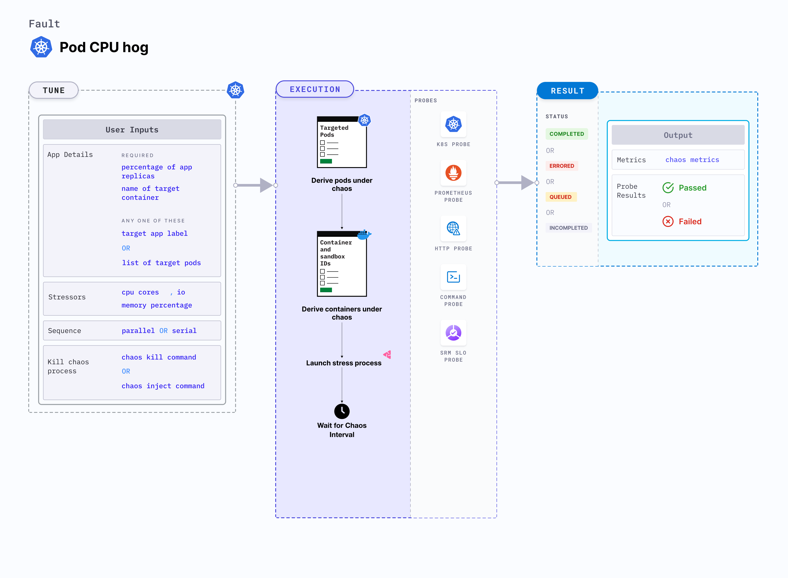

## Introduction

Pod CPU hog is a Kubernetes pod-level chaos fault that excessively consumes CPU resources, resulting in a significant increase in the CPU resource usage of a pod. This fault applies stress on the target pods by smimulating lack of CPU for processes running on the Kubernetes application. This degrades the performance of the application. 



## Use cases

CPU hog: 
- Simulates a situation where the application's CPU resource usage unexpectedly increases.
- Verifies metrics-based horizontal pod autoscaling as well as vertical autoscale, that is, demand based CPU addition. 
- Facilitates scalability of the nodes based on the growth beyond budgeted pods. 
- Verifies the autopilot functionality of cloud managed clusters. 
- Verifies multi-tenant load issues, that is, when the load increases on one container, this does not cause downtime in other containers. 

:::info note
- Kubernetes > 1.16 is required to execute this fault.
- The application pods should be in the running state before and after injecting chaos.
:::

## Fault tunables

  <h3>Optional tunables</h3>
    <table>
      <tr>
        <th> Tunable </th>
        <th> Description </th>
        <th> Notes </th>
      </tr>
      <tr>
        <td> CPU_CORES </td>
        <td> Number of CPU cores subject to CPU stress. </td>
        <td> Default: 1. For more information, go to <a href="https://developer.harness.io/docs/chaos-engineering/chaos-faults/kubernetes/pod/pod-cpu-hog#cpu-cores">CPU cores</a> </td>
      </tr>
      <tr>
        <td> CPU_LOAD </td>
        <td> Perentage of CPU to be consumed. </td>
        <td> For more information, go to <a href="https://developer.harness.io/docs/chaos-engineering/chaos-faults/kubernetes/pod/pod-cpu-hog#cpu-load">CPU load </a> </td>
      </tr>
      <tr>
        <td> TOTAL_CHAOS_DURATION </td>
        <td> Duration for which to insert chaos (in seconds). </td>
        <td> Default: 60 s. For more information, go to <a href="https://developer.harness.io/docs/chaos-engineering/chaos-faults/common-tunables-for-all-faults#duration-of-the-chaos">duration of the chaos</a></td>
      </tr>
      <tr>
        <td> TARGET_PODS </td>
        <td> Comma-separated list of application pod names subject to pod CPU hog.</td>
        <td> If this value is not provided, the fault selects the target pods randomly based on provided appLabels. For more information, go to <a href="https://developer.harness.io/docs/chaos-engineering/chaos-faults/kubernetes/pod/common-tunables-for-pod-faults#target-specific-pods">target specific pods</a></td>
      </tr> 
      <tr> 
        <td> TARGET_CONTAINER </td>
        <td> Name of the target container under stress. </td>
        <td> If this value is not provided, the fault selects the first container of the target pod. For more information, go to <a href="https://developer.harness.io/docs/chaos-engineering/chaos-faults/kubernetes/pod/common-tunables-for-pod-faults#target-specific-container">target specific container</a></td>
      </tr> 
      <tr>
        <td> PODS_AFFECTED_PERC </td>
        <td> Percentage of total pods to target. Provide numeric values. </td>
        <td> Default: 0 (corresponds to 1 replica). For more information, go to <a href="https://developer.harness.io/docs/chaos-engineering/chaos-faults/kubernetes/pod/common-tunables-for-pod-faults#pod-affected-percentage">pod affected percentage</a> </td>
      </tr>
      <tr>
        <td> CONTAINER_RUNTIME </td>
        <td> Container runtime interface for the cluster</td>
        <td> Default: containerd. Supports docker, containerd and crio. For more information, go to <a href="https://developer.harness.io/docs/chaos-engineering/chaos-faults/kubernetes/pod/pod-cpu-hog#container-runtime-and-socket-path">container runtime</a> </td>
      </tr>
      <tr>
        <td> SOCKET_PATH </td>
        <td> Path of the containerd or crio or docker socket file. </td>
        <td> Default: <code>/run/containerd/containerd.sock</code>. For more information, go to <a href="https://developer.harness.io/docs/chaos-engineering/chaos-faults/kubernetes/pod/pod-cpu-hog#container-runtime-and-socket-path">socket path</a> </td>
      </tr> 
      <tr>
        <td> RAMP_TIME </td>
        <td> Period to wait before injecting chaos (in seconds). </td>
        <td> For example, 30 s. For more information, go to <a href="https://developer.harness.io/docs/chaos-engineering/chaos-faults/common-tunables-for-all-faults#ramp-time">ramp time</a></td>
      </tr>
      <tr>
        <td> SEQUENCE </td>
        <td> Sequence of chaos execution for multiple target pods. </td>
        <td> Default: parallel. Supports serial and parallel. For more information, go to <a href="https://developer.harness.io/docs/chaos-engineering/chaos-faults/common-tunables-for-all-faults#sequence-of-chaos-execution">sequence of chaos execution</a></td>
      </tr>
    </table>


### CPU cores

Number of CPU cores to target. Tune it by using the `CPU_CORE` environment variable. 

The following YAML snippet illustrates the use of this environment variable:

[embedmd]:# (./static/manifests/pod-cpu-hog/cpu-cores.yaml yaml)
```yaml
# CPU cores for the stress
apiVersion: litmuschaos.io/v1alpha1
kind: ChaosEngine
metadata:
  name: engine-nginx
spec:
  engineState: "active"
  annotationCheck: "false"
  appinfo:
    appns: "default"
    applabel: "app=nginx"
    appkind: "deployment"
  chaosServiceAccount: litmus-admin
  experiments:
  - name: pod-cpu-hog
    spec:
      components:
        env:
        # CPU cores for stress
        - name: CPU_CORES
          value: '1'
        - name: TOTAL_CHAOS_DURATION
          value: '60'
```

### CPU load

Percentage of CPU to be consumed. Tune it by using the `CPU_LOAD` environment variable.

The following YAML snippet illustrates the use of this environment variable:

[embedmd]: # "./static/manifests/pod-cpu-hog/cpu-load.yaml yaml"

```yaml
# CPU load for the stress
apiVersion: litmuschaos.io/v1alpha1
kind: ChaosEngine
metadata:
  name: engine-nginx
spec:
  engineState: "active"
  annotationCheck: "false"
  appinfo:
    appns: "default"
    applabel: "app=nginx"
    appkind: "deployment"
  chaosServiceAccount: litmus-admin
  experiments:
    - name: pod-cpu-hog
      spec:
        components:
          env:
            # CPU load in percentage for the stress
            - name: CPU_LOAD
              value: "100"
            # CPU core should be provided as 0 for CPU load
            # to work, otherwise it will take CPU core as priority
            - name: CPU_CORES
              value: "0"
            - name: TOTAL_CHAOS_DURATION
              value: "60"
```

### Container runtime and socket path

The `CONTAINER_RUNTIME` and `SOCKET_PATH` environment variables to set the container runtime and socket file path, respectively.

- `CONTAINER_RUNTIME`: It supports `docker`, `containerd`, and `crio` runtimes. The default value is `containerd`.
- `SOCKET_PATH`: It contains path of `containerd` socket file by default(`/run/containerd/containerd.sock`). For `docker`, specify the path as `/var/run/docker.sock`. For `crio`, specify the path as `/var/run/crio/crio.sock`.

The following YAML snippet illustrates the use of this environment variable:

[embedmd]: # "./static/manifests/pod-cpu-hog/container-runtime-and-socket-path.yaml yaml"

```yaml
## provide the container runtime and socket file path
apiVersion: litmuschaos.io/v1alpha1
kind: ChaosEngine
metadata:
  name: engine-nginx
spec:
  engineState: "active"
  annotationCheck: "false"
  appinfo:
    appns: "default"
    applabel: "app=nginx"
    appkind: "deployment"
  chaosServiceAccount: litmus-admin
  experiments:
    - name: pod-cpu-hog
      spec:
        components:
          env:
            # runtime for the container
            # supports docker, containerd, crio
            - name: CONTAINER_RUNTIME
              value: "containerd"
            # path of the socket file
            - name: SOCKET_PATH
              value: "/run/containerd/containerd.sock"
            - name: TOTAL_CHAOS_DURATION
              VALUE: "60"
```