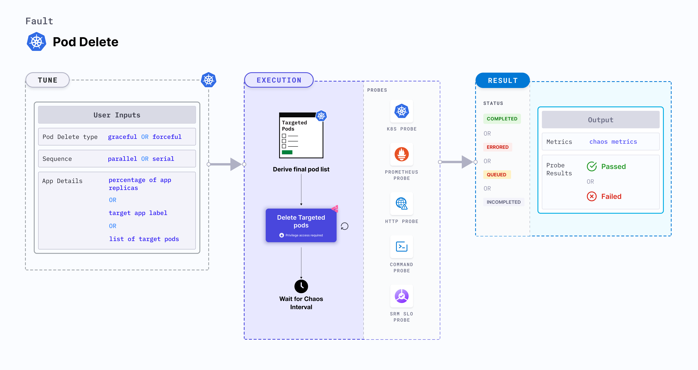

## Introduction

Pod delete is a Kubernetes pod-level chaos fault that causes specific (or random) replicas of an application resource to fail forcibly (or gracefully). 
- To ensure smooth usage, applications must have a minimum number of available replicas. 
- When the pressure on other replicas increases, the horizontal pod autoscaler scales based on the observed resource utilization.



## Use cases

Pod delete:
- Helps check the application's deployment sanity (replica availability and uninterrupted service) and recovery workflow.
- Can be used to verify:
  - Disk (or volume) re-attachment times in stateful applications.
  - Application start-up times, and readiness probe configuration (health endpoints and delays).
  - Adherence to topology constraints (node selectors, tolerations, zone distribution, and affinity (or anti-affinity) policies).
  - Proxy registration times in service-mesh environments.
  - Post (lifecycle) hooks and termination seconds configuration for the microservices (under active load)- that is, graceful termination handling.
  - Resource budgeting on cluster nodes (whether request or limit settings are honored on available nodes for successful schedule).
- Simulates:
  - Graceful delete, or rescheduling, of pods as a result of upgrades.
  - Forced deletion of pods as a result of eviction.
  - Leader-election in complex applications.

:::info note
- Kubernetes > 1.16 is required to execute this fault.
- The application pods are in the running state before and after chaos injection.
:::

## Fault tunables
<h3>Optional tunables</h3>
    <table>
      <tr>
        <th> Tunable </th>
        <th> Description </th>
        <th> Notes </th>
      </tr>
      <tr>
        <td> TOTAL_CHAOS_DURATION </td>
        <td> Duration for which to insert chaos (in seconds).</td>
        <td> Default: 15 s. Overall run duration of the fault may exceed the <code>TOTAL_CHAOS_DURATION</code> by a few minutes. For more information, go to <a href = "https://developer.harness.io/docs/chaos-engineering/chaos-faults/common-tunables-for-all-faults#duration-of-the-chaos">duration of the chaos</a></td>
      </tr>
      <tr>
        <td> CHAOS_INTERVAL </td>
        <td> Time interval between two successive pod failures (in seconds). </td>
        <td> Default: 5 s. For more information, go to <a href= "https://developer.harness.io/docs/chaos-engineering/chaos-faults/common-tunables-for-all-faults#chaos-interval">chaos interval</a></td>
      </tr>
      <tr>
        <td> RANDOMNESS </td>
        <td> Introduces randomness into pod deletions with a minimum period defined by <code>CHAOS_INTERVAL</code> </td>
        <td> Default: false. Supports true and false. For more information, go to <a href= "https://developer.harness.io/docs/chaos-engineering/chaos-faults/kubernetes/pod/pod-delete#random-interval">random interval</a> </td>
      </tr>
      <tr>
        <td> FORCE </td>
        <td> Application pod deletion mode. <code>false</code> indicates graceful deletion with the default termination period of 30s, and <code>true</code> indicates an immediate forceful deletion with 0s grace period.</td>
        <td> Default: <code>true</code>, with <code>terminationGracePeriodSeconds=0</code>. For more information, go to <a href= "https://developer.harness.io/docs/chaos-engineering/chaos-faults/kubernetes/pod/pod-delete#force-delete">force delete</a> </td>
      </tr>
      <tr>
        <td> TARGET_PODS </td>
        <td> Comma-separated list of application pod names subject to chaos. </td>
        <td> If it is not provided, it selects target pods based on provided appLabels. For more information, go to <a href= "https://developer.harness.io/docs/chaos-engineering/chaos-faults/kubernetes/pod/common-tunables-for-pod-faults#target-specific-pods">target specific pods</a> </td>
      </tr>
      <tr>
        <td> PODS_AFFECTED_PERC </td>
        <td> Percentage of total pods to target . Provide numeric values. </td>
        <td> Default: 0 (corresponds to 1 replica). For more information, go to <a href= "https://developer.harness.io/docs/chaos-engineering/chaos-faults/kubernetes/pod/common-tunables-for-pod-faults#pod-affected-percentage">pod affected percentage</a> </td>
      </tr>
      <tr>
        <td> RAMP_TIME </td>
        <td> Period to wait before and after injecting chaos (in seconds). </td>
        <td> For example, 30 s. For more information, go to <a href= "https://developer.harness.io/docs/chaos-engineering/chaos-faults/common-tunables-for-all-faults#ramp-time">ramp time</a></td>
      </tr>
      <tr>
        <td> SEQUENCE </td>
        <td> Sequence of chaos execution for multiple target pods. </td>
        <td> Default: parallel. Supports serial as well. For more information, go to <a href= "https://developer.harness.io/docs/chaos-engineering/chaos-faults/common-tunables-for-all-faults#sequence-of-chaos-execution">sequence of chaos execution</a></td>
      </tr>
    </table>

### Force delete

Specifies if the target pod is deleted `forcefully` or `gracefully`. This fault deletes the pod forcefully if `FORCE` is set to `true` and gracefully if `FORCE` is set to `false`. Tune it by using the `FORCE` environment variable.

The following YAML snippet illustrates the use of this environment variable:

[embedmd]: # "./static/manifests/pod-delete/force.yaml yaml"

```yaml
# tune the deletion of target pods forcefully or gracefully
apiVersion: litmuschaos.io/v1alpha1
kind: ChaosEngine
metadata:
  name: engine-nginx
spec:
  engineState: "active"
  annotationCheck: "false"
  appinfo:
    appns: "default"
    applabel: "app=nginx"
    appkind: "deployment"
  chaosServiceAccount: litmus-admin
  experiments:
    - name: pod-delete
      spec:
        components:
          env:
            # provided as true for the force deletion of pod
            # supports true and false value
            - name: FORCE
              value: "true"
            - name: TOTAL_CHAOS_DURATION
              value: "60"
```

### Random interval

Specifies whether or not to enable randomness in the chaos interval by setting `RANDOMNESS` environment variable to `true`. It supports boolean values. The default value is `false`. Tune it by using the `CHAOS_INTERVAL` environment variable.

- If `CHAOS_INTERVAL` is set in the form of `l-r` that is, `5-10` then it will select a random interval between l and r.
- If `CHAOS_INTERVAL` is set in the form of `value` that is, `10` then it will select a random interval between 0 and value.

The following YAML snippet illustrates the use of this environment variable:

[embedmd]: # "./static/manifests/pod-delete/randomness-interval.yaml yaml"

```yaml
# contains random chaos interval with lower and upper bound of range i.e [l,r]
apiVersion: litmuschaos.io/v1alpha1
kind: ChaosEngine
metadata:
  name: engine-nginx
spec:
  engineState: "active"
  annotationCheck: "false"
  appinfo:
    appns: "default"
    applabel: "app=nginx"
    appkind: "deployment"
  chaosServiceAccount: litmus-admin
  experiments:
    - name: pod-delete
      spec:
        components:
          env:
            # randomness enables iterations at random time interval
            # it supports true and false value
            - name: RANDOMNESS
              value: "true"
            - name: TOTAL_CHAOS_DURATION
              value: "60"
            # it will select a random interval within this range
            # if only one value is provided then it will select a random interval within 0-CHAOS_INTERVAL range
            - name: CHAOS_INTERVAL
              value: "5-10"
```
