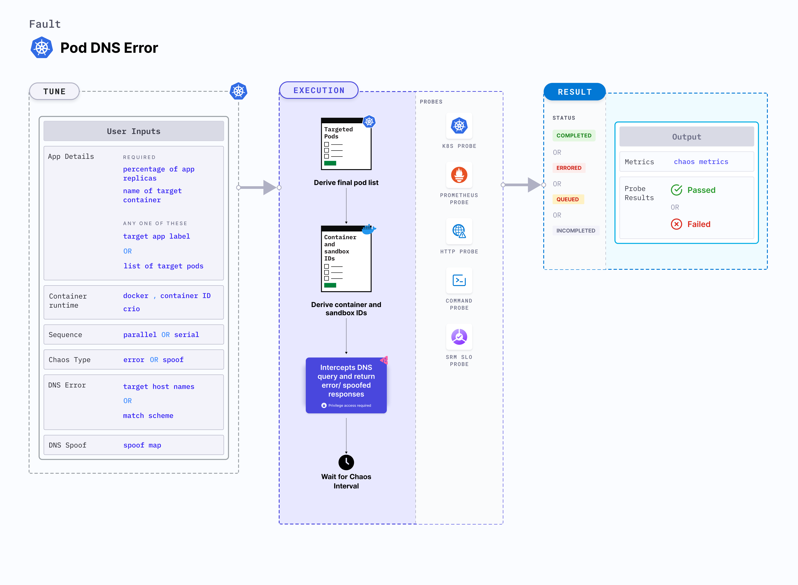

## Introduction

Pod DNS error is a Kubernetes pod-level chaos fault that injects chaos to disrupt DNS resolution in pods. It removes access to services by blocking the DNS resolution of host names or domains.




## Use cases

Pod DNS error:
- Determines the resilience of an application to DNS errors.
- Determines how quickly an application can resolve the host names and recover from the failure. 
- Simulates unavailability of DNS server (loss of access to any external domain from a given microservice).
- Simulates malfunctioning of DNS server (loss of access to specific domains from a given microservice.
- Simulates access to the cloud provider dependencies, and access to specific third party services.

:::info note
- Kubernetes > 1.16 is required to execute this fault.
- The application pods should be in the running state before and after injecting chaos.
:::


## Fault tunables
  <h3>Optional tunables</h3>
    <table>
      <tr>
        <th> Tunable </th>
        <th> Description  </th>
        <th> Notes </th>
      </tr>
      <tr>
        <td> TARGET_CONTAINER </td>
        <td> Name of the container subject to DNS error. </td>
        <td> None. For more information, go to <a href="https://developer.harness.io/docs/chaos-engineering/chaos-faults/kubernetes/pod/common-tunables-for-pod-faults#target-specific-container">target specific container</a></td>
      </tr>
      <tr>
        <td> TOTAL_CHAOS_DURATION </td>
        <td> Duration for which to insert chaos (in seconds). </td>
        <td> Default: 60 s. For more information, go to <a href="https://developer.harness.io/docs/chaos-engineering/chaos-faults/common-tunables-for-all-faults#duration-of-the-chaos">duration of the chaos</a></td>
      </tr>
      <tr>
        <td> TARGET_HOSTNAMES </td>
        <td> List of the target host names or keywords. For example, '["litmuschaos","chaosnative.com"]'. </td>
        <td> If this is not provided, all host names/domains become the target. For more information, go to <a href="https://developer.harness.io/docs/chaos-engineering/chaos-faults/kubernetes/pod/pod-dns-error#target-host-names">target host names</a></td>
      </tr>
      <tr>
        <td> MATCH_SCHEME </td>
        <td> Determines whether the DNS query exactly matches one of the targets or uses any of the targets as a substring. It can be <code>exact</code> or <code>substring</code>. </td>
        <td> If this is not provided, it is set to <code>exact</code>. For more information, go to <a href="https://developer.harness.io/docs/chaos-engineering/chaos-faults/kubernetes/pod/pod-dns-error#match-scheme">match scheme</a></td>
      </tr>
      <tr>
        <td> PODS_AFFECTED_PERC </td>
        <td> Percentage of total pods to target. Provide numeric values. </td>
        <td> Default: 0 (corresponds to 1 replica). For more information, go to <a href="https://developer.harness.io/docs/chaos-engineering/chaos-faults/kubernetes/pod/common-tunables-for-pod-faults#pod-affected-percentage">pod affected percentage</a> </td>
      </tr>
      <tr>
        <td> CONTAINER_RUNTIME </td>
        <td> Container runtime interface for the cluster. </td>
        <td> Default: containerd. Supports docker, containerd and crio. For more information, go to <a href="https://developer.harness.io/docs/chaos-engineering/chaos-faults/kubernetes/pod/pod-dns-error#container-runtime-and-socket-path">container runtime</a> </td>
      </tr>
      <tr>
        <td> SOCKET_PATH </td>
        <td> Path of the docker socket file. </td>
        <td> Default: <code>/run/containerd/containerd.sock</code>. For more information, go to <a href="https://developer.harness.io/docs/chaos-engineering/chaos-faults/kubernetes/pod/pod-dns-error#container-runtime-and-socket-path">socket path</a> </td>
      </tr>
      <tr>
        <td> RAMP_TIME </td>
        <td> Period to wait before and after injecting chaos (in seconds). </td>
        <td> For example, 30 s. For more information, go to <a href="https://developer.harness.io/docs/chaos-engineering/chaos-faults/common-tunables-for-all-faults#ramp-time">ramp time</a></td>
      </tr>
      <tr>
        <td> SEQUENCE </td>
        <td> Sequence of chaos execution for multiple target pods. </td>
        <td> Default: parallel. Supports serial and parallel. For more information, go to <a href="https://developer.harness.io/docs/chaos-engineering/chaos-faults/common-tunables-for-all-faults#sequence-of-chaos-execution">sequence of chaos execution</a></td>
      </tr>
    </table>


### Target host names

Comma-separated names of the target hosts. If `TARGET_HOSTNAMES` is not provided, all host names or domains will be targeted. Tune it by using the `TARGET_HOSTNAMES` environment variable.

The following YAML snippet illustrates the use of this environment variable:

[embedmd]:# (./static/manifests/pod-dns-error/target-hostnames.yaml yaml)
```yaml
# contains the target host names for the dns error
apiVersion: litmuschaos.io/v1alpha1
kind: ChaosEngine
metadata:
  name: engine-nginx
spec:
  engineState: "active"
  annotationCheck: "false"
  appinfo:
    appns: "default"
    applabel: "app=nginx"
    appkind: "deployment"
  chaosServiceAccount: litmus-admin
  experiments:
  - name: pod-dns-error
    spec:
      components:
        env:
        ## comma separated list of host names
        ## if not provided, all hostnames/domains will be targeted
        - name: TARGET_HOSTNAMES
          value: '["litmuschaos","chaosnative.com"]'
        - name: TOTAL_CHAOS_DURATION
          value: '60'
```

### Match scheme

Specifies whether the DNS query should exactly match one of the targets or can have any of the targets as a substring. It supports `exact` or `substring` values. Tune it by using the `MATCH_SCHEME` environment variable. 

The following YAML snippet illustrates the use of this environment variable:

[embedmd]:# (./static/manifests/pod-dns-error/match-scheme.yaml yaml)
```yaml
# contains match scheme for the dns error
apiVersion: litmuschaos.io/v1alpha1
kind: ChaosEngine
metadata:
  name: engine-nginx
spec:
  engineState: "active"
  annotationCheck: "false"
  appinfo:
    appns: "default"
    applabel: "app=nginx"
    appkind: "deployment"
  chaosServiceAccount: litmus-admin
  experiments:
  - name: pod-dns-error
    spec:
      components:
        env:
        ## it supports 'exact' and 'substring' values
        - name: MATCH_SCHEME
          value: 'exact' 
        - name: TOTAL_CHAOS_DURATION
          value: '60'
```

### Container runtime and socket path

The `CONTAINER_RUNTIME` and `SOCKET_PATH` environment variables to set the container runtime and socket file path, respectively.

- `CONTAINER_RUNTIME`: It supports `docker`, `containerd`, and `crio` runtimes. The default value is `containerd`.
- `SOCKET_PATH`: It contains path of containerd socket file by default(`/run/containerd/containerd.sock`). For `docker`, specify path as `/var/run/docker.sock`. For `crio`, specify path as `/var/run/crio/crio.sock`.

The following YAML snippet illustrates the use of these environment variables:

[embedmd]:# (./static/manifests/pod-dns-error/container-runtime-and-socket-path.yaml yaml)
```yaml
## provide the container runtime and socket file path
apiVersion: litmuschaos.io/v1alpha1
kind: ChaosEngine
metadata:
  name: engine-nginx
spec:
  engineState: "active"
  annotationCheck: "false"
  appinfo:
    appns: "default"
    applabel: "app=nginx"
    appkind: "deployment"
  chaosServiceAccount: litmus-admin
  experiments:
  - name: pod-dns-error
    spec:
      components:
        env:
        # runtime for the container
        # supports docker
        - name: CONTAINER_RUNTIME
          value: 'containerd'
        # path of the socket file
        - name: SOCKET_PATH
          value: '/run/containerd/containerd.sock'
        - name: TOTAL_CHAOS_DURATION
          VALUE: '60'
```
