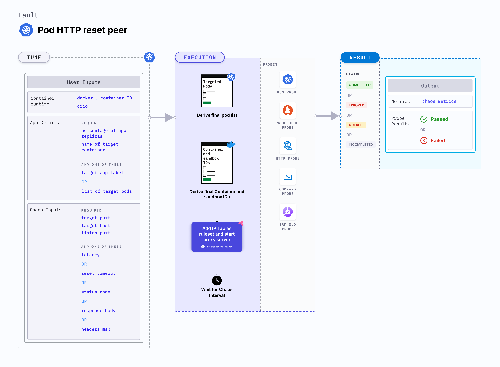

## Introduction

Pod HTTP reset peer is a Kubernetes pod-level chaos fault that injects chaos on the service whose port is specified using the `TARGET_SERVICE_PORT` environment variable. This fault:
- Stops the outgoing HTTP requests by resetting the TCP connection. 
- This is achieved by starting the proxy server and redirecting the traffic through the proxy server.





## Use cases
Pod HTTP reset peer:
- Tests the application's resilience to lossy or flaky HTTP connection.
- Simulates premature connection loss that may occur due to firewall issues or other issues between microservices thereby verifying connection timeout.
- Simulates connection resets due to resource limitations on the server side such as out of memory error, process kills, overload on the server due to high amounts of traffic. 


:::info note
- Kubernetes > 1.16 is required to execute this fault.
- The application pods should be in the running state before and after injecting chaos.
:::

## Fault tunables

  <h3>Mandatory tunables</h3>
    <table>
      <tr>
        <th> Tunable </th>
        <th> Description </th>
        <th> Notes </th>
      </tr>
      <tr>
        <td> TARGET_SERVICE_PORT </td>
        <td> Port of the service to target. </td>
        <td> Default: port 80. For more information, go to <a href="https://developer.harness.io/docs/chaos-engineering/chaos-faults/kubernetes/pod/pod-http-reset-peer#target-service-port">target service port </a></td>
      </tr>
      <tr>
        <td> RESET_TIMEOUT </td>
        <td> Specifies the duration after which connection needs to be reset. </td>
        <td> Default: 0. For more information, go to <a href="https://developer.harness.io/docs/chaos-engineering/chaos-faults/kubernetes/pod/pod-http-reset-peer#reset-timeout">reset timeout </a></td>
      </tr>
    </table>
    <h3>Optional tunables</h3>
    <table>
      <tr>
        <th> Tunable </th>
        <th> Description </th>
        <th> Notes </th>
      </tr>
      <tr>
        <td> PROXY_PORT </td>
        <td> Port where the proxy listens for requests. </td>
        <td> Default: 20000. For more information, go to <a href="https://developer.harness.io/docs/chaos-engineering/chaos-faults/kubernetes/pod/pod-http-reset-peer#proxy-port">proxy port </a> </td>
      </tr>
      <tr>
        <td> NETWORK_INTERFACE </td>
        <td> Network interface used for the proxy. </td>
        <td> Default: `eth0`. For more information, go to <a href="https://developer.harness.io/docs/chaos-engineering/chaos-faults/kubernetes/pod/pod-http-reset-peer#network-interface">network interface</a> </td>
      </tr>
      <tr>
        <td> TOXICITY </td>
        <td> Percentage of HTTP requests to be affected. </td>
        <td> Default: 100. For more information, go to <a href="https://developer.harness.io/docs/chaos-engineering/chaos-faults/kubernetes/pod/pod-http-reset-peer#toxicity">toxicity </a> </td>
      </tr>
      <tr>
        <td> CONTAINER_RUNTIME </td>
        <td> Container runtime interface for the cluster</td>
        <td> Default: containerd. Supports values: docker, containerd and crio. For more information, go to <a href="https://developer.harness.io/docs/chaos-engineering/chaos-faults/kubernetes/pod/pod-dns-error#container-runtime-and-socket-path">container runtime </a> </td>
      </tr>
      <tr>
        <td> SOCKET_PATH </td>
        <td> Path of the containerd or crio or docker socket file. </td>
        <td> Default: <code>/run/containerd/containerd.sock</code>. For more information, go to <a href="https://developer.harness.io/docs/chaos-engineering/chaos-faults/kubernetes/pod/pod-dns-error#container-runtime-and-socket-path">socket path </a></td>
      </tr>
      <tr>
        <td> TOTAL_CHAOS_DURATION </td>
        <td> Duration for which to insert chaos (in seconds). </td>
        <td> Default: 60 s. For more information, go to <a href="https://developer.harness.io/docs/chaos-engineering/chaos-faults/common-tunables-for-all-faults#duration-of-the-chaos">duration of the chaos </a> </td>
      </tr>
      <tr>
        <td> TARGET_PODS </td>
        <td> Comma-separated list of application pod names subject to pod HTTP reset peer.</td>
        <td> If not provided, the fault selects target pods randomly based on provided appLabels. For more information, go to <a href="https://developer.harness.io/docs/chaos-engineering/chaos-faults/kubernetes/pod/common-tunables-for-pod-faults#target-specific-pods"> target specific pods</a></td>
      </tr>
      <tr>
        <td> PODS_AFFECTED_PERC </td>
        <td> Percentage of total pods to target. Provide numeric values. </td>
        <td> Default: 0 (corresponds to 1 replica). For more information, go to <a href="https://developer.harness.io/docs/chaos-engineering/chaos-faults/kubernetes/pod/common-tunables-for-pod-faults#pod-affected-percentage">pod affected percentage</a> </td>
      </tr>
      <tr>
        <td> RAMP_TIME </td>
        <td> Period to wait before and after injecting chaos (in seconds). </td>
        <td> For example, 30 s. For more information, go to <a href="https://developer.harness.io/docs/chaos-engineering/chaos-faults/common-tunables-for-all-faults#ramp-time">ramp time</a></td>
      </tr>
      <tr>
        <td> SEQUENCE </td>
        <td> Sequence of chaos execution for multiple target pods. </td>
        <td> Default: parallel. Supports serial and parallel. For more information, go to <a href="https://developer.harness.io/docs/chaos-engineering/chaos-faults/common-tunables-for-all-faults#sequence-of-chaos-execution">sequence of chaos execution</a></td>
      </tr>
    </table>

### Target service port

Port of the target service. Tune it by using the `TARGET_SERVICE_PORT` environment variable.

The following YAML snippet illustrates the use of this environment variable:

[embedmd]: # "./static/manifests/pod-http-reset-peer/target-service-port.yaml yaml"

```yaml
## provide the port of the targeted service
apiVersion: litmuschaos.io/v1alpha1
kind: ChaosEngine
metadata:
  name: engine-nginx
spec:
  engineState: "active"
  annotationCheck: "false"
  appinfo:
    appns: "default"
    applabel: "app=nginx"
    appkind: "deployment"
  chaosServiceAccount: litmus-admin
  experiments:
    - name: pod-http-reset-peer
      spec:
        components:
          env:
            # provide the port of the targeted service
            - name: TARGET_SERVICE_PORT
              value: "80"
```

### Proxy port

Port where the proxy server listens for requests. Tune it by using the `PROXY_PORT` environment variable.
The following YAML snippet illustrates the use of this environment variable:

[embedmd]: # "./static/manifests/pod-http-reset-peer/proxy-port.yaml yaml"

```yaml
## provide the port for proxy server
apiVersion: litmuschaos.io/v1alpha1
kind: ChaosEngine
metadata:
  name: engine-nginx
spec:
  engineState: "active"
  annotationCheck: "false"
  appinfo:
    appns: "default"
    applabel: "app=nginx"
    appkind: "deployment"
  chaosServiceAccount: litmus-admin
  experiments:
    - name: pod-http-reset-peer
      spec:
        components:
          env:
            # provide the port for proxy server
            - name: PROXY_PORT
              value: "8080"
            # provide the port of the targeted service
            - name: TARGET_SERVICE_PORT
              value: "80"
```

### Reset timeout

Duration after which connection is reset. Tune it by using the `RESET_TIMEOUT` environment variable.

The following YAML snippet illustrates the use of this environment variable:

[embedmd]: # "./static/manifests/pod-http-reset-peer/reset-timeout.yaml yaml"

```yaml
## provide the reset timeout value
apiVersion: litmuschaos.io/v1alpha1
kind: ChaosEngine
metadata:
  name: engine-nginx
spec:
  engineState: "active"
  annotationCheck: "false"
  appinfo:
    appns: "default"
    applabel: "app=nginx"
    appkind: "deployment"
  chaosServiceAccount: litmus-admin
  experiments:
    - name: pod-http-reset-peer
      spec:
        components:
          env:
            # reset timeout specifies after how much duration to reset the connection
            - name: RESET_TIMEOUT #in ms
              value: "2000"
            # provide the port of the targeted service
            - name: TARGET_SERVICE_PORT
              value: "80"
```

### Toxicity

Percentage of the total number of HTTP requests that need to be affected. Tune it by using the `TOXICITY` environment variable.

The following YAML snippet illustrates the use of this environment variable:

[embedmd]: # "./static/manifests/pod-http-reset-peer/toxicity.yaml yaml"

```yaml
## provide the toxicity
apiVersion: litmuschaos.io/v1alpha1
kind: ChaosEngine
metadata:
  name: engine-nginx
spec:
  engineState: "active"
  annotationCheck: "false"
  appinfo:
    appns: "default"
    applabel: "app=nginx"
    appkind: "deployment"
  chaosServiceAccount: litmus-admin
  experiments:
    - name: pod-http-reset-peer
      spec:
        components:
          env:
            # toxicity is the probability of the request to be affected
            # provide the percentage value in the range of 0-100
            # 0 means no request will be affected and 100 means all request will be affected
            - name: TOXICITY
              value: "100"
            # provide the port of the targeted service
            - name: TARGET_SERVICE_PORT
              value: "80"
```

### Network interface

Network interface used for the proxy. Tune it by using the `NETWORK_INTERFACE` environment variable.

The following YAML snippet illustrates the use of this environment variable:

[embedmd]: # "./static/manifests/pod-http-reset-peer/network-interface.yaml yaml"

```yaml
## provide the network interface for proxy
apiVersion: litmuschaos.io/v1alpha1
kind: ChaosEngine
metadata:
  name: engine-nginx
spec:
  engineState: "active"
  annotationCheck: "false"
  appinfo:
    appns: "default"
    applabel: "app=nginx"
    appkind: "deployment"
  chaosServiceAccount: litmus-admin
  experiments:
    - name: pod-http-reset-peer
      spec:
        components:
          env:
            # provide the network interface for proxy
            - name: NETWORK_INTERFACE
              value: "eth0"
            # provide the port of the targeted service
            - name: TARGET_SERVICE_PORT
              value: "80"
```

### Container runtime and socket path

The `CONTAINER_RUNTIME` and `SOCKET_PATH` environment variable to set the container runtime and socket file path, respectively.

- `CONTAINER_RUNTIME`: It supports `docker`, `containerd`, and `crio` runtimes. The default value is `containerd`.
- `SOCKET_PATH`: It contains path of containerd socket file by default(`/run/containerd/containerd.sock`). For `docker`, specify path as `/var/run/docker.sock`. For `crio`, specify path as `/var/run/crio/crio.sock`.

The following YAML snippet illustrates the use of these environment variables:

[embedmd]: # "./static/manifests/pod-http-reset-peer/container-runtime-and-socket-path.yaml yaml"

```yaml
## provide the container runtime and socket file path
apiVersion: litmuschaos.io/v1alpha1
kind: ChaosEngine
metadata:
  name: engine-nginx
spec:
  engineState: "active"
  annotationCheck: "false"
  appinfo:
    appns: "default"
    applabel: "app=nginx"
    appkind: "deployment"
  chaosServiceAccount: litmus-admin
  experiments:
    - name: pod-http-reset-peer
      spec:
        components:
          env:
            # runtime for the container
            # supports docker, containerd, crio
            - name: CONTAINER_RUNTIME
              value: "containerd"
            # path of the socket file
            - name: SOCKET_PATH
              value: "/run/containerd/containerd.sock"
            # provide the port of the targeted service
            - name: TARGET_SERVICE_PORT
              value: "80"
```