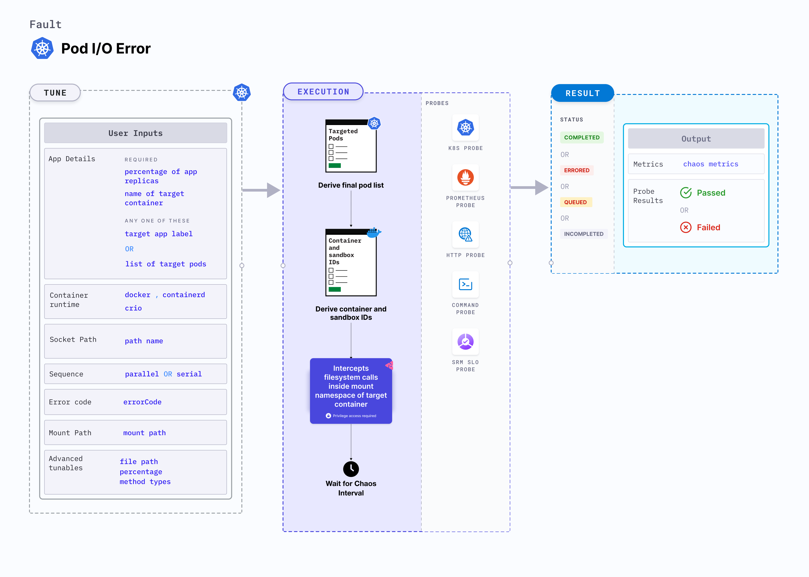

import IOFaultsCaution from './shared/io-faults-caution.md'

The pod-io-error chaos fault simulates an error that can occur during system calls of the files located within the mounted volume of the pod.
When triggered, it causes the call to fail and return an error, potentially disrupting critical processes that rely on accurate file operations.



## Use cases
Pod IO error:
- Simulates the error to test whether the application is able to recover gracefully from a failure in that service.
- Simulates errors into file system calls during a load test to see how the application responds, and whether it is able to handle the increased traffic,
- Simulates errors to test how your application responds to unexpected failures so you can plan accordingly.
- Simulates errors into file system call to test whether the application is vulnerable to attacks that exploit file system vulnerabilities.

<IOFaultsCaution />

:::info note
- Kubernetes 1.16 is required to execute this fault.
- The application pods should be in the running state before and after injecting chaos.
:::

## Fault tunables

  <h3>Mandatory tunables</h3>
    <table>
      <tr>
        <th> Tunable </th>
        <th> Description </th>
        <th> Notes </th>
      </tr>
      <tr>
        <td> ERROR_CODE </td>
        <td> Specify the error code to be injected in file system calls</td>
        <td> For more information, go to <a href="#error-code">error code</a>.</td>
      </tr>
      <tr>
        <td> MOUNT_PATH </td>
        <td> The absolute mount path of the volume mounted to the target pod</td>
        <td> For more information, go to <a href="#mount-path">mount path</a>. </td>
      </tr>
    </table>

  <h3>Optional tunables</h3>
    <table>
      <tr>
        <th> Tunable </th>
        <th> Description </th>
        <th> Notes </th>
      </tr>
      <tr>
        <td> TARGET_CONTAINER </td>
        <td> Name of the container subject to IO error </td>
        <td> If the value is not provided, the fault injects chaos on the first container of the pod. For more information, go to <a href="https://developer.harness.io/docs/chaos-engineering/chaos-faults/kubernetes/pod/common-tunables-for-pod-faults#target-specific-container">target specific container</a>.</td>
      </tr>
      <tr>
        <td> FILE_PATH </td>
        <td> The path for injecting faults can be specified as either a single file or a wildcard. If not provided, it will target all the files present inside the mount path </td>
        <td> For more information, go to <a href="#advanced-fault-tunables">file path</a>. </td>
      </tr>
      <tr>
        <td> PERCENTAGE </td>
        <td> The likelihood of failure per operation, expressed as a percentage </td>
        <td> For more information, go to <a href="#advanced-fault-tunables">percentage</a>. </td>
      </tr>
      <tr>
        <td> METHOD_TYPES </td>
        <td> This contains the file system call or methods. </td>
        <td> For more information, go to <a href="#advanced-fault-tunables">percentage</a>. </td>
      </tr>
      <tr>
        <td> CONTAINER_RUNTIME </td>
        <td> Container runtime interface for the cluster </td>
        <td> Default: containerd. Supports docker, containerd and crio. For more information, go to <a href="#container-runtime-and-socket-path">container runtime </a>. </td>
      </tr>
      <tr>
        <td> SOCKET_PATH </td>
        <td> Path of the containerd or crio or docker socket file </td>
        <td> Defaults to <code>/run/containerd/containerd.sock</code>. For more information, go to <a href="#container-runtime-and-socket-path">socket path</a>.</td>
      </tr>
      <tr>
        <td> TOTAL_CHAOS_DURATION </td>
        <td> Duration to inject insert chaos (in seconds) </td>
        <td> Default: 60 s. </td>
      </tr>
      <tr>
        <td> TARGET_PODS </td>
        <td> Comma-separated list of application pod names subject to pod IO error </td>
        <td> If not provided, the fault selects target pods randomly based on provided appLabels. For more information go to <a href="/docs/chaos-engineering/technical-reference/chaos-faults/kubernetes/pod/common-tunables-for-pod-faults/#target-specific-pods">target specific pods</a>.</td>
      </tr>  
      <tr>
        <td> PODS_AFFECTED_PERC </td>
        <td> Percentage of total pods to target. Provide numeric values. </td>
        <td> Default: 0 (corresponds to 1 replica). For more information, go to <a href="https://developer.harness.io/docs/chaos-engineering/chaos-faults/kubernetes/pod/common-tunables-for-pod-faults#pod-affected-percentage">pod affected percentage</a>.</td>
      </tr> 
      <tr>
        <td> RAMP_TIME </td>
        <td> Period to wait before and after injecting chaos (in seconds) </td>
        <td> For example, 30 s. For more information, go to <a href="https://developer.harness.io/docs/chaos-engineering/chaos-faults/common-tunables-for-all-faults#ramp-time">ramp time</a>.</td>
      </tr>
      <tr>
        <td> SEQUENCE </td>
        <td> Sequence of chaos execution for multiple target pods </td>
        <td> Default: parallel. Supports serial and parallel. For more information, go to <a href="https://developer.harness.io/docs/chaos-engineering/chaos-faults/common-tunables-for-all-faults#sequence-of-chaos-execution">sequence of chaos execution</a>.</td>
      </tr>
    </table>

### Error Code

Error code to be injected in system calls of the files located within the mounted volume of the pod. Tune it by using the `ERROR_CODE` environment variable. 

The following YAML snippet illustrates the use of this environment variable:

[embedmd]:# (./static/manifests/pod-io-error/io-error.yaml yaml)
```yaml
# it injects io error in the file system calls
apiVersion: litmuschaos.io/v1alpha1
kind: ChaosEngine
metadata:
  name: engine-nginx
spec:
  engineState: "active"
  annotationCheck: "false"
  appinfo:
    appns: "default"
    applabel: "app=nginx"
    appkind: "deployment"
  chaosServiceAccount: litmus-admin
  experiments:
  - name: pod-io-error
    spec:
      components:
        env:
        # error code
        - name: ERROR_CODE
          value: '5'
        - name: MOUNT_PATH
          value: '/etc/config'
        - name: TOTAL_CHAOS_DURATION
          value: '60'
```

### Mount Path

Mount path of the volume mounted to the target application. Tune it by using the `MOUNT_PATH` environment variable.

The following YAML snippet illustrates the use of this environment variable:

[embedmd]:# (./static/manifests/pod-io-error/mount-path.yaml yaml)
```yaml
# it injects io error in the file system calls
apiVersion: litmuschaos.io/v1alpha1
kind: ChaosEngine
metadata:
  name: engine-nginx
spec:
  engineState: "active"
  annotationCheck: "false"
  appinfo:
    appns: "default"
    applabel: "app=nginx"
    appkind: "deployment"
  chaosServiceAccount: litmus-admin
  experiments:
  - name: pod-io-error
    spec:
      components:
        env:
        # mount path of the volume
        - name: MOUNT_PATH
          value: '/etc/config'
        - name: ERROR_CODE
          value: '5'
        - name: TOTAL_CHAOS_DURATION
          value: '60'
```

### Advanced Fault Tunables

- `FILE_PATH`: The path for injecting faults can be specified as either a single file or a wildcard. By default it targets all the files present inside the mount path.
- `PERCENTAGE`: The likelihood of failure per operation, expressed as a percentage. Default is 100%.
- `METHOD_TYPES`: This contains the file system call or methods. By default it targets all the methods.

The following YAML snippet illustrates the use of this environment variable:

[embedmd]:# (./static/manifests/pod-io-error/advanced-fault-tunables.yaml yaml)
```yaml
# it injects io error in the file system calls
apiVersion: litmuschaos.io/v1alpha1
kind: ChaosEngine
metadata:
  name: engine-nginx
spec:
  engineState: "active"
  annotationCheck: "false"
  appinfo:
    appns: "default"
    applabel: "app=nginx"
    appkind: "deployment"
  chaosServiceAccount: litmus-admin
  experiments:
  - name: pod-io-error
    spec:
      components:
        env:
        # filter the target files
        - name: FILE_PATH
          value: '/etc/config/file.txt'
        # percentage of i/o calls
        - name: PERCENTAGE
          value: '50'
        # names of the io methods
        - name: METHOD_TYPES
          value: '["read","write"]'
        - name: ERROR_CODE
          value: '5'
        - name: MOUNT_PATH
          value: '/etc/config'
        - name: TOTAL_CHAOS_DURATION
          value: '60'
```

### Container runtime and socket path

The `CONTAINER_RUNTIME` and `SOCKET_PATH` are environment variables to set the container runtime and socket file path, respectively.

- `CONTAINER_RUNTIME`: This supports `docker`, `containerd`, and `crio` runtimes. The default value is `containerd`.
- `SOCKET_PATH`: This contains the path of containerd socket file by default (`/run/containerd/containerd.sock`). For `docker`, specify the path as `/var/run/docker.sock`. For `crio`, specify the path as `/var/run/crio/crio.sock`.

The following YAML snippet illustrates the use of these environment variables:

[embedmd]:# (./static/manifests/pod-io-error/container-runtime-and-socket-path.yaml yaml)
```yaml
## provide the container runtime and socket file path
apiVersion: litmuschaos.io/v1alpha1
kind: ChaosEngine
metadata:
  name: engine-nginx
spec:
  engineState: "active"
  annotationCheck: "false"
  appinfo:
    appns: "default"
    applabel: "app=nginx"
    appkind: "deployment"
  chaosServiceAccount: litmus-admin
  experiments:
  - name: pod-io-error
    spec:
      components:
        env:
        # runtime for the container
        # supports docker, containerd, crio
        - name: CONTAINER_RUNTIME
          value: 'containerd'
        # path of the socket file
        - name: SOCKET_PATH
          value: '/run/containerd/containerd.sock'
        - name: ERROR_CODE
          value: '5'
        - name: MOUNT_PATH
          value: '/etc/config'
        - name: TOTAL_CHAOS_DURATION
          VALUE: '60'
```
