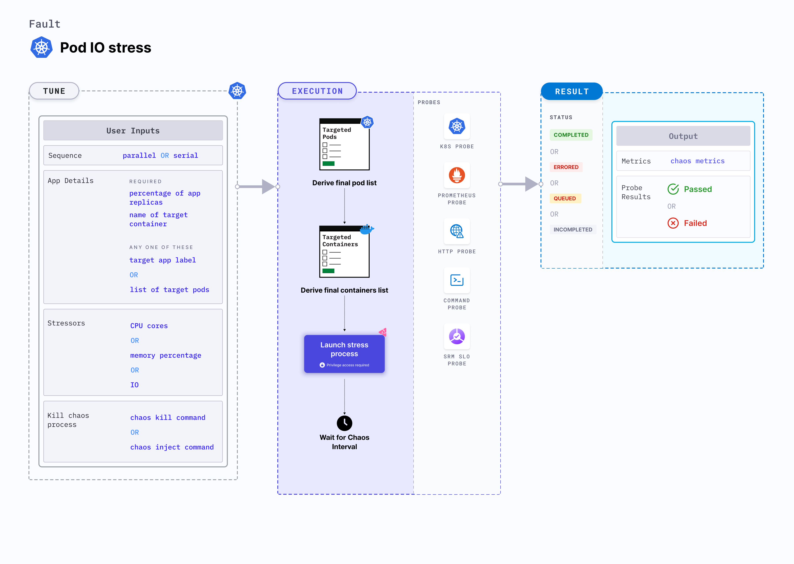

## Introduction

Pod I/O stress is a Kubernetes pod-level chaos fault that causes I/O stress on the application pod by increasing the number of input and output requests. Applying stress on the disk with continuous and heavy I/O degrades the reads and writes with respect to the microservices. Scratch space consumed on a node may lead to lack of memory for new containers to be scheduled. All these aspects increase resilience to stress. 




## Use cases
Pod IO stress:
- Aims to verify the resilience of applications that share the disk resource for ephemeral (or persistent) storage.
- Simulates slower disk operations by the application.
- Simulates noisy neighbour problems by hogging the disk bandwidth.
- Verifies the disk performance on increasing I/O threads and varying I/O block sizes. 
- Checks how the application functions under high disk latency conditions and when I/O traffic is very high.
- Checks how the application functions under large I/O blocks, and when other services monopolize the I/O disks. 

:::info note
- Kubernetes> 1.16 is required to execute this fault.
- The application pods should be in the running state before and after injecting chaos.
:::

## Fault tunables

  <h3>Optional tunables</h3>
    <table>
      <tr>
        <th> Tunable </th>
        <th> Description </th>
        <th> Notes </th>
      </tr>
      <tr>
        <td> FILESYSTEM_UTILIZATION_PERCENTAGE </td>
        <td> Specifies the size as a percentage of free space on the file system. </td>
        <td> Default: 10 %. For more information, go to <a href="https://developer.harness.io/docs/chaos-engineering/chaos-faults/kubernetes/pod/pod-io-stress#filesystem-utilization-percentage"> file system utilization percentage </a></td>
      </tr>
      <tr>
        <td> FILESYSTEM_UTILIZATION_BYTES </td>
        <td> Specifies the size in gigabytes (GB). <code>FILESYSTEM_UTILIZATION_PERCENTAGE</code> and <code>FILESYSTEM_UTILIZATION_BYTES</code> are mutually exclusive. If both the values are provided, <code>FILESYSTEM_UTILIZATION_PERCENTAGE</code> takes priority. For more information, go to <a href="https://developer.harness.io/docs/chaos-engineering/chaos-faults/kubernetes/pod/pod-io-stress#filesystem-utilization-bytes"> file system utilization bytes</a></td>
        <td> </td>
      </tr>
      <tr>
        <td> NUMBER_OF_WORKERS </td>
        <td> Number of IO workers involved in IO disk stress. </td>
        <td> Default: 4. For more information, go to <a href="https://developer.harness.io/docs/chaos-engineering/chaos-faults/kubernetes/pod/pod-io-stress#workers-for-stress">workers for stress</a></td>
      </tr> 
      <tr>
        <td> TOTAL_CHAOS_DURATION </td>
        <td> Duration for which to insert chaos (in seconds). </td>
        <td> Default: 120 s. For more information, go to <a href="https://developer.harness.io/docs/chaos-engineering/chaos-faults/common-tunables-for-all-faults#duration-of-the-chaos">duration of the chaos </a></td>
      </tr>
      <tr>
        <td> VOLUME_MOUNT_PATH </td>
        <td> Fill the given volume mount path. </td>
        <td> For more information, go to <a href="https://developer.harness.io/docs/chaos-engineering/chaos-faults/kubernetes/pod/pod-io-stress#mount-path"> mount path</a></td>
      </tr> 
      <tr>
        <td> TARGET_PODS </td>
        <td> Comma-separated list of application pod names subject to pod IO stress. </td>
        <td> If not provided, the fault selects target pods randomly based on provided appLabels. For more information, go to <a href="https://developer.harness.io/docs/chaos-engineering/chaos-faults/kubernetes/pod/common-tunables-for-pod-faults#target-specific-pods"> target specific pods</a></td>
      </tr>  
      <tr>
        <td> PODS_AFFECTED_PERC </td>
        <td> Percentage of total pods to target. Provide numeric values. </td>
        <td> Default: 0 (corresponds to 1 replica). For more information, go to <a href="https://developer.harness.io/docs/chaos-engineering/chaos-faults/kubernetes/pod/common-tunables-for-pod-faults#pod-affected-percentage">pod affected percentage</a></td>
      </tr>
      <tr>
        <td> CONTAINER_RUNTIME </td>
        <td> Container runtime interface for the cluster. </td>
        <td> Default: containerd. Supports docker, containerd and crio. For more information, go to <a href="https://developer.harness.io/docs/chaos-engineering/chaos-faults/kubernetes/pod/pod-dns-error#container-runtime-and-socket-path">container runtime </a> </td>
      </tr>
      <tr>
        <td> SOCKET_PATH </td>
        <td> Path of the containerd or crio or docker socket file. </td>
        <td> Default: <code>/run/containerd/containerd.sock</code> For more information, go to <a href="https://developer.harness.io/docs/chaos-engineering/chaos-faults/kubernetes/pod/pod-dns-error#container-runtime-and-socket-path">socket path</a></td>
      </tr>    
      <tr>
        <td> RAMP_TIME </td>
        <td> Period to wait before and after injecting chaos (in seconds). </td>
        <td> For example, 30 s. For more information, go to <a href="https://developer.harness.io/docs/chaos-engineering/chaos-faults/common-tunables-for-all-faults#ramp-time">ramp time</a></td>
      </tr>
      <tr>
        <td> SEQUENCE </td>
        <td> Sequence of chaos execution for multiple target pods. </td>
        <td> Default: parallel. Supports serial and parallel. For more information, go to <a href="https://developer.harness.io/docs/chaos-engineering/chaos-faults/common-tunables-for-all-faults#sequence-of-chaos-execution">sequence of chaos execution</a></td>
      </tr>
    </table>


### File system utilization percentage

Amount (in percentage) of free space in the pod. Tune it by using the `FILESYSTEM_UTILIZATION_PERCENTAGE` environment variable.

The following YAML snippet illustrates the use of this environment variable:

[embedmd]: # "./static/manifests/pod-io-stress/filesystem-utilization-percentage.yaml yaml"

```yaml
# stress the i/o of the targeted pod with FILESYSTEM_UTILIZATION_PERCENTAGE of total free space
# it is mutually exclusive with the FILESYSTEM_UTILIZATION_BYTES.
# if both are provided then it will use FILESYSTEM_UTILIZATION_PERCENTAGE for stress
apiVersion: litmuschaos.io/v1alpha1
kind: ChaosEngine
metadata:
  name: engine-nginx
spec:
  engineState: "active"
  annotationCheck: "false"
  appinfo:
    appns: "default"
    applabel: "app=nginx"
    appkind: "deployment"
  chaosServiceAccount: litmus-admin
  experiments:
    - name: pod-io-stress
      spec:
        components:
          env:
            # percentage of free space of file system, need to be stressed
            - name: FILESYSTEM_UTILIZATION_PERCENTAGE
              value: "10" #in GB
            - name: TOTAL_CHAOS_DURATION
              VALUE: "60"
```

### File system utilization bytes

Amount of free space available in the pod in gigabytes (GB). Tune it by using the `FILESYSTEM_UTILIZATION_BYTES` environment variable.
`FILESYSTEM_UTILIZATION_PERCENTAGE` and `FILESYSTEM_UTILIZATION_BYTES` environment variables are mutually exclusive. If both the values are provided, `FILESYSTEM_UTILIZATION_PERCENTAGE` takes priority.

The following YAML snippet illustrates the use of this environment variable:

[embedmd]: # "./static/manifests/pod-io-stress/filesystem-utilization-bytes.yaml yaml"

```yaml
# stress the i/o of the targeted pod with given FILESYSTEM_UTILIZATION_BYTES
# it is mutually exclusive with the FILESYSTEM_UTILIZATION_PERCENTAGE.
# if both are provided then it will use FILESYSTEM_UTILIZATION_PERCENTAGE for stress
apiVersion: litmuschaos.io/v1alpha1
kind: ChaosEngine
metadata:
  name: engine-nginx
spec:
  engineState: "active"
  annotationCheck: "false"
  appinfo:
    appns: "default"
    applabel: "app=nginx"
    appkind: "deployment"
  chaosServiceAccount: litmus-admin
  experiments:
    - name: pod-io-stress
      spec:
        components:
          env:
            # size of io to be stressed
            - name: FILESYSTEM_UTILIZATION_BYTES
              value: "1" #in GB
            - name: TOTAL_CHAOS_DURATION
              VALUE: "60"
```

### Container runtime and socket path

The `CONTAINER_RUNTIME` and `SOCKET_PATH` environment variables to set the container runtime and socket file path, respectively.

- `CONTAINER_RUNTIME`: It supports `docker`, `containerd`, and `crio` runtimes. The default value is `containerd`.
- `SOCKET_PATH`: It contains path of containerd socket file by default(`/run/containerd/containerd.sock`). For `docker`, specify path as `/var/run/docker.sock`. For `crio`, specify path as `/var/run/crio/crio.sock`.

The following YAML snippet illustrates the use of this environment variable:

[embedmd]: # "./static/manifests/pod-io-stress/container-runtime-and-socket-path.yaml yaml"

```yaml
## provide the container runtime and socket file path
apiVersion: litmuschaos.io/v1alpha1
kind: ChaosEngine
metadata:
  name: engine-nginx
spec:
  engineState: "active"
  annotationCheck: "false"
  appinfo:
    appns: "default"
    applabel: "app=nginx"
    appkind: "deployment"
  chaosServiceAccount: litmus-admin
  experiments:
    - name: pod-io-stress
      spec:
        components:
          env:
            # runtime for the container
            # supports docker, containerd, crio
            - name: CONTAINER_RUNTIME
              value: "containerd"
            # path of the socket file
            - name: SOCKET_PATH
              value: "/run/containerd/containerd.sock"
            - name: TOTAL_CHAOS_DURATION
              VALUE: "60"
```

### Mount path

Volume mount path that is to be filled. Tune it by using the `VOLUME_MOUNT_PATH` environment variable.

The following YAML snippet illustrates the use of this environment variable:

[embedmd]: # "./static/manifests/pod-io-stress/mount-path.yaml yaml"

```yaml
# provide the volume mount path, which needs to be filled
apiVersion: litmuschaos.io/v1alpha1
kind: ChaosEngine
metadata:
  name: engine-nginx
spec:
  engineState: "active"
  annotationCheck: "false"
  appinfo:
    appns: "default"
    applabel: "app=nginx"
    appkind: "deployment"
  chaosServiceAccount: litmus-admin
  experiments:
    - name: pod-io-stress
      spec:
        components:
          env:
            # path need to be stressed/filled
            - name: VOLUME_MOUNT_PATH
              value: "/some-dir-in-container"
            - name: TOTAL_CHAOS_DURATION
              VALUE: "60"
```

### Workers for stress

Number of workers for the stress. Tune it by using the `NUMBER_OF_WORKERS` environment variable.

The following YAML snippet illustrates the use of this environment variable:

[embedmd]: # "./static/manifests/pod-io-stress/workers.yaml yaml"

```yaml
# number of workers for the stress
apiVersion: litmuschaos.io/v1alpha1
kind: ChaosEngine
metadata:
  name: engine-nginx
spec:
  engineState: "active"
  annotationCheck: "false"
  appinfo:
    appns: "default"
    applabel: "app=nginx"
    appkind: "deployment"
  chaosServiceAccount: litmus-admin
  experiments:
    - name: pod-io-stress
      spec:
        components:
          env:
            # number of io workers
            - name: NUMBER_OF_WORKERS
              value: "4"
            - name: TOTAL_CHAOS_DURATION
              VALUE: "60"
```