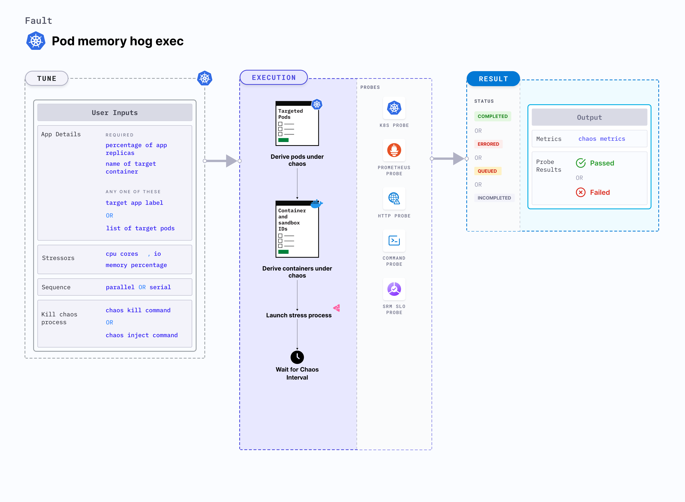

## Introduction

Pod memory hog exec is a Kubernetes pod-level chaos fault that consumes excessive memory resources on the application container. Since this fault stresses the target container, the primary process within the container may consume the available system memory on the node. 
- Memory usage within containers is subject to various constraints in Kubernetes. 
- When specification mentions the resource limits, exceeding these limits results in termination of the container due to OOM kill. 
- For containers that have no resource limits, the blast radius is high which results in the node being killed based on the `oom_score`. 




## Use cases
Pod memory hog exec:
- Simulates conditions where the application pods experience memory spikes either due to expected or undesired processes.
- Simulates the situation of memory leaks in the deployment of microservices.
- Simulates application slowness due to memory starvation, and noisy neighbour problems due to hogging. 
- Verifies pod priority and QoS setting for eviction purposes. 
- Verifies application restarts on OOM (out of memory) kills. 
- Tests how the overall application stack behaves when such a situation occurs.

:::info note
- Kubernetes > 1.16 is required to execute this fault.
- The application pods should be in the running state before and after injecting chaos.
:::

## Fault tunables

  <h3>Optional tunables</h3>
    <table>
      <tr>
        <th> Tunable </th>
        <th> Description </th>
        <th> Notes </th>
      </tr>
      <tr>
        <td> MEMORY_CONSUMPTION </td>
        <td> Amount of memory used consumed by the pod (in megabytes). </td>
        <td> Default: 500 MB (Up to 2000 MB). For more information, go to <a href="https://developer.harness.io/docs/chaos-engineering/chaos-faults/kubernetes/pod/pod-memory-hog-exec#memory-consumption"> memory consumption </a></td>
      </tr>
      <tr>
        <td> TOTAL_CHAOS_DURATION </td>
        <td> Duration for which to insert chaos (in seconds). </td>
        <td> Default: 60 s. For more information, go to <a href="https://developer.harness.io/docs/chaos-engineering/chaos-faults/common-tunables-for-all-faults#duration-of-the-chaos">duration of the chaos </a> </td>
      </tr>
      <tr>
        <td> TARGET_PODS </td>
        <td> Comma-separated list of application pod names subject to pod memory hog. </td>
        <td> If not provided, the fault selects target pods randomly based on provided appLabels. For more information, go to <a href="https://developer.harness.io/docs/chaos-engineering/chaos-faults/kubernetes/pod/common-tunables-for-pod-faults#target-specific-pods"> target specific pods</a></td>
      </tr>
      <tr> 
        <td> TARGET_CONTAINER </td>
        <td> Name of the target container. </td>
        <td> If this value is not provided, the fault selects the first container of the target pod. For more information, go to <a href="https://developer.harness.io/docs/chaos-engineering/chaos-faults/kubernetes/pod/common-tunables-for-pod-faults#target-specific-container">target specific container </a></td>
      </tr> 
      <tr>
        <td> CHAOS_KILL_COMMAND </td>
        <td> Command to kill the chaos process. If the commands don't work, check if the target pod's base image offers a shell. If yes, identify the appropriate shell command to kill the chaos process.</td>
        <td> Defaults to <code>kill $(find /proc -name exe -lname '*/dd' 2>&1 | grep -v 'Permission denied' | awk -F/ '&#123;print $(NF-1)&#125;' | head -n 1)</code>. An alternative to the default command is <code>kill -9 $(ps afx | grep \"[dd] if=/dev/zero\" | awk '&#123;print $1&#125;' | tr '\n' ' ')</code>. For more information, go to <a href="https://developer.harness.io/docs/chaos-engineering/chaos-faults/kubernetes/pod/pod-memory-hog-exec#chaos-kill-commands"> chaos kill commands </a></td>
      </tr>
      <tr>
        <td> PODS_AFFECTED_PERC </td>
        <td> Percentage of total pods to target. Provide numeric values. </td>
        <td> Default: 0 (corresponds to 1 replica). For more information, go to <a href="https://developer.harness.io/docs/chaos-engineering/chaos-faults/kubernetes/pod/common-tunables-for-pod-faults#pod-affected-percentage">pod affected percentage </a></td>
      </tr>
      <tr>
        <td> RAMP_TIME </td>
        <td> Period to wait before and after injecting chaos (in seconds). </td>
        <td> For example, 30 s. For more information, go to <a href="https://developer.harness.io/docs/chaos-engineering/chaos-faults/common-tunables-for-all-faults#ramp-time">ramp time</a></td>
      </tr>
      <tr>
        <td> SEQUENCE </td>
        <td> Sequence of chaos execution for multiple target pods. </td>
        <td> Default: parallel. Supports serial and parallel. For more information, go to <a href="https://developer.harness.io/docs/chaos-engineering/chaos-faults/common-tunables-for-all-faults#sequence-of-chaos-execution">sequence of chaos execution</a></td>
      </tr>
    </table>

### Memory consumption

Amount of memory consumed by the target pod. The memory consumption limit is 2000 MB. Tune it by using the `MEMORY_CONSUMPTION` environment variable.

The following YAML snippet illustrates the use of this environment variable:

[embedmd]: # "./static/manifests/pod-memory-hog-exec/memory-consumption.yaml yaml"

```yaml
# memory to be stressed in MB
apiVersion: litmuschaos.io/v1alpha1
kind: ChaosEngine
metadata:
  name: engine-nginx
spec:
  engineState: "active"
  annotationCheck: "false"
  appinfo:
    appns: "default"
    applabel: "app=nginx"
    appkind: "deployment"
  chaosServiceAccount: litmus-admin
  experiments:
    - name: pod-memory-hog
      spec:
        components:
          env:
            # memory consumption value in MB
            # it is limited to 2000MB
            - name: MEMORY_CONSUMPTION
              value: "500" #in MB
            - name: TOTAL_CHAOS_DURATION
              value: "60"
```

### Chaos kill commands

Kill command set to exhaust the resources. Tune it by using the `CHAOS_KILL_COMMAND` environment variable.

- `CHAOS_KILL_COMMAND`: "kill $(find /proc -name exe -lname '\*/dd' 2>&1 | grep -v 'Permission denied' | awk -F/ '{print $(NF-1)}' | head -n 1)"

The following YAML snippet illustrates the use of this environment variable:

[embedmd]: # "./static/manifests/pod-memory-hog-exec/kill-command.yaml yaml"

```yaml
# provide the chaos kill command used to kill the chaos process
apiVersion: litmuschaos.io/v1alpha1
kind: ChaosEngine
metadata:
  name: engine-nginx
spec:
  engineState: "active"
  annotationCheck: "false"
  appinfo:
    appns: "default"
    applabel: "app=nginx"
    appkind: "deployment"
  chaosServiceAccount: litmus-admin
  experiments:
    - name: pod-memory-hog-exec
      spec:
        components:
          env:
            # command to kill the dd process
            # alternative command: "kill -9 $(ps afx | grep \"[dd] if=/dev/zero\" | awk '{print $1}' | tr '\n' ' ')"
            - name: CHAOS_KILL_COMMAND
              value: "kill $(find /proc -name exe -lname '*/dd' 2>&1 | grep -v 'Permission denied' | awk -F/ '{print $(NF-1)}' | head -n 1)"
            - name: TOTAL_CHAOS_DURATION
              value: "60"
```
