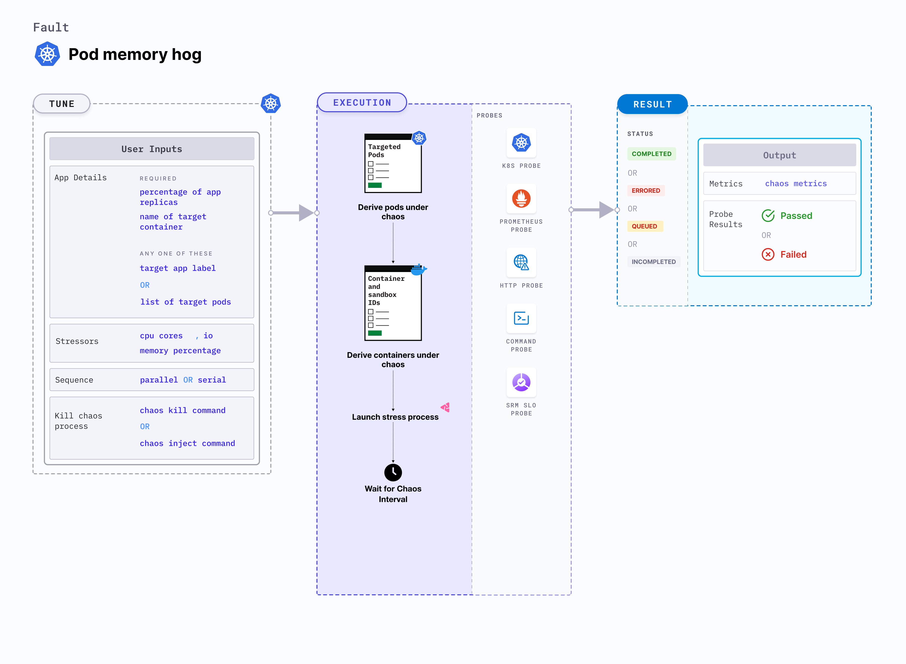

## Introduction

Pod memory hog is a Kubernetes pod-level chaos fault that consumes excessive memory resources on the application container. Since this fault stresses the target container, the primary process within the container may consume the available system memory on the node. 
- Memory usage within containers is subject to various constraints in Kubernetes. 
- When specification mentions the resource limits, exceeding these limits results in termination of the container due to OOM kill. 
- For containers that have no resource limits, the blast radius is high which results in the node being killed based on the `oom_score`. 



## Use cases
Pod memory hog exec:
- Simulates conditions where the application pods experience memory spikes either due to expected or undesired processes.
- Simulates the situation of memory leaks in the deployment of microservices.
- Simulates application slowness due to memory starvation, and noisy neighbour problems due to hogging. 
- Verifies pod priority and QoS setting for eviction purposes. 
- Verifies application restarts on OOM (out of memory) kills. 
- Tests how the overall application stack behaves when such a situation occurs.

:::info note
- Kubernetes> 1.16 is required to execute this fault.
- The application pods should be in the running state before and after injecting chaos.
:::


## Fault tunables

  <h3>Optional tunables</h3>
    <table>
      <tr>
        <th> Tunable </th>
        <th> Description </th>
        <th> Notes </th>
      </tr>
      <tr>
        <td> MEMORY_CONSUMPTION </td>
        <td> Amount of memory consumed by the Kubernetes pod (in megabytes). </td>
        <td> Default: 500 MB. For more information, go to <a href="https://developer.harness.io/docs/chaos-engineering/chaos-faults/kubernetes/pod/pod-memory-hog#memory-consumption"> memory consumption</a></td>
      </tr>
      <tr>
        <td> NUMBER_OF_WORKERS </td>
        <td> Number of workers used to run the stress process. </td>
        <td> Default: 1. For more information, go to <a href="https://developer.harness.io/docs/chaos-engineering/chaos-faults/kubernetes/pod/pod-memory-hog#workers-for-stress"> workers for stress</a></td>
      </tr>  
      <tr>
        <td> TOTAL_CHAOS_DURATION </td>
        <td> Duration for which to insert chaos (in seconds). </td>
        <td> Default: 60 s. For more information, go to <a href="https://developer.harness.io/docs/chaos-engineering/chaos-faults/common-tunables-for-all-faults#duration-of-the-chaos">duration of the chaos </a> </td>
      </tr>
      <tr>
        <td> TARGET_PODS </td>
        <td> Comma-separated list of application pod names subject to pod memory hog. </td>
        <td> If this value is not provided, the fault selects target pods randomly based on provided appLabels. For more information, go to <a href="https://developer.harness.io/docs/chaos-engineering/chaos-faults/kubernetes/pod/common-tunables-for-pod-faults#target-specific-pods"> target specific pods</a></td>
      </tr>
      <tr>
        <td> TARGET_CONTAINER </td>
        <td> Name of the target container.</td>
        <td> If this value is not provided, the fault selects the first container of the target pod. For more information, go to <a href="https://developer.harness.io/docs/chaos-engineering/chaos-faults/kubernetes/pod/common-tunables-for-pod-faults#target-specific-container"> target specific container</a></td>
      </tr>   
      <tr>
        <td> CONTAINER_RUNTIME </td>
        <td> Container runtime interface for the cluster. </td>
        <td> Default: containerd. Supports docker, containerd and crio. For more information, go to <a href="https://developer.harness.io/docs/chaos-engineering/chaos-faults/kubernetes/pod/pod-dns-error#container-runtime-and-socket-path"> container runtime </a></td>
      </tr>
      <tr>
        <td> SOCKET_PATH </td>
        <td> Path of the containerd or crio or docker socket file. </td>
        <td> Default: <code>/run/containerd/containerd.sock</code>. For more information, go to <a href="https://developer.harness.io/docs/chaos-engineering/chaos-faults/kubernetes/pod/pod-memory-hog#container-runtime-and-socket-path"> socket path</a></td>
      </tr>        
      <tr>
        <td> PODS_AFFECTED_PERC </td>
        <td> Percentage of total pods to target. Provide numeric values. </td>
        <td> Default: 0 (corresponds to 1 replica). For more information, go to <a href="https://developer.harness.io/docs/chaos-engineering/chaos-faults/kubernetes/pod/common-tunables-for-pod-faults#pod-affected-percentage">pod affected percentage </a></td>
      </tr>
      <tr>
        <td> RAMP_TIME </td>
        <td> Period to wait before and after injecting chaos (in seconds). </td>
        <td> For example, 30 s. For more information, go to <a href="https://developer.harness.io/docs/chaos-engineering/chaos-faults/common-tunables-for-all-faults#ramp-time">ramp time</a></td>
      </tr>
      <tr>
        <td> SEQUENCE </td>
        <td> Sequence of chaos execution for multiple target pods. </td>
        <td> Default: parallel. Supports serial and parallel. For more information, go to <a href="https://developer.harness.io/docs/chaos-engineering/chaos-faults/common-tunables-for-all-faults#sequence-of-chaos-execution">sequence of chaos execution</a></td>
      </tr>
    </table>

### Memory consumption

Amount of memory consumed by the target pod. Tune it by using the `MEMORY_CONSUMPTION` environment variable.

The following YAML snippet illustrates the use of this environment variable:

[embedmd]: # "./static/manifests/pod-memory-hog/memory-consumption.yaml yaml"

```yaml
# define the memory consumption in MB
apiVersion: litmuschaos.io/v1alpha1
kind: ChaosEngine
metadata:
  name: engine-nginx
spec:
  engineState: "active"
  annotationCheck: "false"
  appinfo:
    appns: "default"
    applabel: "app=nginx"
    appkind: "deployment"
  chaosServiceAccount: litmus-admin
  experiments:
    - name: pod-memory-hog
      spec:
        components:
          env:
            # memory consumption value
            - name: MEMORY_CONSUMPTION
              value: "500" #in MB
            - name: TOTAL_CHAOS_DURATION
              value: "60"
```

### Workers for stress

Number of workers used to stress the resources. Tune it by using the `NUMBER_OF_WORKERS` environment variable.

The following YAML snippet illustrates the use of this environment variable:

[embedmd]: # "./static/manifests/pod-memory-hog/workers.yaml yaml"

```yaml
# number of workers used for the stress
apiVersion: litmuschaos.io/v1alpha1
kind: ChaosEngine
metadata:
  name: engine-nginx
spec:
  engineState: "active"
  annotationCheck: "false"
  appinfo:
    appns: "default"
    applabel: "app=nginx"
    appkind: "deployment"
  chaosServiceAccount: litmus-admin
  experiments:
    - name: pod-memory-hog
      spec:
        components:
          env:
            # number of workers for stress
            - name: NUMBER_OF_WORKERS
              value: "1"
            - name: TOTAL_CHAOS_DURATION
              value: "60"
```

### Container runtime and socket path

The `CONTAINER_RUNTIME` and `SOCKET_PATH` envrionment variables to set the container runtime and socket file path, respectively.

- `CONTAINER_RUNTIME`: It supports `docker`, `containerd`, and `crio` runtimes. The default value is `containerd`.
- `SOCKET_PATH`: It contains path of containerd socket file by default(`/run/containerd/containerd.sock`). For `docker`, specify path as `/var/run/docker.sock`. For `crio`, specify path as `/var/run/crio/crio.sock`.

The following YAML snippet illustrates the use of these environment variables:

[embedmd]: # "./static/manifests/pod-memory-hog/container-runtime-and-socket-path.yaml yaml"

```yaml
## provide the container runtime and socket file path
apiVersion: litmuschaos.io/v1alpha1
kind: ChaosEngine
metadata:
  name: engine-nginx
spec:
  engineState: "active"
  annotationCheck: "false"
  appinfo:
    appns: "default"
    applabel: "app=nginx"
    appkind: "deployment"
  chaosServiceAccount: litmus-admin
  experiments:
    - name: pod-io-stress
      spec:
        components:
          env:
            # runtime for the container
            # supports docker, containerd, crio
            - name: CONTAINER_RUNTIME
              value: "containerd"
            # path of the socket file
            - name: SOCKET_PATH
              value: "/run/containerd/containerd.sock"
            - name: TOTAL_CHAOS_DURATION
              VALUE: "60"
```
