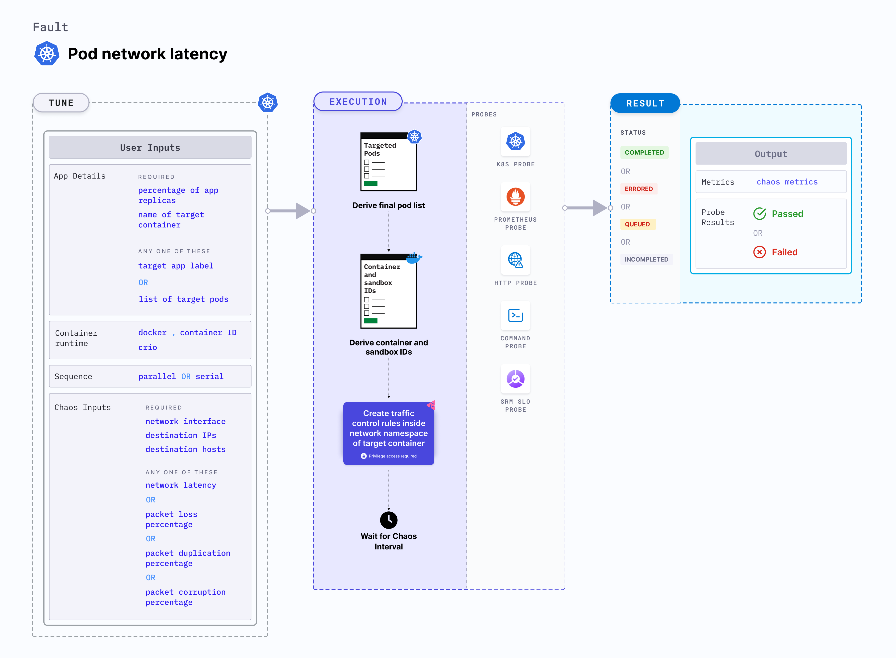

## Introduction

Pod network latency is a Kubernetes pod-level chaos fault that introduces latency (delay) to a specific container. This fault:
- Initiates a traffic control (tc) process with netem rules to add egress delays.
- Degrades the nwtwork without marking the pod as unhealthy or unworthy of traffic by kube-proxy (unless there is a liveness probe that measures thw latency and restarts (or crashes) the container).
- Issues with microservice communication across the services can be resolved by using middleware that switches the traffic based on certain SLOs or performance parameters. 
  - Such issues can also be resolved by setting up alerts and notifications to highlight a degradation, so that they can be addressed, and rectified. A
  - Issues can also be resolved by understanding the impact of the failure and determining the last point before degradation in the application stack. 





## Use cases
Pod network latency:
- Tests the application's resilience to lossy or flaky networks.
- Simulates issues within the pod network or microservice communication across the services in different availability zones or regions. 
- Applications may stall or become corrupt while waiting endlessly for a data packet. This fault can reduce the blast radius to the traffic that you wish to test by specifying the IP addresses. 
- Simulates a consistently slow network connection between microservices (for example, cross-region connectivity between active-active peers of a given service or across the services or poor cni-performance in the inter-pod-communication network). 
- Simulates a jittery connection with transient latency spikes between microservices.
- Simulates a slow response on specific third-party or dependent components or services.
- Simulates a degraded data-plane of service-mesh infrastructure.  


:::info note
- Kubernetes> 1.16 is required to execute this fault.
- The application pods should be in the running state before and after injecting chaos.
:::

## Fault tunables

  <h3>Optional tunables</h3>
    <table>
      <tr>
        <th> Tunable </th>
        <th> Description </th>
        <th> Notes </th>
      </tr>
      <tr>
        <td> NETWORK_INTERFACE </td>
        <td> Name of ethernet interface considered for shaping traffic. </td>
        <td> For more information, go to <a href="https://developer.harness.io/docs/chaos-engineering/chaos-faults/kubernetes/pod/pod-network-latency#network-interface">network interface</a>.</td>
      </tr>
      <tr>
        <td> TARGET_CONTAINER </td>
        <td> Name of the container subject to the network latency. Applicable for <code>containerd</code> and <code>crio</code> runtimes.</td>
        <td> With these runtimes, if the value is not provided, the fault injects chaos on the first container of the pod. For more information, go to <a href="https://developer.harness.io/docs/chaos-engineering/chaos-faults/kubernetes/pod/common-tunables-for-pod-faults#target-specific-container">target specific container</a>.</td>
      </tr>
      <tr>
        <td> NETWORK_LATENCY </td>
        <td> Delay (in milliseconds). Provide numeric values. </td>
        <td> Defaults to 2000. For more information, go to <a href="https://developer.harness.io/docs/chaos-engineering/chaos-faults/kubernetes/pod/pod-network-latency#network-latency">network latency</a>.</td>
      </tr>
      <tr>
        <td> JITTER </td>
        <td> Network jitter (in milliseconds). Provide numeric values. </td>
        <td> Defaults to 0. For more information, go to <a href="https://developer.harness.io/docs/chaos-engineering/chaos-faults/kubernetes/pod/pod-network-latency#jitter">jitter</a>.</td>
      </tr> 
      <tr>
        <td> CONTAINER_RUNTIME </td>
        <td> Container runtime interface for the cluster. </td>
        <td> Default: containerd. Supports docker, containerd and crio. For more information, go to <a href="https://developer.harness.io/docs/chaos-engineering/chaos-faults/kubernetes/pod/pod-dns-error#container-runtime-and-socket-path">container runtime</a>. </td>
      </tr>
      <tr>
        <td> SOCKET_PATH </td>
        <td> Path of the containerd or crio or docker socket file. </td>
        <td> Default: <code>/run/containerd/containerd.sock</code>. For more information, go to <a href="https://developer.harness.io/docs/chaos-engineering/chaos-faults/kubernetes/pod/pod-dns-error#container-runtime-and-socket-path">socket path</a>.</td>
      </tr>
      <tr>
        <td> TOTAL_CHAOS_DURATION </td>
        <td> Duration for which to insert chaos (in seconds). </td>
        <td> Default: 60 s. For more information, go to <a href="https://developer.harness.io/docs/chaos-engineering/chaos-faults/common-tunables-for-all-faults#duration-of-the-chaos">duration of the chaos</a>.</td>
      </tr>
      <tr>
        <td> TARGET_PODS </td>
        <td> Comma-separated list of application pod names subject to pod network latency. </td>
        <td> If not provided, the fault selects target pods randomly based on provided appLabels. For more information, go to <a href="https://developer.harness.io/docs/chaos-engineering/chaos-faults/kubernetes/pod/common-tunables-for-pod-faults#target-specific-pods"> target specific pods</a>.</td>
      </tr> 
      <tr>
        <td> DESTINATION_IPS </td>
        <td> IP addresses of the services or pods or the CIDR blocks(range of IPs) whose accessibility is impacted. Comma separated IP(S) or CIDR(S) can be provided.</td>
        <td> If these values are not provided, the fault induces network chaos for all IPs or destinations. For more information, go to <a href="https://developer.harness.io/docs/chaos-engineering/chaos-faults/kubernetes/pod/pod-network-latency#destination-ips-and-destination-hosts">destination IPs</a>.</td>
      </tr>  
      <tr>
        <td> DESTINATION_HOSTS </td>
        <td> DNS names or FQDN names of the services whose accessibility is impacted. </td>
        <td> If these values are not provided, the fault induces network chaos for all IPs or destinations or DESTINATION_IPS if already defined. For more information, go to <a href="https://developer.harness.io/docs/chaos-engineering/chaos-faults/kubernetes/pod/pod-network-latency#destination-ips-and-destination-hosts">destination hosts</a>.</td>
      </tr>   
      <tr>
        <td> SOURCE_PORTS </td>
        <td> Ports of the target application, the accessibility to which is impacted </td>
        <td> Comma separated port(s) can be provided. If not provided, it will induce network chaos for all ports. </td>
      </tr>  
      <tr>
        <td> DESTINATION_PORTS </td>
        <td> Ports of the destination services or pods or the CIDR blocks(range of IPs), the accessibility to which is impacted </td>
        <td> Comma separated port(s) can be provided. If not provided, it will induce network chaos for all ports. </td>
      </tr>
      <tr>
        <td> PODS_AFFECTED_PERC </td>
        <td> Percentage of total pods to target. Provie numeric values. </td>
        <td> Default: 0 (corresponds to 1 replica). For more information, go to <a href="https://developer.harness.io/docs/chaos-engineering/chaos-faults/kubernetes/pod/common-tunables-for-pod-faults#pod-affected-percentage">pod affected percentage</a>.</td>
      </tr>
      <tr>
        <td> RAMP_TIME </td>
        <td> Period to wait before and after injecting chaos (in seconds). </td>
        <td> For example, 30 s. For more information, go to <a href="https://developer.harness.io/docs/chaos-engineering/chaos-faults/common-tunables-for-all-faults#ramp-time">ramp time</a>.</td>
      </tr>
      <tr>
        <td> SEQUENCE </td>
        <td> Sequence of chaos execution for multiple target pods. </td>
        <td> Default: parallel. Supports serial and parallel. For more information, go to <a href="https://developer.harness.io/docs/chaos-engineering/chaos-faults/common-tunables-for-all-faults#sequence-of-chaos-execution">sequence of chaos execution</a>.</td>
      </tr>
    </table>

### Network latency

Network delay (in ms) injected into the target application. Tune it by using the `NETWORK_LATENCY` environment variable.

The following YAML snippet illustrates the use of this environment variable:

[embedmd]: # "./static/manifests/pod-network-latency/network-latency.yaml yaml"

```yaml
# it injects network-latency for the egress traffic
apiVersion: litmuschaos.io/v1alpha1
kind: ChaosEngine
metadata:
  name: engine-nginx
spec:
  engineState: "active"
  annotationCheck: "false"
  appinfo:
    appns: "default"
    applabel: "app=nginx"
    appkind: "deployment"
  chaosServiceAccount: litmus-admin
  experiments:
    - name: pod-network-latency
      spec:
        components:
          env:
            # network latency to be injected
            - name: NETWORK_LATENCY
              value: "2000" #in ms
            - name: TOTAL_CHAOS_DURATION
              value: "60"
```

### Destination IPs and destination hosts

Default IPs and hosts whose traffic is interrupted due to the network faults. Tune it by using the `DESTINATION_IPS` and `DESTINATION_HOSTS` environment variabes, respectively.

- `DESTINATION_IPS`: It contains the IP addresses of the services or pods or the CIDR blocks(range of IPs) whose accessibility is impacted.
- `DESTINATION_HOSTS`: It contains the DNS names or FQDN names of the services whose accessibility is impacted.

The following YAML snippet illustrates the use of these environment variables:

[embedmd]: # "./static/manifests/pod-network-latency/destination-ips-and-hosts.yaml yaml"

```yaml
# it injects the chaos for the egress traffic for specific ips/hosts
apiVersion: litmuschaos.io/v1alpha1
kind: ChaosEngine
metadata:
  name: engine-nginx
spec:
  engineState: "active"
  annotationCheck: "false"
  appinfo:
    appns: "default"
    applabel: "app=nginx"
    appkind: "deployment"
  chaosServiceAccount: litmus-admin
  experiments:
    - name: pod-network-latency
      spec:
        components:
          env:
            # supports comma separated destination ips
            - name: DESTINATION_IPS
              value: "8.8.8.8,192.168.5.6"
            # supports comma separated destination hosts
            - name: DESTINATION_HOSTS
              value: "nginx.default.svc.cluster.local,google.com"
            - name: TOTAL_CHAOS_DURATION
              value: "60"
```

### Source And Destination Ports

By default, the network experiments disrupt traffic for all the source and destination ports. The interruption of specific port(s) can be tuned via `SOURCE_PORTS` and `DESTINATION_PORTS` ENV.

- `SOURCE_PORTS`: It contains ports of the target application, the accessibility to which is impacted
- `DESTINATION_PORTS`: It contains the ports of the destination services or pods or the CIDR blocks(range of IPs), the accessibility to which is impacted

Use the following example to tune this:

[embedmd]:# (./static/manifests/pod-network-latency/source-and-destination-ports.yaml yaml)
```yaml
# it inject the chaos for the egress traffic for specific ports
apiVersion: litmuschaos.io/v1alpha1
kind: ChaosEngine
metadata:
  name: engine-nginx
spec:
  engineState: "active"
  annotationCheck: "false"
  appinfo:
    appns: "default"
    applabel: "app=nginx"
    appkind: "deployment"
  chaosServiceAccount: litmus-admin
  experiments:
  - name: pod-network-latency
    spec:
      components:
        env:
        # supports comma separated source ports
        - name: SOURCE_PORTS
          value: '80'
        # supports comma separated destination ports
        - name: DESTINATION_PORTS
          value: '8080,9000'
        - name: TOTAL_CHAOS_DURATION
          value: '60'
```

### Network interface

Name of the ethernet interface considered to shape the traffic. Its default value is `eth0`. Tune it by using the `NETWORK_INTERFACE` environment variable. 

The following YAML snippet illustrates the use of this environment variable:

[embedmd]: # "./static/manifests/pod-network-latency/network-interface.yaml yaml"

```yaml
# provide the network interface
apiVersion: litmuschaos.io/v1alpha1
kind: ChaosEngine
metadata:
  name: engine-nginx
spec:
  engineState: "active"
  annotationCheck: "false"
  appinfo:
    appns: "default"
    applabel: "app=nginx"
    appkind: "deployment"
  chaosServiceAccount: litmus-admin
  experiments:
    - name: pod-network-latency
      spec:
        components:
          env:
            # name of the network interface
            - name: NETWORK_INTERFACE
              value: "eth0"
            - name: TOTAL_CHAOS_DURATION
              value: "60"
```

### Jitter

Specified whether or not to allow a network delay variation (in ms). Its default value is `0`. Tune it by using the `JITTER` environment variable. 

The following YAML snippet illustrates the use of this environment variable:

[embedmd]: # "./static/manifests/pod-network-latency/network-latency-jitter.yaml yaml"

```yaml
# provide the network latency jitter
apiVersion: litmuschaos.io/v1alpha1
kind: ChaosEngine
metadata:
  name: engine-nginx
spec:
  engineState: "active"
  annotationCheck: "false"
  appinfo:
    appns: "default"
    applabel: "app=nginx"
    appkind: "deployment"
  chaosServiceAccount: litmus-admin
  experiments:
    - name: pod-network-latency
      spec:
        components:
          env:
            # value of the network latency jitter (in ms)
            - name: JITTER
              value: "200"
```

### Container runtime and socket path

The `CONTAINER_RUNTIME` and `SOCKET_PATH` environment variables to set the container runtime and socket file path, respectively.

- `CONTAINER_RUNTIME`: It supports `docker`, `containerd`, and `crio` runtimes. The default value is `containerd`.
- `SOCKET_PATH`: It contains path of containerd socket file by default(`/run/containerd/containerd.sock`). For `docker`, specify path as `/var/run/docker.sock`. For `crio`, specify path as `/var/run/crio/crio.sock`.

The following YAML snippet illustrates the use of these environment variables:

[embedmd]: # "./static/manifests/pod-network-latency/container-runtime-and-socket-path.yaml yaml"

```yaml
## provide the container runtime and socket file path
apiVersion: litmuschaos.io/v1alpha1
kind: ChaosEngine
metadata:
  name: engine-nginx
spec:
  engineState: "active"
  annotationCheck: "false"
  appinfo:
    appns: "default"
    applabel: "app=nginx"
    appkind: "deployment"
  chaosServiceAccount: litmus-admin
  experiments:
    - name: pod-network-latency
      spec:
        components:
          env:
            # runtime for the container
            # supports docker, containerd, crio
            - name: CONTAINER_RUNTIME
              value: "containerd"
            # path of the socket file
            - name: SOCKET_PATH
              value: "/run/containerd/containerd.sock"
            - name: TOTAL_CHAOS_DURATION
              VALUE: "60"
```
