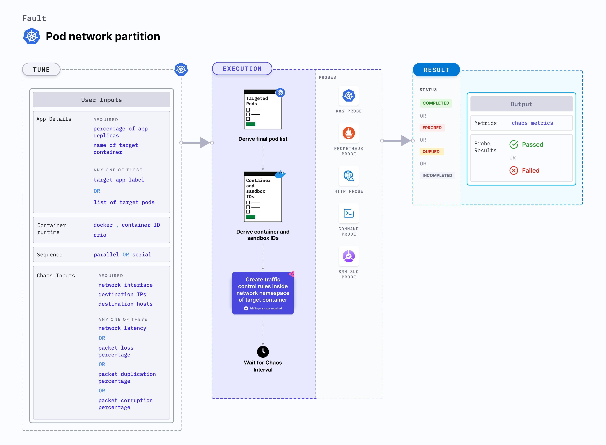

## Introduction

Pod network partition is a Kubernetes pod-level fault that blocks 100 percent ingress and egress traffic of the target application by creating a network policy.



## Use cases

Pod network partition tests the application's resilience to lossy or flaky network.

:::info note
- Kubernetes > 1.16 is required to execute this fault.
- The application pods should be in the running state before and after injecting chaos.
:::

## Fault tunables

  <h3>Optional tunables</h3>
    <table>
      <tr>
        <th> Tunable </th>
        <th> Description </th>
        <th> Notes </th>
      </tr>
      <tr>
        <td> TOTAL_CHAOS_DURATION </td>
        <td> Duration for which to insert chaos (in seconds). </td>
        <td> Default: 60 s. For more information, go to <a href="https://developer.harness.io/docs/chaos-engineering/chaos-faults/common-tunables-for-all-faults#duration-of-the-chaos">duration of the chaos</a></td>
      </tr>
      <tr>
        <td> POLICY_TYPES </td>
        <td> Contains the type of network policy. </td>
        <td> It supports <code>egress</code>, <code>ingress</code> and <code>all</code> values. For more information, go to <a href="https://developer.harness.io/docs/chaos-engineering/chaos-faults/kubernetes/pod/pod-network-partition#policy-type">policy type</a></td>
      </tr>
      <tr>
        <td> POD_SELECTOR </td>
        <td> Contains the labels of the destination pods. </td>
        <td> For example, <code>app=cart</code>. For more information, go to <a href="https://developer.harness.io/docs/chaos-engineering/chaos-faults/kubernetes/pod/pod-network-partition#target-specific-pods">target pods</a></td>
      </tr>
      <tr>
        <td> NAMESPACE_SELECTOR </td>
        <td> Contains the labels of the destination namespaces. </td>
        <td> For example, <code>env=prod</code>. For more information, go to <a href="https://developer.harness.io/docs/chaos-engineering/chaos-faults/kubernetes/pod/pod-network-partition#target-specific-namespaces">target namespaces</a> </td>
      </tr>
      <tr>
        <td> PORTS </td>
        <td> Comma-separated list of the target ports. </td>
        <td> For example, 80,443,22. For more information, go to <a href="https://developer.harness.io/docs/chaos-engineering/chaos-faults/kubernetes/pod/pod-network-partition#destination-ports">destination ports</a></td>
      </tr>
      <tr>
        <td> DESTINATION_IPS </td>
        <td> IP addresses of the services or pods or the CIDR blocks (range of IPs) whose accessibility impacted. Comma-separated IPs or CIDRs can be provided.</td>
        <td> If values are not provided, the fault induces network chaos on all IPs or destinations. For more information, go to <a href="https://developer.harness.io/docs/chaos-engineering/chaos-faults/kubernetes/pod/pod-network-partition#destination-ips-and-destination-hosts">destination IPs</a></td>
      </tr>  
      <tr>
        <td> DESTINATION_HOSTS </td>
        <td> DNS names or FQDN names of the services whose accessibility is impacted. </td>
        <td> If not provided, this fault induces network chaos for all IPs or destinations or <code>DESTINATION_IPS</code> if already defined. For more information, go to <a href="https://developer.harness.io/docs/chaos-engineering/chaos-faults/kubernetes/pod/pod-network-partition#destination-ips-and-destination-hosts">destination hosts</a></td>
      </tr>   
      <tr>   
        <td> RAMP_TIME </td>
        <td> Period to wait before and after injecting chaos (in seconds). </td>
        <td> For example, 30 s. For more information, go to <a href="https://developer.harness.io/docs/chaos-engineering/chaos-faults/common-tunables-for-all-faults#ramp-time">ramp time</a></td>
      </tr>
    </table>

### Destination IPs and destination hosts

Default IPs and hosts whose traffic is interrupted due to the network faults. Tune it by using the `DESTINATION_IPS` and `DESTINATION_HOSTS` environment variabes, respectively.

- `DESTINATION_IPS`: It contains the IP addresses of the services or pods or the CIDR blocks (range of IPs) whose accessibility is impacted.
- `DESTINATION_HOSTS`: It contains the DNS names or FQDN names of the services whose accessibility is impacted.

The following YAML snippet illustrates the use of these environment variables:

[embedmd]: # "./static/manifests/pod-network-partition/destination-ips-and-hosts.yaml yaml"

```yaml
# it injects the chaos for specific ips/hosts
apiVersion: litmuschaos.io/v1alpha1
kind: ChaosEngine
metadata:
  name: engine-nginx
spec:
  engineState: "active"
  annotationCheck: "false"
  appinfo:
    appns: "default"
    applabel: "app=nginx"
    appkind: "deployment"
  chaosServiceAccount: litmus-admin
  experiments:
    - name: pod-network-partition
      spec:
        components:
          env:
            # supports comma separated destination ips
            - name: DESTINATION_IPS
              value: "8.8.8.8,192.168.5.6"
            # supports comma separated destination hosts
            - name: DESTINATION_HOSTS
              value: "nginx.default.svc.cluster.local,google.com"
            - name: TOTAL_CHAOS_DURATION
              value: "60"
```

### Target specific namespaces

Specifies whether or not to provide access to and from the pods in a specific namespace. By default, the network partition interrupts traffic for all the namespaces. Tune it by using the `NAMESPACE_SELECTOR` environment variable.

The following YAML snippet illustrates the use of this environment variable:

[embedmd]: # "./static/manifests/pod-network-partition/namespace-selectors.yaml yaml"

```yaml
# it injects the chaos for specified namespaces, matched by labels
apiVersion: litmuschaos.io/v1alpha1
kind: ChaosEngine
metadata:
  name: engine-nginx
spec:
  engineState: "active"
  annotationCheck: "false"
  appinfo:
    appns: "default"
    applabel: "app=nginx"
    appkind: "deployment"
  chaosServiceAccount: litmus-admin
  experiments:
    - name: pod-network-partition
      spec:
        components:
          env:
            # labels of the destination namespace
            - name: NAMESPACE_SELECTOR
              value: "key=value"
            - name: TOTAL_CHAOS_DURATION
              value: "60"
```

### Target specific pods

Specifies whether or not to provide access to and from specific pods by specifying the pod labels. By default, the network partition fault interrupts traffic for all the external pods. Tune it by using the `POD_SELECTOR` environment variable.

The following YAML snippet illustrates the use of this environment variable:

[embedmd]: # "./static/manifests/pod-network-partition/pod-selectors.yaml yaml"

```yaml
# it injects the chaos for specified pods, matched by labels
apiVersion: litmuschaos.io/v1alpha1
kind: ChaosEngine
metadata:
  name: engine-nginx
spec:
  engineState: "active"
  annotationCheck: "false"
  appinfo:
    appns: "default"
    applabel: "app=nginx"
    appkind: "deployment"
  chaosServiceAccount: litmus-admin
  experiments:
    - name: pod-network-partition
      spec:
        components:
          env:
            # labels of the destination pods
            - name: POD_SELECTOR
              value: "key=value"
            - name: TOTAL_CHAOS_DURATION
              value: "60"
```

### Policy type

Specifies whether or not to tune the interruption of the **ingress** or **egress** traffic. By default, the network partition fault interrupts both ingress and egress traffic. Tune it by using the `POLICY_TYPES` environment variable.

The following YAML snippet illustrates the use of this environment variable:

[embedmd]: # "./static/manifests/pod-network-partition/policy-type.yaml yaml"

```yaml
# inject network loss for only ingress or only egress or all traffics
apiVersion: litmuschaos.io/v1alpha1
kind: ChaosEngine
metadata:
  name: engine-nginx
spec:
  engineState: "active"
  annotationCheck: "false"
  appinfo:
    appns: "default"
    applabel: "app=nginx"
    appkind: "deployment"
  chaosServiceAccount: litmus-admin
  experiments:
    - name: pod-network-partition
      spec:
        components:
          env:
            # provide the network policy type
            # it supports `ingress`, `egress`, and `all` values
            # default value is `all`
            - name: POLICY_TYPES
              value: "all"
            - name: TOTAL_CHAOS_DURATION
              value: "60"
```

### Destination ports

Comma-separated list of ports that interrupt the traffic during a network partition fault. Specific ports are accessed by tuning `PORTS` environment variable.
- If `PORT` is not set and none of the pod-selector, namespace-selector, or destination_ips are provided, then the fault blocks the traffic for all ports for all pods and IPs.
- If `PORT` is not set but one of the pod-selector, namespace-selector, or destination_ips are provided, then the fault allows all the ports for all the pods and IPs filtered by the specified selectors.

The following YAML snippet illustrates the use of this environment variable:

[embedmd]: # "./static/manifests/pod-network-partition/ports.yaml yaml"

```yaml
# it injects the chaos for specified ports
apiVersion: litmuschaos.io/v1alpha1
kind: ChaosEngine
metadata:
  name: engine-nginx
spec:
  engineState: "active"
  annotationCheck: "false"
  appinfo:
    appns: "default"
    applabel: "app=nginx"
    appkind: "deployment"
  chaosServiceAccount: litmus-admin
  experiments:
    - name: pod-network-partition
      spec:
        components:
          env:
            # comma separated list of ports
            - name: PORTS
              value: "tcp: [8080,80], udp: [9000,90]"
            - name: TOTAL_CHAOS_DURATION
              value: "60"
```