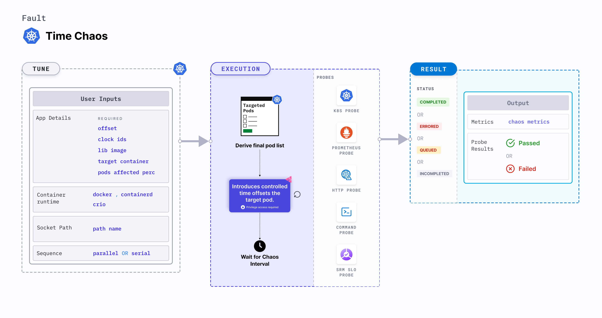

## Introduction

Time Chaos is a Kubernetes pod-level fault that introduces controlled time offsets to disrupt the system time of the target pod



## Use cases
Time Chaos:
- Simulate scenarios where TLS certificates expire while the system is in operation. This allows them to assess how their applications, services, or infrastructure handle expired certificates in real-time.
- It is used to identify potential weaknesses in the system's ability to recover and handle time-related faults, leading to improvements in fault-tolerant designs and system resilience.
-  It can be used in various simulations to mimic real-world scenarios where time synchronization or manipulation is critical.

:::info note
- Kubernetes > 1.16 is required to execute this fault.
- The application pods should be in the running state before and after injecting chaos.
:::

## Fault tunables

  <h3>Optional tunables</h3>
    <table>
      <tr>
        <th> Tunable </th>
        <th> Description </th>
        <th> Notes </th>
      </tr>
      <tr>
        <td> OFFSET </td>
        <td> Offset value used to modify the system time </td>
        <td> Default: 3600s. For more information, go to <a href="https://developer.harness.io/docs/chaos-engineering/chaos-faults/kubernetes/pod/time-chaos#offset-and-clock-ids">offset</a></td>
      </tr>
    </table>

  <h3>Optional tunables</h3>
    <table>
      <tr>
        <th> Tunable </th>
        <th> Description </th>
        <th> Notes </th>
      </tr>
      <tr>
        <td> TOTAL_CHAOS_DURATION </td>
        <td> Duration for which to insert chaos (in seconds). </td>
        <td> Default: 60 s. For more information, go to <a href="https://developer.harness.io/docs/chaos-engineering/chaos-faults/common-tunables-for-all-faults#duration-of-the-chaos">duration of the chaos</a></td>
      </tr>
      <tr>
        <td> CLOCK_IDS </td>
        <td> Comma separated clock ids of the target system clock</td>
        <td> Default: CLOCK_REALTIME. For more information, go to <a href="https://developer.harness.io/docs/chaos-engineering/chaos-faults/kubernetes/pod/time-chaos#offset-and-clock-ids">offset</a></td>
      </tr>
      <tr>
        <td> TARGET_CONTAINER </td>
        <td> Name of the container subject to time chaos</td>
        <td> If this value is not provided, the fault selects the first container of the target pod. For more information, go to <a href="https://developer.harness.io/docs/chaos-engineering/chaos-faults/kubernetes/pod/common-tunables-for-pod-faults#target-specific-container">target specific container</a></td>
      </tr>
      <tr>
        <td> CONTAINER_RUNTIME </td>
        <td> Container runtime interface for the cluster</td>
        <td> Default: containerd. Supports docker, containerd and crio. For more information, go to <a href="https://developer.harness.io/docs/chaos-engineering/chaos-faults/kubernetes/pod/time-chaos#container-runtime-and-socket-path">container runtime </a> </td>
      </tr>
      <tr>
        <td> SOCKET_PATH </td>
        <td> Path of the containerd or crio or docker socket file. </td>
        <td> Defaults to <code>/run/containerd/containerd.sock</code>. For more information, go to <a href="https://developer.harness.io/docs/chaos-engineering/chaos-faults/kubernetes/pod/time-chaos#container-runtime-and-socket-path">socket path</a></td>
      </tr>
      <tr>
        <td> TARGET_PODS </td>
        <td> Comma-separated list of application pod names subject to chaos</td>
        <td> If not provided, the fault selects target pods randomly based on provided appLabels. For more information, go to <a href="https://developer.harness.io/docs/chaos-engineering/chaos-faults/kubernetes/pod/common-tunables-for-pod-faults#target-specific-pods"> target specific pods</a></td>
      </tr>
      <tr>
        <td> PODS_AFFECTED_PERC </td>
        <td> Percentage of total pods to target. Provide numeric values. </td>
        <td> Default: 0 (corresponds to 1 replica). For more information, go to <a href="https://developer.harness.io/docs/chaos-engineering/chaos-faults/kubernetes/pod/common-tunables-for-pod-faults#pod-affected-percentage">pod affected percentage</a></td>
      </tr>
      <tr>
        <td> SEQUENCE </td>
        <td> Sequence of chaos execution for multiple target pods. </td>
        <td> Default: parallel. Supports serial and parallel. For more information, go to <a href="https://developer.harness.io/docs/chaos-engineering/chaos-faults/common-tunables-for-all-faults#sequence-of-chaos-execution">sequence of chaos execution</a></td>
      </tr>
      <tr>   
        <td> RAMP_TIME </td>
        <td> Period to wait before and after injecting chaos (in seconds). </td>
        <td> For example, 30 s. For more information, go to <a href="https://developer.harness.io/docs/chaos-engineering/chaos-faults/common-tunables-for-all-faults#ramp-time">ramp time</a></td>
      </tr>
    </table>

### Offset and Clock IDs

The `OFFSET` and `CLOCK_IDS` environment variables set the offset and clock ids, respectively.

- `OFFSET`: Offset value used to modify the system time. It should match with `^(\d+)(ms|s|m|h)$` regex.
- `CLOCK_IDS`: Comma separated clock ids of the target system clock. Refer 'uapi/linux/time.h' for more details

The following YAML snippet illustrates the use of this environment variable:

[embedmd]: # "./static/manifests/time-chaos/offset-and-clock-ids.yaml yaml"

```yaml
## provide the offset and clock ids
apiVersion: litmuschaos.io/v1alpha1
kind: ChaosEngine
metadata:
  name: engine-nginx
spec:
  engineState: "active"
  annotationCheck: "false"
  appinfo:
    appns: "default"
    applabel: "app=nginx"
    appkind: "deployment"
  chaosServiceAccount: litmus-admin
  experiments:
    - name: time-chaos
      spec:
        components:
          env:
            # time offset
            - name: OFFSET
              value: "3600s"
            # clock ids of the target system
            - name: CLOCK_IDS
              value: "CLOCK_REALTIME"
            - name: TOTAL_CHAOS_DURATION
              VALUE: "60"
```


### Container runtime and socket path

The `CONTAINER_RUNTIME` and `SOCKET_PATH` environment variables set the container runtime and socket file path, respectively.

- `CONTAINER_RUNTIME`: It supports `docker`, `containerd`, and `crio` runtimes. The default value is `containerd`.
- `SOCKET_PATH`: It contains path of `containerd` socket file by default(`/run/containerd/containerd.sock`). For `docker`, specify the path as `/var/run/docker.sock`. For `crio`, specify the path as `/var/run/crio/crio.sock`.

The following YAML snippet illustrates the use of this environment variable:

[embedmd]: # "./static/manifests/time-chaos/container-runtime-and-socket-path.yaml yaml"

```yaml
## provide the container runtime and socket file path
apiVersion: litmuschaos.io/v1alpha1
kind: ChaosEngine
metadata:
  name: engine-nginx
spec:
  engineState: "active"
  annotationCheck: "false"
  appinfo:
    appns: "default"
    applabel: "app=nginx"
    appkind: "deployment"
  chaosServiceAccount: litmus-admin
  experiments:
    - name: time-chaos
      spec:
        components:
          env:
            # time offset
            - name: OFFSET
              value: "3600s"
            # runtime for the container
            # supports docker, containerd, crio
            - name: CONTAINER_RUNTIME
              value: "containerd"
            # path of the socket file
            - name: SOCKET_PATH
              value: "/run/containerd/containerd.sock"
            - name: TOTAL_CHAOS_DURATION
              VALUE: "60"
```
