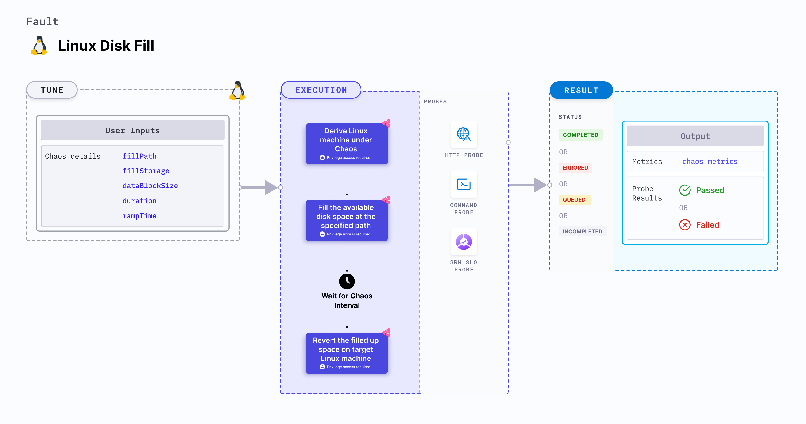

import Ossupport from './shared/note-supported-os.md'
import FaultPermissions from './shared/fault-permissions.md'


Linux disk fill fills up the available disk space at a given system path for a specific duration.



## Use cases
Linux disk fill:
- Induces heavy disk usage scenario on the target Linux machines.
- Simulates a lack of storage space for the underlying applications in the system.
- Validates application failover and data resiliency in the scenario of low disk space.

<Ossupport />

<FaultPermissions />

## Fault tunables
<h3>Optional tunables</h3>
<table>
  <tr>
    <th> Tunable </th>
    <th> Description </th>
    <th> Notes </th>
  </tr>
  <tr>
    <td> fillPath </td>
    <td> System path to fill. </td>
    <td> Path to a valid directory. </td>
  </tr>
  <tr>
    <td> fillStorage </td>
    <td> Amount of storage to be filled. </td>
    <td> Can be specified in bytes (b/B), kilobytes (k/K), megabytes (m/M), gigabytes (g/G), or percentage (%) of available storage. If no unit is provided, the value is assumed to be in bytes. Example values: <code>30m</code>, <code>1G</code>, <code>35%</code>, etc. Default: 50%. </td>
  </tr>
  <tr>
    <td> dataBlockSize </td>
    <td> Size of each data block used to fill up the disk. </td>
    <td> Can be specified in bytes (b/B), kilobytes (k/K), megabytes (m/M), or gigabytes (g/G). If no unit is provided, the value is assumed to be in bytes. Example values: <code>30m</code>, <code>500k</code>, <code>1G</code>, etc. Default: 256 KB. </td>
  </tr>
  <tr>
    <td> duration </td>
    <td> Duration through which chaos is injected into the target resource (in seconds). </td>
    <td> Default: 30 s </td>
  </tr>
  <tr>
    <td> rampTime </td>
    <td> Period to wait before and after injecting chaos (in seconds). </td>
    <td> Default: 0 s </td>
  </tr>
</table>

### Fill path

The `fillPath` input variable determines the system path to be filled up.

The following YAML snippet illustrates the use of this environment variable:

[embedmd]:# (./static/manifests/linux-disk-fill/fill-path.yaml yaml)
```yaml
# specify the fill path
apiVersion: litmuchaos.io/v1alpha1
kind: LinuxFault
metadata:
  name: linux-disk-fill
  labels:
    name: disk-fill
spec:
  diskFillChaos/inputs:
    fillPath: "/"
    duration: 30
```

### Fill storage

The `fillStorage` input variable determines the amount of storage space to be filled up at the `fillPath` path.

The following YAML snippet illustrates the use of this environment variable:

[embedmd]:# (./static/manifests/linux-disk-fill/fill-storage.yaml yaml)
```yaml
# specify the storage to be filled
apiVersion: litmuchaos.io/v1alpha1
kind: LinuxFault
metadata:
  name: linux-disk-fill
  labels:
    name: disk-fill
spec:
  diskFillChaos/inputs:
    fillPath: "/"
    fillStorage: 72%
    duration: 30
```

### Data block size

The `dataBlockSize` input variable determines the size of a single block of data, that is used to fill up the disk. A larger block size results in quick completion of the disk fill operation and vice-versa.

The following YAML snippet illustrates the use of this environment variable:

[embedmd]:# (./static/manifests/linux-disk-fill/data-block-size.yaml yaml)
```yaml
# specify the data block size
apiVersion: litmuchaos.io/v1alpha1
kind: LinuxFault
metadata:
  name: linux-disk-fill
  labels:
    name: disk-fill
spec:
  diskFillChaos/inputs:
    fillPath: "/"
    fillStorage: 80%
    dataBlockSize: 400k
    duration: 30
```
