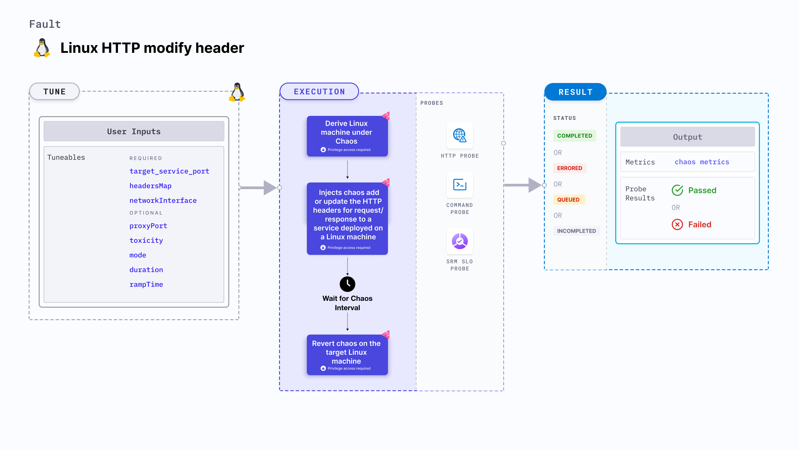

import Ossupport from './shared/note-supported-os.md'
import FaultPermissions from './shared/fault-permissions.md'


Linux HTTP modify header injects chaos to add or update the HTTP headers for request/response to a service deployed on a Linux machine.



## Use cases

- Evaluates the application's resilience to incorrect or incomplete headers in application services.

<Ossupport />

<FaultPermissions />

## Fault tunables
<h3>Mandatory tunables</h3>
<table>
  <tr>
    <th> Tunable </th>
    <th> Description </th>
    <th> Notes </th>
  </tr>
   <tr>
      <td> targetServicePort </td>
      <td> Port of the target service. </td>
      <td> Default: <code>80</code>. </td>
    </tr>
    <tr>
      <td> headersMap </td>
      <td> Map of the headers to modify or add. </td>
      <td> For example, &#123;"X-Litmus-Test-Header": "X-Litmus-Test-Value"&#125;. To remove a header, just set the value to ""; For example, &#123;"X-Litmus-Test-Header": ""&#125;. </td>
    </tr>
    <tr>
      <td> networkInterface </td>
      <td> Network interface used by the target service. </td>
      <td> If no value is provided, response will be an empty body. </td>
    </tr>
</table>
<h3>Optional tunables</h3>
<table>
  <tr>
    <th> Tunable </th>
    <th> Description </th>
    <th> Notes </th>
  </tr>
  <tr>
    <td> proxyPort </td>
    <td> Port where the proxy listens for requests. </td>
    <td> Default: <code>20000</code>. </td>
  </tr>
  <tr>
    <td> toxicity </td>
    <td> Percentage of HTTP requests to be affected. </td>
    <td> Default: <code>100</code>. </td>
  </tr>
  <tr>
    <td> mode </td>
    <td> Can be either <code>request</code> or <code>response</code>. Corresponds to whether to inject chaos into the HTTP requests or responses. </td>
    <td> Default: <code>response</code> </td>
  </tr>
  <tr>
    <td> duration </td>
    <td> Duration through which chaos is injected into the target resource (in seconds). </td>
    <td> Default: 30s </td>
  </tr>
  <tr>
    <td> rampTime </td>
    <td> Period to wait before and after injecting chaos (in seconds). </td>
    <td> Default: 0s </td>
  </tr>
</table>

### Target service port

Port of the target service. Tune it by using the `targetServicePort` environment variable.

The following YAML snippet illustrates the use of this environment variable:

[embedmd]:# (./static/manifests/linux-http-modify-header/targetServicePort.yaml yaml)
```yaml
# target service port as https port 443
apiVersion: litmuchaos.io/v1alpha1
kind: LinuxFault
metadata:
  name: linux-http-modify-header
  labels:
    name: http-modify-header
spec:
  httpChaos/inputs:
    duration: 30
    networkInterface: "ens4"
    targetServicePort: 443
```

### Proxy port

Port on which the proxy server listens for requests. Tune it by using the `proxyPort` environment variable.

The following YAML snippet illustrates the use of this environment variable:

[embedmd]: # (./static/manifests/linux-http-modify-header/proxyPort.yaml yaml)
```yaml
# port for the proxy server
apiVersion: litmuchaos.io/v1alpha1
kind: LinuxFault
metadata:
  name: linux-http-modify-header
  labels:
    name: http-modify-header
spec:
  httpChaos/inputs:
    duration: 30
    networkInterface: "ens4"
    targetServicePort: 443
    proxyPort: 32045
```

### Mode
Specifies whether whether the chaos should be added to the HTTP request or response. Tune it by using the `mode` environment variable.

The following YAML snippet illustrates the use of this environment variable:

[embedmd]:# (./static/manifests/linux-http-modify-header/mode.yaml yaml)
```yaml
## provide the mode; request/response
apiVersion: litmuchaos.io/v1alpha1
kind: LinuxFault
metadata:
  name: linux-http-modify-header
  labels:
    name: http-modify-header
spec:
  httpChaos/inputs:
    duration: 30
    networkInterface: "ens4"
    targetServicePort: 443
    mode: response
```

### Toxicity

Percentage of the total number of HTTP requests to be affected. Tune it by using the `toxicity` environment variable.

The following YAML snippet illustrates the use of this environment variable:

[embedmd]: # (./static/manifests/linux-latency/toxicity.yaml yaml)
```yaml
# provide the toxicity
apiVersion: litmuchaos.io/v1alpha1
kind: LinuxFault
metadata:
  name: linux-http-modify-header
  labels:
    name: http-modify-header
spec:
  httpChaos/inputs:
    duration: 30
    networkInterface: "ens4"
    targetServicePort: 443
    toxicity: 50
```

### Headers map

Map of the headers that need to be modified or added to the HTTP request or response. Tune it by using the `headersMap` environment variable.

The following YAML snippet illustrates the use of this environment variable:

[embedmd]: # (./static/manifests/linux-http-modify-header/headersMap.yaml yaml)

```yaml
## provide the headers as a map
apiVersion: litmuchaos.io/v1alpha1
kind: LinuxFault
metadata:
  name: linux-http-modify-header
  labels:
    name: http-modify-header
spec:
  httpChaos/inputs:
    duration: 30
    networkInterface: "ens4"
    targetServicePort: 443
    headersMap: '{"X-Litmus-Test-Header": "X-Litmus-Test-Value"}'
```

### Network interface

Network interface used by the target service. Tune it by using the `networkInterface` environment variable.

The following YAML snippet illustrates the use of this environment variable:

[embedmd]: # (./static/manifests/http-modify-header/networkInterface.yaml yaml)
```yaml
# network interface for the target service
apiVersion: litmuchaos.io/v1alpha1
kind: LinuxFault
metadata:
  name: linux-http-modify-header
  labels:
    name: http-modify-header
spec:
  httpChaos/inputs:
    duration: 30
    networkInterface: "ens4"
```
