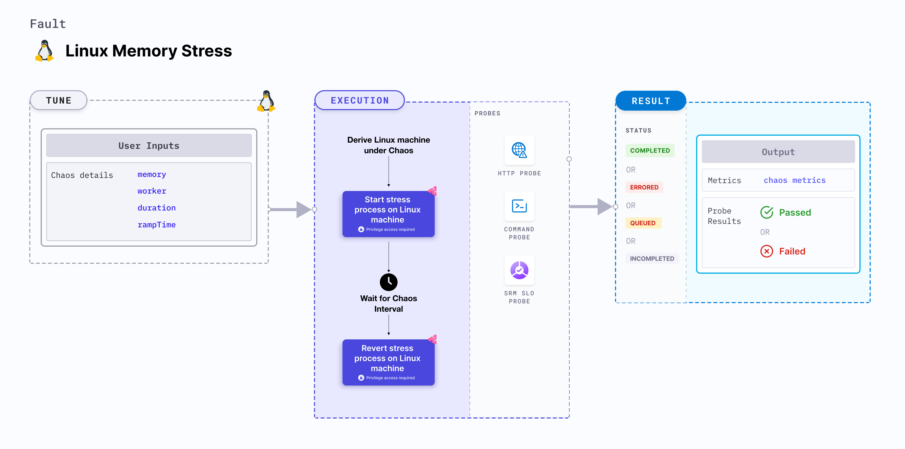

import Ossupport from './shared/note-supported-os.md'
import FaultPermissions from './shared/fault-permissions.md'


Linux memory stress causes memory consumption of the target Linux machines for a specific duration.



## Use cases
- Induces memory consumption and exhaustion on the target Linux machines.
- Simulates a lack of memory for processes running on the application, which degrades their performance.
- Simulates application slowness due to memory starvation, and noisy neighbour problems due to excessive consumption of memory.

<Ossupport />

<FaultPermissions />

## External packages
This fault uses [`stress-ng`](https://github.com/ColinIanKing/stress-ng), which is installed as part of the infrastructure installation.

## Fault tunables
<h3>Optional tunables</h3>
<table>
  <tr>
    <th> Tunable </th>
    <th> Description </th>
    <th> Notes </th>
  </tr>
  <tr>
    <td> memory </td>
    <td> Amount of memory to be consumed. </td>
    <td> Can be specified in bytes (b/B), kilobytes (k/K), megabytes (m/M), gigabytes (g/G), or percentage (%) of available storage. If no unit is provided, the value is assumed to be in bytes. Example values: <code>30m</code>, <code>1G</code>, <code>35%</code>, etc. Default: 256m </td>
  </tr>
  <tr>
    <td> workers </td>
    <td> Number of worker processes to start. </td>
    <td> Default: 1 </td>
  </tr>
  <tr>
    <td> duration </td>
    <td> Duration through which chaos is injected into the target resource (in seconds). </td>
    <td> Default: 30 s </td>
  </tr>
  <tr>
    <td> rampTime </td>
    <td> Period to wait before and after injecting chaos (in seconds). </td>
    <td> Default: 0 s </td>
  </tr>
</table>

### Workers

The `workers` input variable utilizes a specific number of workers for the memory stress fault.

The following YAML snippet illustrates the use of this environment variable:

[embedmd]:# (./static/manifests/linux-memory-stress/workers.yaml yaml)
```yaml
# workers to utilize
apiVersion: litmuchaos.io/v1alpha1
kind: LinuxFault
metadata:
  name: linux-memory-stress
  labels:
    name: memory-stress
spec:
  stressChaos/inputs:
    workers: 1
    memory: 5g
```

### Memory consumption

The `memory` input variable specifies the amount of memory to be filled.

The following YAML snippet illustrates the use of this environment variable:

[embedmd]:# (./static/manifests/linux-memory-stress/memory.yaml yaml)
```yaml
# memory to consume
apiVersion: litmuchaos.io/v1alpha1
kind: LinuxFault
metadata:
  name: linux-memory-stress
  labels:
    name: memory-stress
spec:
  stressChaos/inputs:
    workers: 1
    memory: 50%
```
