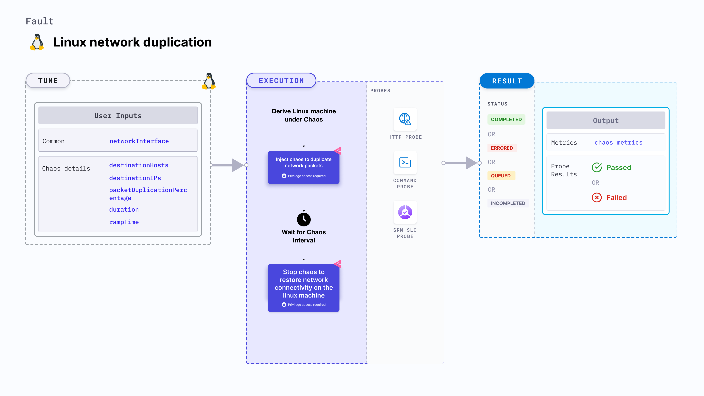

import Ossupport from './shared/note-supported-os.md'
import FaultPermissions from './shared/fault-permissions.md'


Linux network duplication injects chaos to disrupt network connectivity on a Linux machine by duplicating network packets.



## Use cases
- Induces network duplication on the target Linux machines.
- Simulates packet duplication in the network.

<Ossupport />

<FaultPermissions />

## Fault tunables
<h3>Mandatory tunables</h3>
<table>
  <tr>
    <th> Tunable </th>
    <th> Description </th>
    <th> Notes </th>
  </tr>
  <tr>
    <td> networkInterface </td>
    <td> Network interface to target. </td>
    <td> For example: <code>eth0</code> </td>
  </tr>
</table>

<h3>Optional tunables</h3>
<table>
  <tr>
    <th> Tunable </th>
    <th> Description </th>
    <th> Notes </th>
  </tr>
    <tr>
    <td> destinationHosts </td>
    <td> List of the target host names or keywords. For example, <code>google.com,litmuschaos.io</code> </td>
    <td> If neither <code>destinationHosts</code> nor <code> destinationIPs</code> is provided, all host names/domains are targeted </td>
  </tr>
  <tr>
    <td> destinationIPs </td>
    <td> List of the target IPs. For example, <code>1.1.1.1,8.8.8.8</code> </td>
    <td> If neither <code>destinationHosts</code> nor <code> destinationIPs</code> is provided, all host names/domains are targeted</td>
  </tr>
  <tr>
    <td> packetDuplicationPercentage </td>
    <td> Percentage of packet to duplicate. For example <code>50</code>. </td>
    <td> Default: 100% </td>
  </tr>
  <tr>
    <td> duration </td>
    <td> Duration through which chaos is injected into the target resource (in seconds). </td>
    <td> Default: 30s </td>
  </tr>
  <tr>
    <td> rampTime </td>
    <td> Period to wait before and after injecting chaos (in seconds). </td>
    <td> Default: 0s </td>
  </tr>
</table>

### Destination hosts

The `destinationHosts` input variable subjects the comma-separated names of the target hosts to chaos.

The following YAML snippet illustrates the use of this environment variable:

[embedmd]:# (./static/manifests/linux-network-duplication/destination-hosts.yaml yaml)
```yaml
apiVersion: litmuchaos.io/v1alpha1
kind: LinuxFault
metadata:
  name: linux-network-duplication
  labels:
    name: network-duplication
spec:
  networkChaos/inputs:
    destinationHosts: 'google.com'
    networkInterface: "eth0"
```

### Destination IPs

The `destinationIPs` input variable subjects the comma-separated names of the target IPs to chaos.

The following YAML snippet illustrates the use of this environment variable:

[embedmd]:# (./static/manifests/linux-network-duplication/destination-ips.yaml yaml)
```yaml
apiVersion: litmuchaos.io/v1alpha1
kind: LinuxFault
metadata:
  name: linux-network-duplication
  labels:
    name: network-duplication
spec:
  networkChaos/inputs:
    destinationIPs: '1.1.1.1'
    networkInterface: "eth0"
```

### Packet duplication percentage

The `packetDuplicationPercentage` input variable duplicates a specific percentage of the data packets.

The following YAML snippet illustrates the use of this environment variable:

[embedmd]:# (./static/manifests/linux-network-duplication/packet-duplication-percentage.yaml yaml)
```yaml
apiVersion: litmuchaos.io/v1alpha1
kind: LinuxFault
metadata:
  name: linux-network-duplication
  labels:
    name: network-duplication
spec:
  networkChaos/inputs:
    packetDuplicationPercentage: '50'
    networkInterface: "eth0"
```

