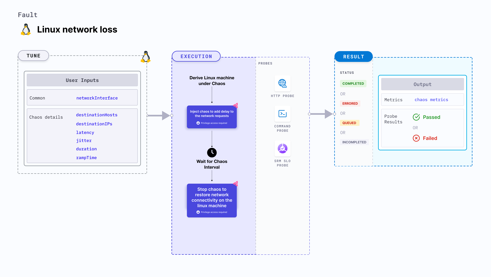

import Ossupport from './shared/note-supported-os.md'
import FaultPermissions from './shared/fault-permissions.md'


Linux network loss injects chaos to disrupt network connectivity on the Linux machine by blocking the network requests.



## Use cases
- Induces network loss on the target Linux machines.
- Simulates loss of connectivity access by blocking the network requests on the machine.

<Ossupport />

<FaultPermissions />

## Fault tunables
<h3>Mandatory tunables</h3>
<table>
  <tr>
    <th> Tunable </th>
    <th> Description </th>
    <th> Notes </th>
  </tr>
  <tr>
    <td> networkInterfaces </td>
    <td> Network interfaces to target as comma separated values. </td>
    <td> For example, <code>eth0,ens192</code> </td>
  </tr>
</table>
<h3>Optional tunables</h3>
<table>
  <tr>
    <th> Tunable </th>
    <th> Description </th>
    <th> Notes </th>
  </tr>
  <tr>
    <td> destinationHosts </td>
    <td> List of the target host names or keywords. For example: <code>google.com,litmuschaos.io</code></td>
    <td> If neither <code>destinationHosts</code> nor <code> destinationIPs</code> is present, the fault injects chaos for all hostnames/domains </td>
  </tr>
  <tr>
    <td> destinationIPs </td>
    <td> List of the target IPs. For example: <code>1.1.1.1,8.8.8.8</code> </td>
    <td> If neither <code>destinationHosts</code> nor <code> destinationIPs</code> is provided, all host names/domains are targeted</td>
  </tr>
  <tr>
    <td> packetLossPercentage </td>
    <td> Percentage of packet loss. For example, <code> 100 </code> </td>
    <td> Default: 100% </td>
  </tr>
  <tr>
    <td> sourcePorts </td>
    <td> Source ports to be filtered for chaos. For example: <code> 5000,8080 </code> </td>
    <td> Alternatively, the ports can be filtered to exempt from chaos i.e. whitelisted. To specify the exemption, prepend a <code>!</code> before the ports list. For example: <code> !5000,8080 </code> </td>
  </tr>
  <tr>
    <td> destinationPorts </td>
    <td> Destination ports to be filtered for chaos. For example: <code> 5000,8080 </code> </td>
    <td> Alternatively, the ports can be filtered to exempt from chaos i.e. whitelisted. To specify the exemption, prepend a <code>!</code> before the ports list. For example: <code> !5000,8080 </code> </td>
  </tr>
  <tr>
    <td> duration </td>
    <td> Duration through which chaos is injected into the target resource (in seconds). </td>
    <td> Default: 30s </td>
  </tr>
  <tr>
    <td> rampTime </td>
    <td> Period to wait before and after injecting chaos (in seconds). </td>
    <td> Default: 0s </td>
  </tr>
</table>

### Destination hosts

The `destinationHosts` input variable subjects the comma-separated names of the target hosts to chaos.

The following YAML snippet illustrates the use of this environment variable:

[embedmd]:# (./static/manifests/linux-network-loss/destination-hosts.yaml yaml)
```yaml
apiVersion: litmuchaos.io/v1alpha1
kind: LinuxFault
metadata:
  name: linux-network-loss
  labels:
    name: network-loss
spec:
  networkChaos/inputs:
    destinationHosts: 'google.com'
    networkInterfaces: "eth0"
```

### Destination IPs

The `destinationIPs` input variable subjects the comma-separated names of the target IPs to chaos.

The following YAML snippet illustrates the use of this environment variable:

[embedmd]:# (./static/manifests/linux-network-loss/destination-ips.yaml yaml)
```yaml
apiVersion: litmuchaos.io/v1alpha1
kind: LinuxFault
metadata:
  name: linux-network-loss
  labels:
    name: network-loss
spec:
  networkChaos/inputs:
    destinationIPs: '1.1.1.1'
    networkInterfaces: "eth0"
```

### Source and destination ports

By default, the network experiments disrupt traffic for all the source and destination ports. Tune the interruption of specific port(s) using `sourcePorts` and `destinationPorts` inputs.

- `sourcePorts`: It contains ports of the target application, the accessibility to which is impacted
- `destinationPorts`: It contains the ports of the destination services or pods or the CIDR blocks(range of IPs), the accessibility to which is impacted

The following YAML snippet illustrates the use of this environment variable:

[embedmd]:# (./static/manifests/linux-network-loss/source-and-destination-ports.yaml yaml)
```yaml
apiVersion: litmuchaos.io/v1alpha1
kind: LinuxFault
metadata:
  name: linux-network-loss
  labels:
    name: network-loss
spec:
  networkChaos/inputs:
    destinationIPs: '1.1.1.1'
    networkInterfaces: "eth0"
    sourcePorts: "8080,3000"
    destinationPorts: "5000,3000"
```

### Ignore Source and Destination Ports

By default, the network experiments disrupt traffic for all the source and destination ports. Ignore the specific ports using `sourcePorts` and `destinationPorts` inputs.

- `sourcePorts`: Provide the comma-separated source ports preceded by `!`, that you'd like to ignore from the chaos.
- `destinationPorts`: Provide the comma-separated destination ports preceded by `!` , that you'd like to ignore from the chaos.

The following YAML snippet illustrates the use of this environment variable:

[embedmd]:# (./static/manifests/linux-network-loss/ignore-source-and-destination-ports.yaml yaml)
```yaml
apiVersion: litmuchaos.io/v1alpha1
kind: LinuxFault
metadata:
  name: linux-network-loss
  labels:
    name: network-loss
spec:
  networkChaos/inputs:
    destinationIPs: '1.1.1.1'
    networkInterfaces: "eth0"
    sourcePorts: "!8080,3000"
    destinationPorts: "!5000,3000"
```

### Packet loss percentage

The `packetLossPercentage` input variable loses a specific percentage of the data packets.

The following YAML snippet illustrates the use of this environment variable:

[embedmd]:# (./static/manifests/linux-network-loss/packet-loss-percentage.yaml yaml)
```yaml
apiVersion: litmuchaos.io/v1alpha1
kind: LinuxFault
metadata:
  name: linux-network-loss
  labels:
    name: network-loss
spec:
  networkChaos/inputs:
    packetLossPercentage: '50'
    networkInterfaces: "eth0"
```
