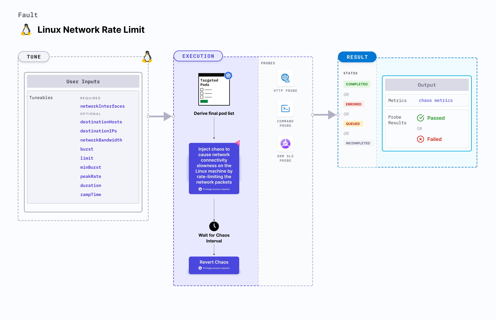

import Ossupport from './shared/note-supported-os.md'
import FaultPermissions from './shared/fault-permissions.md'


Linux network rate limit injects chaos to cause network connectivity slowness on the Linux machine by rate-limiting the network packets.



## Use cases
- Induces network rate limit on the target Linux machines.
- Simulates loss of connectivity access by blocking the network requests on the machine.

<Ossupport />

<FaultPermissions />

## Fault tunables
<h3>Mandatory tunables</h3>
<table>
  <tr>
    <th> Tunable </th>
    <th> Description </th>
    <th> Notes </th>
  </tr>
  <tr>
    <td> networkInterfaces </td>
    <td> Network interfaces to target as comma separated values. </td>
    <td> For example: <code>eth0,ens192</code> </td>
  </tr>
</table>

<h3>Optional tunables</h3>
<table>
  <tr>
    <th> Tunable </th>
    <th> Description </th>
    <th> Notes </th>
  </tr>
  <tr>
    <td> destinationHosts </td>
    <td> List of the target host names or keywords. For example: <code>google.com,litmuschaos.io</code></td>
    <td> If neither <code>destinationHosts</code> nor <code> destinationIPs</code> is provided, all host names/domains are targeted </td>
  </tr>
  <tr>
    <td> destinationIPs </td>
    <td> List of the target IPs. For example: <code>1.1.1.1,8.8.8.8</code> </td>
    <td> If neither <code>destinationHosts</code> nor <code> destinationIPs</code> is provided, all host names/domains are targeted</td>
  </tr>
  <tr>
    <td> networkBandwidth </td>
    <td> Specify the network bandwidth rate limit. </td>
    <td> Defaults to <code>1mbit</code> </td>
  </tr>
  <tr>
    <td> burst </td>
    <td> Burst for the size of bucket, that is, the maximum amount of bytes that tokens can be available for instantaneously. </td>
    <td> Defaults to <code>2kb</code> </td>
  </tr>
  <tr>
    <td> limit </td>
    <td> Limit on the number of bytes that can be queued while waiting for tokens to become available. </td>
    <td> Defaults to <code>2kb</code> </td>
  </tr>
  <tr>
    <td> minBurst </td>
    <td> Size of the peakrate bucket. </td>
    <td> For example, <code>1kb</code>. </td>
  </tr>
    <tr>
    <td> peakRate </td>
    <td> Maximum depletion rate of the bucket. </td>
    <td> For example, <code>1mbit</code>. </td>
  </tr>
  <tr>
    <td> duration </td>
    <td> Duration through which chaos is injected into the target resource (in seconds). </td>
    <td> Default: 30s </td>
  </tr>
  <tr>
    <td> rampTime </td>
    <td> Period to wait before and after injecting chaos (in seconds). </td>
    <td> Default: 0s </td>
  </tr>
</table>

### Destination hosts

The `destinationHosts` input variable subjects the comma-separated names of the target hosts to chaos.

The following YAML snippet illustrates the use of this input variable:

[embedmd]:# (./static/manifests/linux-network-rate-limit/destination-hosts.yaml yaml)
```yaml
apiVersion: litmuchaos.io/v1alpha1
kind: LinuxFault
metadata:
  name: linux-network-rate-limit
  labels:
    name: network-rate-limit
spec:
  networkChaos/inputs:
    destinationHosts: 'google.com'
    networkInterfaces: "eth0"
```

### Destination IPs

The `destinationIPs` input variable subjects the comma-separated names of the target IPs to chaos.

The following YAML snippet illustrates the use of this input variable:

[embedmd]:# (./static/manifests/linux-network-rate-limit/destination-ips.yaml yaml)
```yaml
apiVersion: litmuchaos.io/v1alpha1
kind: LinuxFault
metadata:
  name: linux-network-rate-limit
  labels:
    name: network-rate-limit
spec:
  networkChaos/inputs:
    destinationIPs: '1.1.1.1'
    networkInterfaces: "eth0"
```

### Network bandwidth

Network bandwidth injected. Tune it by using the `networkBandwidth` input variable.

Following YAML snippet illustrates the use of this input variable:

[embedmd]:# (./static/manifests/linux-network-rate-limit/network-bandwidth.yaml yaml)
```yaml
apiVersion: litmuchaos.io/v1alpha1
kind: LinuxFault
metadata:
  name: linux-network-rate-limit
  labels:
    name: network-rate-limit
spec:
  networkChaos/inputs:
    destinationIPs: '1.1.1.1'
    networkInterfaces: "eth0"
    networkBandwidth: 1mbit
```

### Burst

Size of bucket, in bytes. It is the maximum number of bytes for which tokens can be instantaneously available. Tune it by using the `burst` input variable.

Following YAML snippet illustrates the use of this input variable:

[embedmd]:# (./static/manifests/network-rate-limit/burst.yaml yaml)
```yaml
apiVersion: litmuchaos.io/v1alpha1
kind: LinuxFault
metadata:
  name: linux-network-rate-limit
  labels:
    name: network-rate-limit
spec:
  networkChaos/inputs:
    destinationIPs: '1.1.1.1'
    networkInterfaces: "eth0"
    burst: 2kb
```

### Limit

Limit on the number of bytes that can be queued while waiting for tokens to become available. Tune it by using the `limit` input variable.

Following YAML snippet illustrates the use of this input variable:

[embedmd]:# (./static/manifests/network-rate-limit/limit.yaml yaml)
```yaml
apiVersion: litmuchaos.io/v1alpha1
kind: LinuxFault
metadata:
  name: linux-network-rate-limit
  labels:
    name: network-rate-limit
spec:
  networkChaos/inputs:
    destinationIPs: '1.1.1.1'
    networkInterfaces: "eth0"
    limit: 2kb
```