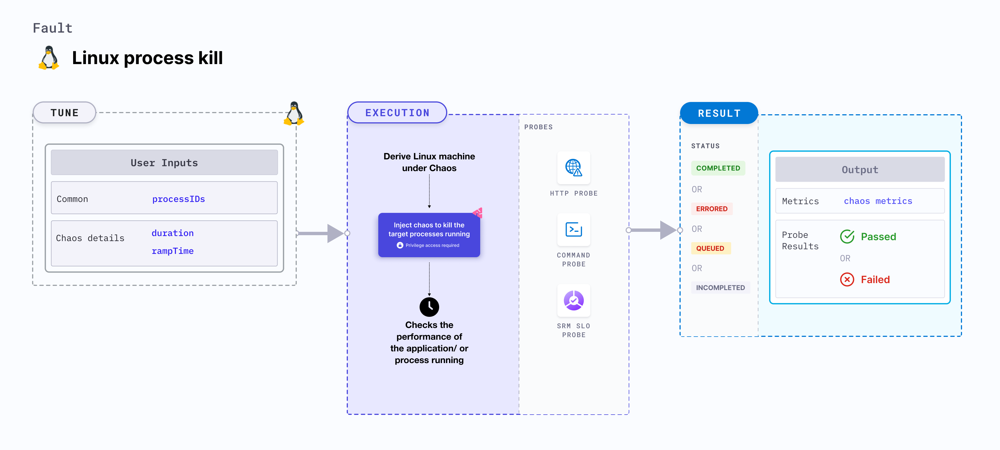

import Ossupport from './shared/note-supported-os.md'
import FaultPermissions from './shared/fault-permissions.md'


The Linux process kill fault kills the target processes running on the Linux machines. It checks the performance of the application or process running on the Linux machine.



## Use cases
Linux process kill:
- Induces process kill on the target Linux machines.
- Disrupts the application-critical processes such as databases or message queues by killing the underlying processes or threads.
- Determines the resilience of applications when processes on a Linux machine are unexpectedly killed (or disrupted).

<Ossupport />

<FaultPermissions />

## Fault tunables
<h3>Mandatory tunables</h3>
<table>
  <tr>
    <th> Tunable </th>
    <th> Description </th>
    <th> Notes </th>
  </tr>
  <tr>
    <td> processIDs </td>
    <td> Comma-separated process IDs of the target processes. </td>
    <td> Takes precedence over <code>processNames</code> and <code>processCommand</code> when all three parameters are defined. For example, <code>13453,32444,27436</code> </td>
  </tr>
  <tr>
    <td> processCommand </td>
    <td> Command used to start the target processes. A substring match is performed to determine the target process. </td>
    <td> Takes precedence over <code>processNames</code> when both are defined. For example, <code>/usr/lib64/thunderbird/thunderbird</code> </td>
  </tr>
  <tr>
    <td> processNames </td>
    <td> Comma-separated target process names. </td>
    <td> For example, <code>nginx,redis</code> </td>
  </tr>
</table>
<h3>Optional tunables</h3>
<table>
  <tr>
    <th> Tunable </th>
    <th> Description </th>
    <th> Notes </th>
  </tr>
  <tr>
    <td> forceKill </td>
    <td> Whether to force kill the process using the <code>SIGKILL</code> signal or <code>SIGTERM</code> signal for graceful killing. </td>
    <td> Default: <code>false</code>. </td>
  </tr>
  <tr>
    <td> duration </td>
    <td> Duration through which chaos is injected into the target resource (in seconds). </td>
    <td> Default: 30 s </td>
  </tr>
  <tr>
    <td> rampTime </td>
    <td> Period to wait before and after injecting chaos (in seconds). </td>
    <td> Default: 0 s </td>
  </tr>
</table>

### Process IDs

The `processIDs` input variable targets process IDs to kill.

The following YAML snippet illustrates the use of this environment variable:

[embedmd]:# (./static/manifests/linux-process-kill/process-ids.yaml yaml)
```yaml
# process ids of target processes
apiVersion: litmuchaos.io/v1alpha1
kind: LinuxFault
metadata:
  name: linux-process-kill
  labels:
    name: process-kill
spec:
  processKillChaos/inputs:
    processIDs: "13453,32444,27436"
    duration: 30
```

### Process Names

The `processNames` input variable targets process names to kill.

The following YAML snippet illustrates the use of this environment variable:

[embedmd]:# (./static/manifests/linux-process-kill/process-names.yaml yaml)
```yaml
# process names of target processes
apiVersion: litmuchaos.io/v1alpha1
kind: LinuxFault
metadata:
  name: linux-process-kill
  labels:
    name: process-kill
spec:
  processKillChaos/inputs:
    processNames: "nginx,redis"
    duration: 30
```

### Process Command

The `processCommand` input variable targets the processes, based on the command used to start processes, if available. A substring match is made on the given command to determine the target processes.

The following YAML snippet illustrates the use of this environment variable:

[embedmd]:# (./static/manifests/linux-process-kill/process-command.yaml yaml)
```yaml
# process command of the target process
apiVersion: litmuchaos.io/v1alpha1
kind: LinuxFault
metadata:
  name: linux-process-kill
  labels:
    name: process-kill
spec:
  processKillChaos/inputs:
    processCommand: "/usr/lib64/thunderbird/thunderbird"
    duration: 30
```

### Force Kill

The `forceKill` input variable specifies whether to force kill the target processes using the `SIGKILL` signal or gracefully kill the target processes with the `SIGTERM` signal.

The following YAML snippet illustrates the use of this environment variable:

[embedmd]:# (./static/manifests/linux-process-kill/force-kill.yaml yaml)
```yaml
# force kill processes
apiVersion: litmuchaos.io/v1alpha1
kind: LinuxFault
metadata:
  name: linux-process-kill
  labels:
    name: process-kill
spec:
  processKillChaos/inputs:
    processNames: "nginx"
    duration: 30
    forceKill: true
```
