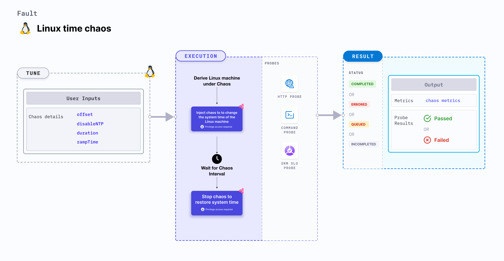

import Ossupport from './shared/note-supported-os.md'
import FaultPermissions from './shared/fault-permissions.md'

Linux time chaos injects chaos to change the time of the Linux machine.



## Use cases
- Induces time chaos to change the system time on the target Linux machines.
- Determines the resiliency of the underlying application components when subjected to a change in the system time.

<Ossupport />

<FaultPermissions />

## Fault tunables
<h3>Optional tunables</h3>
<table>
  <tr>
    <th> Tunable </th>
    <th> Description </th>
    <th> Notes </th>
  </tr>
  <tr>
    <td> offset </td>
    <td> Time offset to increment or decrement the system time. Should be provided in <code>(+/-)[numeric-hours]h[numeric-minutes]m[numeric-seconds]s</code> format.</td>
    <td> For example: <code>+24h</code>, <code>-13h12m</code>, <code>-3h12m16s</code> </td>
  </tr>
  <tr>
    <td> disableNTP </td>
    <td> Set it to disable the NTP server. </td>
    <td> Defaults to <code>true</code> </td>
  </tr>
  <tr>
    <td> duration </td>
    <td> Duration through which chaos is injected into the target resource (in seconds). </td>
    <td> Default: 30s </td>
  </tr>
  <tr>
    <td> rampTime </td>
    <td> Period to wait before and after injecting chaos (in seconds). </td>
    <td> Default: 0s </td>
  </tr>
</table>

### Offset

The `offset` input variable increments and decrements the system time using time offset. It is specified in (+/-)[numeric-hours]h[numeric-minutes]m[numeric-seconds]s format. 

The following YAML snippet illustrates the use of this environment variable:

[embedmd]:# (./static/manifests/linux-time-chaos/offset.yaml yaml)
```yaml
# time offset
apiVersion: litmuchaos.io/v1alpha1
kind: LinuxFault
metadata:
  name: linux-time-chaos
  labels:
    name: time-chaos
spec:
  timeChaos/inputs:
    offset: '+1h30m'
```

### DisableNTP

The `disableNTP` input variable prevents the fault from disabling the NTP server.

The following YAML snippet illustrates the use of this environment variable:

[embedmd]:# (./static/manifests/linux-time-chaos/disable-ntp.yaml yaml)
```yaml
# disable the ntp server
apiVersion: litmuchaos.io/v1alpha1
kind: LinuxFault
metadata:
  name: linux-time-chaos
  labels:
    name: time-chaos
spec:
  timeChaos/inputs:
    disableNTP: 'true'
```
