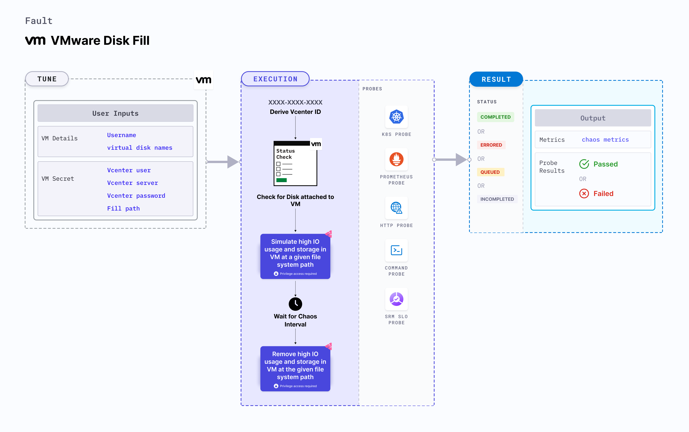

VMware disk fill fault contains chaos to inject disk fill in a VM at a given filesystem path. It fills up the path up to a given amount to simulate high IO usage and storage space unavailability.



## Use cases

- VMware disk fill determines the resilience of an application to unexpected spikes in resources.
- It determines how well an application handles unexpected exhaustion of storage space.
- It simulates slower disk operations due to high IO usage for the underlying applications.
- It verifies the disk performance on increasing IO threads and varying IO block sizes.

:::note

- Kubernetes > 1.16 is required to execute this fault.
- Execution plane should be connected to vCenter and host vCenter on port 443.
- VMware tool should be installed on the target VM with remote execution enabled.
- The VM should be in a healthy state before and after injecting chaos.
- Appropriate vCenter permissions should be provided to access the hosts and the VMs.
- Kubernetes secret has to be created that has the Vcenter credentials in the `CHAOS_NAMESPACE`. VM credentials can be passed as secrets or as a `ChaosEngine` environment variable. Below is a sample secret file:

```yaml
apiVersion: v1
kind: Secret
metadata:
  name: vcenter-secret
  namespace: litmus
type: Opaque
stringData:
  VCENTERSERVER: XXXXXXXXXXX
  VCENTERUSER: XXXXXXXXXXXXX
  VCENTERPASS: XXXXXXXXXXXXX
```

:::

## Fault tunables

  <h3>Mandatory fields</h3>
    <table>
      <tr>
        <th> Variables </th>
        <th> Description </th>
        <th> Notes </th>
      </tr>
      <tr>
        <td> VM_NAME </td>
        <td> Name of the target VM(s).</td>
        <td> Multiple names can be provided as comma-separated values (when there are multiple VMs subject to chaos). It also helps run the govc command. </td>
      </tr>
      <tr>
        <td> VM_USER_NAME </td>
        <td> Username of the target VM(s).</td>
        <td> Multiple usernames can be provided as comma-separated values (when there are multiple VMs subject to chaos). It also helps run the govc command. </td>
      </tr>
      <tr>
        <td> VM_PASSWORD </td>
        <td> Password for the target VM(s).</td>
        <td> It helps run the govc command. </td>
      </tr>
    </table>
    <h3>Optional fields</h3>
    <table>
      <tr>
        <th> Variables </th>
        <th> Description </th>
        <th> Notes </th>
      </tr>
      <tr>
        <td> FILL_PATH </td>
        <td> The path to be subjected for disk fill chaos. It should be a valid directory. </td>
        <td> Defaults to <code>/</code>. </td>
      </tr>
      <tr>
        <td> TOTAL_CHAOS_DURATION </td>
        <td> Duration that you specify, through which chaos is injected into the target resource (in seconds).</td>
        <td> Defaults to 30s. For more information, go to <a href="https://developer.harness.io/docs/chaos-engineering/chaos-faults/common-tunables-for-all-faults#duration-of-the-chaos"> duration of the chaos. </a></td>
      </tr>
      <tr>
        <td> CHAOS_INTERVAL </td>
        <td> Time interval between two successive instance terminations (in seconds). </td>
        <td> Defaults to 30s. For more information, go to <a href="https://developer.harness.io/docs/chaos-engineering/chaos-faults/common-tunables-for-all-faults#chaos-interval"> chaos interval. </a></td>
      </tr>
      <tr>
        <td> SEQUENCE </td>
        <td> Sequence of chaos execution for multiple instances. </td>
        <td> Defaults to parallel. Supports serial sequence as well. For more information, go to <a href="https://developer.harness.io/docs/chaos-engineering/chaos-faults/common-tunables-for-all-faults#sequence-of-chaos-execution"> sequence of chaos execution.</a></td>
      </tr>
      <tr>
        <td> RAMP_TIME </td>
        <td> Period to wait before and after injecting chaos (in seconds).</td>
        <td> For example, 30s. For more information, go to <a href="https://developer.harness.io/docs/chaos-engineering/chaos-faults/common-tunables-for-all-faults#ramp-time"> ramp time.</a></td>
      </tr>
      <tr>
        <td> FILL_PERCENTAGE </td>
        <td> The percentage value of the total available storage at the <code>FILL_PATH</code> which should be filled. </td>
        <td>Defaults to 50. It is mutually exclusive to <code>FILL_STORAGE_MEBIBYTES</code> </td>
      </tr>
      <tr>
        <td> FILL_STORAGE_MEBIBYTES </td>
        <td> The storage amount to be filled at the <code>FILL_PATH</code> in mebibytes. </td>
        <td>It is mutually exclusive to <code>FILL_PERCENTAGE</code>. If both the values are provided, then <code>FILL_STORAGE_MEBIBYTES</code> is used. </td>
      </tr>
      <tr>
        <td> DATA_BLOCK_SIZE </td>
        <td> The size of a single block to be used for filling the disk in KB. </td>
        <td> Defaults to 256. </td>
      </tr>
    </table>
    <h3>Secret fields</h3>
     <table>
      <tr>
        <th> Variables </th>
        <th> Description </th>
        <th> Notes </th>
      </tr>
      <tr>
        <td> GOVC_URL </td>
        <td> vCenter server URL used to perform API calls using the govc command.</td>
        <td> It is derived from a secret. </td>
      </tr>
      <tr>
        <td> GOVC_USERNAME </td>
        <td> Username of the vCenter server used for authentication purposes. </td>
        <td> It can be set up using a secret. </td>
      </tr>
      <tr>
        <td> GOVC_PASSWORD </td>
        <td> Password of the vCenter server used for authentication purposes. </td>
        <td> It can be set up using a secret. </td>
      </tr>
      <tr>
        <td> GOVC_INSECURE </td>
        <td> Runs the govc command in insecure mode. It is set to <code>true</code>. </td>
        <td> It can be set up using a secret. </td>
      </tr>
     </table>

### Disk fill at a path

It specifies the path at which disk fill will be performed. Tune it by using the `FILL_PATH` environment variable.

Use the following example to tune it:

[embedmd]: # "./static/manifests/vmware-disk-fill/vmware-fill-path.yaml yaml"

```yaml
# induces disk fill at fill path
apiVersion: litmuschaos.io/v1alpha1
kind: ChaosEngine
metadata:
  name: vmware-engine
spec:
  engineState: "active"
  chaosServiceAccount: litmus-admin
  experiments:
    - name: vmware-disk-fill
      spec:
        components:
          env:
            - name: VM_NAME
              value: "vm-1,vm-2"
            - name: VM_USER_NAME
              value: "ubuntu,debian"
            - name: VM_PASSWORD
              value: "123,123"
            - name: FILL_PATH
              value: "/home/user"
```

### Disk fill as a percentage of available storage

It specifies the percentage of available storage to be filled. Tune it by using the `FILL_PERCENTAGE` environment variable.

Use the following example to tune it:

[embedmd]: # "./static/manifests/vmware-disk-fill/vmware-fill-percentage.yaml yaml"

```yaml
# disk fill as a percentage of total available storage
apiVersion: litmuschaos.io/v1alpha1
kind: ChaosEngine
metadata:
  name: vmware-engine
spec:
  engineState: "active"
  chaosServiceAccount: litmus-admin
  experiments:
    - name: vmware-disk-fill
      spec:
        components:
          env:
            - name: VM_NAME
              value: "vm-1,vm-2"
            - name: VM_USER_NAME
              value: "ubuntu,debian"
            - name: VM_PASSWORD
              value: "123,123"
            - name: FILL_PERCENTAGE
              value: "30"
```

### Disk fill in mebibytes

Specifies the storage to be filled in mebibytes. Tune it by using the `FILL_STORAGE_MEBIBYTES` environment variable.

Use the following example to tune it:

[embedmd]: # "./static/manifests/vmware-disk-fill/vmware-fill-mebibytes.yaml yaml"

```yaml
# induces disk fill in mebibytes
apiVersion: litmuschaos.io/v1alpha1
kind: ChaosEngine
metadata:
  name: engine-nginx
spec:
  engineState: "active"
  chaosServiceAccount: litmus-admin
  experiments:
    - name: vmware-disk-fill
      spec:
        components:
          env:
            - name: VM_NAME
              value: "vm-1,vm-2"
            - name: VM_USER_NAME
              value: "ubuntu,debian"
            - name: VM_PASSWORD
              value: "123,123"
            - name: FILL_STORAGE_MEBIBYTES
              value: "2048"
```

### Specify data block size

It specifies the block size to be used for filling the disk. A smaller block size would take longer time to fill the requisite amount of storage and vice versa. Tune it by using the `DATA_BLOCK_SIZE` environment variable.

Use the following example to tune it:

[embedmd]: # "./static/manifests/vmware-disk-fill/vmware-data-block-size.yaml yaml"

```yaml
# configures the block size to be used for disk fill
apiVersion: litmuschaos.io/v1alpha1
kind: ChaosEngine
metadata:
  name: engine-nginx
spec:
  engineState: "active"
  chaosServiceAccount: litmus-admin
  experiments:
    - name: vmware-disk-fill
      spec:
        components:
          env:
            - name: VM_NAME
              value: "vm-1,vm-2"
            - name: VM_USER_NAME
              value: "ubuntu,debian"
            - name: VM_PASSWORD
              value: "123,123"
            - name: DATA_BLOCK_SIZE
              value: "1024"
```
