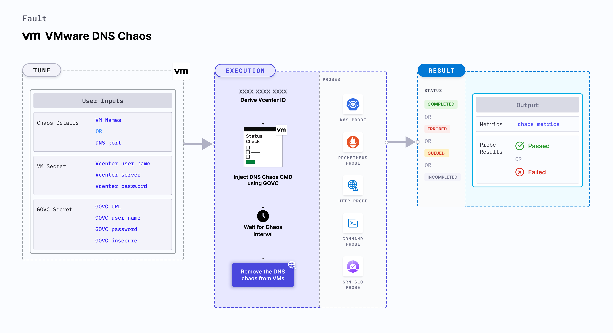

VMware DNS chaos causes DNS errors in the VMware VMs which results in the DNS server being unavailable or malfunctioning for a specific duration. It checks the performance of the application (or process) running on the VMware VMs.




## Use cases

- VMware DNS chaos causes DNS errors on the target VMs which results in unavailability (or distorted) network connectivity from the VM to the target hosts. 
- It provides a hypothesis wherein certain services of an application could be unreachable from the VM. 
- It determines how DNS errors impact the infrastructure and standalone tasks in the application.
- It simulates unavailability of DNS server, that is, loss of access to any external domain from a given microservice.
- It simulates malfunctioning of DNS server, that is, loss of access to specific domains from a given microservice, loss of access to cloud provider dependencies, and loss of access to specific third party services.


:::note
- Kubernetes > 1.16 is required to execute this fault.
- Execution plane should be connected to vCenter and host vCenter on port 443. 
- VMware tool should be installed on the target VM with remote execution enabled.
- The VM should be in a healthy state before and after injecting chaos.
- Appropriate vCenter permissions should be provided to access the hosts and the VMs.
- Kubernetes secret has to be created that has the Vcenter credentials in the `CHAOS_NAMESPACE`. VM credentials can be passed as secrets or as a `ChaosEngine` environment variable. Below is a sample secret file:

```yaml
apiVersion: v1
kind: Secret
metadata:
  name: vcenter-secret
  namespace: litmus
type: Opaque
stringData:
    VCENTERSERVER: XXXXXXXXXXX
    VCENTERUSER: XXXXXXXXXXXXX
    VCENTERPASS: XXXXXXXXXXXXX
``` 
:::

## Fault tunables

  <h3>Mandatory fields</h3>
    <table>
      <tr>
        <th> Variables </th>
        <th> Description </th>
        <th> Notes </th>
      </tr>
      <tr>
        <td> VM_USER_NAME </td>
        <td> Username of the target VM(s).</td>
        <td> Multiple usernames can be provided as comma-separated values (when there are multiple VMs subject to chaos). It also helps run the govc command. </td>
      </tr>
      <tr>
        <td> VM_PASSWORD </td>
        <td> Password for the target VM(s).</td>
        <td> It helps run the govc command. </td>
      </tr>
      <tr>
        <td> PORT </td>
        <td> DNS Port</td>
        <td> Defaults to 54. For more information, go to <a href="https://developer.harness.io/docs/chaos-engineering/chaos-faults/vmware/VMware-DNS-chaos#run-dns-chaos-with-port"> DNS chaos with port.</a> </td>
      </tr>
    </table>
    <h3>Optional fields</h3>
    <table>
      <tr>
        <th> Variables </th>
        <th> Description </th>
        <th> Notes </th>
      </tr>
      <tr>
        <td> TOTAL_CHAOS_DURATION </td>
        <td> Duration that you specify, through which chaos is injected into the target resource (in seconds).</td>
        <td> Defaults to 30s. For more information, go to <a href="https://developer.harness.io/docs/chaos-engineering/chaos-faults/common-tunables-for-all-faults#duration-of-the-chaos"> duration of the chaos. </a></td>
      </tr>
      <tr>
        <td> CHAOS_INTERVAL </td>
        <td> Time interval between two successive instance terminations (in seconds). </td>
        <td> Defaults to 30s. For more information, go to <a href="https://developer.harness.io/docs/chaos-engineering/chaos-faults/common-tunables-for-all-faults#chaos-interval"> chaos interval. </a></td>
      </tr>
      <tr>
        <td> SEQUENCE </td>
        <td> Sequence of chaos execution for multiple instances. </td>
        <td> Defaults to parallel. Supports serial sequence as well. For more information, go to <a href="https://developer.harness.io/docs/chaos-engineering/chaos-faults/common-tunables-for-all-faults#sequence-of-chaos-execution"> sequence of chaos execution.</a></td>
      </tr>
      <tr>
        <td> RAMP_TIME </td>
        <td> Period to wait before and after injecting chaos (in seconds).</td>
        <td> For example, 30s. For more information, go to <a href="https://developer.harness.io/docs/chaos-engineering/chaos-faults/common-tunables-for-all-faults#ramp-time"> ramp time.</a></td>
      </tr>
      <tr>
        <td> TARGET_HOSTNAMES </td>
        <td> List of the target host names. If it is not provided, all host names (or domains) are targeted. </td>
        <td> For example, '["litmuschaos","chaosnative.com"]'. For more information, go to <a href="https://developer.harness.io/docs/chaos-engineering/chaos-faults/vmware/VMware-DNS-chaos#run-dns-chaos-with-target-host-names"> target host names. </a></td>
      </tr>
      <tr>
        <td> MATCH_SCHEME </td>
        <td> Determines whether the DNS query should exactly match the targets or can be a substring. </td>
        <td> Defaults to exact. For more information, go to <a href="https://developer.harness.io/docs/chaos-engineering/chaos-faults/vmware/VMware-DNS-chaos#run-dns-chaos-with-match-scheme"> DNS chaos with match scheme. </a></td>
      </tr>
      <tr>
        <td> UPSTREAM_SERVER </td>
        <td> Custom upstream server to which the intercepted DNS requests will be forwarded. </td>
        <td> Defaults to the server mentioned in <code>resolv.conf</code> file. For more information, go to <a href="https://developer.harness.io/docs/chaos-engineering/chaos-faults/vmware/VMware-DNS-chaos#run-dns-chaos-with-upstream-server"> DNS chaos with upstream server. </a></td>
      </tr>
    </table>
    <h3>Secret fields</h3>
     <table>
      <tr>
        <th> Variables </th>
        <th> Description </th>
        <th> Notes </th>
      </tr>
      <tr>
        <td> GOVC_URL </td>
        <td> vCenter server URL used to perform API calls using the govc command.</td>
        <td> It is derived from a secret. </td>
      </tr>
      <tr>
        <td> GOVC_USERNAME </td>
        <td> Username of the vCenter server used for authentication purposes. </td>
        <td> It can be set up using a secret. </td>
      </tr>
      <tr>
        <td> GOVC_PASSWORD </td>
        <td> Password of the vCenter server used for authentication purposes. </td>
        <td> It can be set up using a secret. </td>
      </tr>
      <tr>
        <td> GOVC_INSECURE </td>
        <td> Runs the govc command in insecure mode. It is set to <code>true</code>. </td>
        <td> It can be set up using a secret. </td>
      </tr>
     </table>


### Run DNS chaos with port

It specifies the DNS port where DNS chaos is injected. Tune it by using the `PORT` environment variable.

Use the following example to tune it:

[embedmd]:# (./static/manifests/vmware-dns-chaos/vmware-dns-port.yaml yaml)
```yaml
# induces DNS chaos on the VMware VM
apiVersion: litmuschaos.io/v1alpha1
kind: ChaosEngine
metadata:
  name: VMware-engine
spec:
  engineState: "active"
  chaosServiceAccount: litmus-admin
  experiments:
  - name: VMware-DNS-chaos
    spec:
      components:
        env:
        - name: PORT
          value: '54'
        - name: VM_NAME
          value: 'vm-1,vm-2'
        - name: VM_USER_NAME
          value: 'ubuntu,debian'
        - name: VM_PASSWORD
          value: '123,123'
```

### Run DNS chaos with target host names

It specifies the list of the target host names into which DNS chaos is injected. Tune it by using the `TARGET_HOSTNAMES` environment variable.

Use the following example to tune it:

[embedmd]:# (./static/manifests/vmware-dns-chaos/vmware-dns-target-hostnames.yaml yaml)
```yaml
# induces DNS chaos on the VMware VMs
apiVersion: litmuschaos.io/v1alpha1
kind: ChaosEngine
metadata:
  name: engine-nginx
spec:
  engineState: "active"
  chaosServiceAccount: litmus-admin
  experiments:
  - name: VMware-DNS-chaos
    spec:
      components:
        env:
        # list of target host names
        - name: TARGET_HOSTNAMES
          value: '["litmuschaos","chaosnative.com"]'
        - name: VM_NAME
          value: 'vm-1,vm-2'
        - name: VM_USER_NAME
          value: 'ubuntu,debian'
        - name: VM_PASSWORD
          value: '123,123'
```


### Run DNS chaos with match scheme

It specifies whether the DNS query should exactly match the targets or can be a substring. Tune it by using the `MATCH_SCHEME` environment variable.

Use the following example to tune it:

[embedmd]:# (./static/manifests/vmware-dns-chaos/vmware-dns-match-scheme.yaml yaml)
```yaml
# induces DNS chaos on the VMware VMs
apiVersion: litmuschaos.io/v1alpha1
kind: ChaosEngine
metadata:
  name: engine-nginx
spec:
  engineState: "active"
  chaosServiceAccount: litmus-admin
  experiments:
  - name: VMware-DNS-chaos
    spec:
      components:
        env:
        # match scheme type
        - name: MATCH_SCHEME
          value: 'exact'
        - name: VM_NAME
          value: 'vm-1,vm-2'
        - name: VM_USER_NAME
          value: 'ubuntu,debian'
        - name: VM_PASSWORD
          value: '123,123'
```


### Run DNS chaos with upstream server

It specifies the custom upstream server to which the intercepted DNS requests are forwarded. It defaults to the server mentioned in the `resolv.conf` file. Tune it by using the `UPSTREAM_SERVER` environment variable.

Use the following example to tune it:

[embedmd]:# (./static/manifests/vmware-dns-chaos/vmware-dns-upstream-server.yaml yaml)
```yaml
# induces DNS chaos on the VMware VMs
apiVersion: litmuschaos.io/v1alpha1
kind: ChaosEngine
metadata:
  name: engine-nginx
spec:
  engineState: "active"
  chaosServiceAccount: litmus-admin
  experiments:
  - name: VMware-DNS-chaos
    spec:
      components:
        env:
        # name of the upstream server
        - name: UPSTREAM_SERVER
          value: '8.8.8.8'
        - name: VM_NAME
          value: 'vm-1,vm-2'
        - name: VM_USER_NAME
          value: 'ubuntu,debian'
        - name: VM_PASSWORD
          value: '123,123'
```