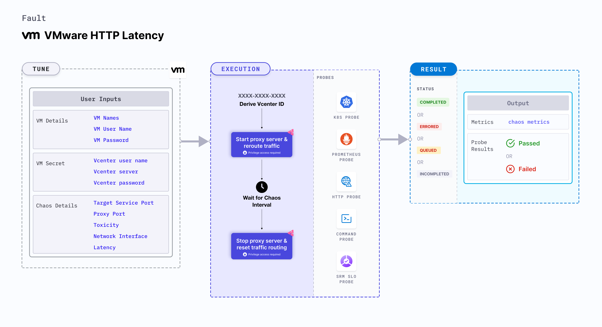

VMware HTTP latency injects HTTP response latency into the service of a specific port.
- This is achieved by starting the proxy server and redirecting the traffic through the proxy server.
- It helps determine the application's resilience to lossy (or flaky) HTTP responses.



## Use cases

- VMware HTTP latency determines the resilience of an application to HTTP latency. 
- It determines how the system recovers or fetches the responses when there is a delay in accessing the service. - It simulates latency to specific API services for (or from) a given microservice. 
- It also simulates a slow response on specific third party (or dependent) components (or services). 

:::note
- Kubernetes >= 1.17 is required to execute this fault.
- Appropriate vCenter permissions should be provided to start and stop the VMs.
- The VM should be in a healthy state before and after injecting chaos.
- Kubernetes secret has to be created that has the Vcenter credentials in the `CHAOS_NAMESPACE`. VM credentials can be passed as secrets or as a `ChaosEngine` environment variable. Below is a sample secret file:

```yaml
apiVersion: v1
kind: Secret
metadata:
    name: vcenter-secret
    namespace: litmus
type: Opaque
stringData:
    VCENTERSERVER: XXXXXXXXXXX
    VCENTERUSER: XXXXXXXXXXXXX
    VCENTERPASS: XXXXXXXXXXXXX
```
:::

## Fault tunables

   <h3>Mandatory fields</h3>
    <table>
        <tr>
            <th> Variables </th>
            <th> Description </th>
            <th> Notes </th>
        </tr>
        <tr>
            <td> VM_NAME </td>
            <td> Name of the VMware VM.</td>
            <td> For example, test-vm. </td>
        </tr>
        <tr>
            <td> VM_USER_NAME </td>
            <td> Username with sudo privileges.</td>
            <td> For example, vm-user. </td>
        </tr>
        <tr>
            <td> VM_PASSWORD </td>
            <td> User password. </td>
            <td> For example, 1234. </td>
        </tr>
        <tr>
            <td> LATENCY </td>
            <td> Delay added to the request (in milliseconds).</td>
            <td> For example, 1000ms. For more information, go to <a href="https://developer.harness.io/docs/chaos-engineering/chaos-faults/vmware/VMware-http-latency#latency"> latency.</a></td>
        </tr>
        <tr>
            <td> TARGET_SERVICE_PORT </td>
            <td> Service port to target. </td>
            <td> Defaults to port 80. For more information, go to <a href="https://developer.harness.io/docs/chaos-engineering/chaos-faults/vmware/VMware-http-latency#target-service-port"> target service port.</a></td>
        </tr>
    </table>
    <h3>Optional fields</h3>
    <table>
        <tr>
            <th> Variables </th>
            <th> Description </th>
            <th> Notes </th>
        </tr>
        <tr>
            <td> TOTAL_CHAOS_DURATION </td>
            <td> Duration that you specify, through which chaos is injected into the target resource (in seconds). </td>
            <td> Defaults to 30s. For more information, go to <a href="https://developer.harness.io/docs/chaos-engineering/chaos-faults/common-tunables-for-all-faults#duration-of-the-chaos"> duration of the chaos. </a></td>
        </tr>
        <tr>
            <td> CHAOS_INTERVAL </td>
            <td> Time interval between two successive instance terminations (in seconds). </td>
            <td> Defaults to 30s. For more information, go to <a href="https://developer.harness.io/docs/chaos-engineering/chaos-faults/common-tunables-for-all-faults#chaos-interval"> chaos interval.</a></td>
        </tr>
        <tr>
            <td> SEQUENCE </td>
            <td> Sequence of chaos execution for multiple instances. </td>
        <td> Defaults to parallel. Supports serial sequence as well. For more information, go to <a href="https://developer.harness.io/docs/chaos-engineering/chaos-faults/common-tunables-for-all-faults#sequence-of-chaos-execution"> sequence of chaos execution.</a></td>
        </tr>
        <tr>
        <td> RAMP_TIME </td>
        <td> Period to wait before and after injecting chaos (in seconds). </td>
        <td> For example, 30s. For more information, go to <a href="https://developer.harness.io/docs/chaos-engineering/chaos-faults/common-tunables-for-all-faults#ramp-time"> ramp time. </a></td>
        </tr>
        <tr>
            <td> INSTALL_DEPENDENCY </td>
            <td> Whether to install the dependency to run the fault </td>
            <td> If the dependency already exists, you can turn it off. Its default value is 'True'. </td>
        </tr>
        <tr>
            <td> PROXY_PORT </td>
            <td> Port where the proxy listens for requests.</td>
            <td> Defaults to 20000. For more information, go to <a href="https://developer.harness.io/docs/chaos-engineering/chaos-faults/vmware/VMware-http-latency#proxy-port"> proxy port.</a></td>
        </tr>
        <tr>
            <td> TOXICITY </td>
            <td> Percentage of HTTP requests affected. </td>
            <td> Defaults to 100. For more information, go to <a href="https://developer.harness.io/docs/chaos-engineering/chaos-faults/vmware/VMware-http-latency#toxicity"> toxicity.</a></td>
        </tr>
        <tr>
          <td> NETWORK_INTERFACE </td>
          <td> Network interface used for the proxy. </td>
          <td> Defaults to eth0. For more information, go to <a href="https://developer.harness.io/docs/chaos-engineering/chaos-faults/vmware/VMware-http-latency#network-interface"> network interface. </a></td>
        </tr>
    </table>


### Target service port

It specifies the port of the target service. Tune it by using the `TARGET_SERVICE_PORT` environment variable.

Use the following example to tune it:

[embedmd]:# (./static/manifests/http-latency/target-service-port.yaml yaml)
```yaml
## provide the port of the targeted service
apiVersion: litmuschaos.io/v1alpha1
kind: ChaosEngine
metadata:
  name: engine-nginx
spec:
  engineState: "active"
  chaosServiceAccount: litmus-admin
  experiments:
  - name: VMware-http-latency
    spec:
      components:
        env:
        # provide the port of the targeted service
        - name: TARGET_SERVICE_PORT
          value: "80"
```

### Proxy Port

It specifies the port where the proxy server listens for requests. Tune it by using the `PROXY_PORT` environment variable.

Use the following example to tune it:

[embedmd]:# (./static/manifests/http-latency/proxy-port.yaml yaml)
```yaml
# provide the port for proxy server
apiVersion: litmuschaos.io/v1alpha1
kind: ChaosEngine
metadata:
  name: engine-nginx
spec:
  engineState: "active"
  chaosServiceAccount: litmus-admin
  experiments:
  - name: VMware-http-latency
    spec:
      components:
        env:
        # provide the port for proxy server
        - name: PROXY_PORT
          value: '8080'
        # provide the port of the targeted service
        - name: TARGET_SERVICE_PORT
          value: "80"
```

### Latency

It specifies the latency value added to the HTTP request. Tune it by using the `LATENCY` environment variable.

Use the following example to tune it:

[embedmd]:# (./static/manifests/http-latency/latency.yaml yaml)
```yaml
## provide the latency value
apiVersion: litmuschaos.io/v1alpha1
kind: ChaosEngine
metadata:
  name: engine-nginx
spec:
  engineState: "active"
  chaosServiceAccount: litmus-admin
  experiments:
  - name: VMware-http-latency
    spec:
      components:
        env:
        # provide the latency value
        - name: LATENCY
          value: '2000'
        # provide the port of the targeted service
        - name: TARGET_SERVICE_PORT
          value: "80"
```

### Toxicity

It specifies the toxicity value added to the HTTP request. Toxicity value defines the percentage of the total number of HTTP requests that are affected. Tune it by using the `TOXICITY` environment variable.

Use the following example to tune it:

[embedmd]:# (./static/manifests/http-latency/toxicity.yaml yaml)
```yaml
## provide the toxicity
apiVersion: litmuschaos.io/v1alpha1
kind: ChaosEngine
metadata:
  name: engine-nginx
spec:
  engineState: "active"
  chaosServiceAccount: litmus-admin
  experiments:
  - name: VMware-http-latency
    spec:
      components:
        env:
        # toxicity is the probability of the request to be affected
        # provide the percentage value in the range of 0-100
        # 0 means no request will be affected and 100 means all request will be affected
        - name: TOXICITY
          value: "100"
        # provide the port of the targeted service
        - name: TARGET_SERVICE_PORT
          value: "80"
```

### Network interface

It specifies the network interface to be used for the proxy. Tune it by using the `NETWORK_INTERFACE` environment variable.

Use the following example to tune it:

[embedmd]:# (./static/manifests/http-latency/network-interface.yaml yaml)
```yaml
## provide the network interface for proxy
apiVersion: litmuschaos.io/v1alpha1
kind: ChaosEngine
metadata:
  name: engine-nginx
spec:
  engineState: "active"
  chaosServiceAccount: litmus-admin
  experiments:
  - name: VMware-http-latency
    spec:
      components:
        env:
        # provide the network interface for proxy
        - name: NETWORK_INTERFACE
          value: "eth0"
        # provide the port of the targeted service
        - name: TARGET_SERVICE_PORT
          value: '80'
```
