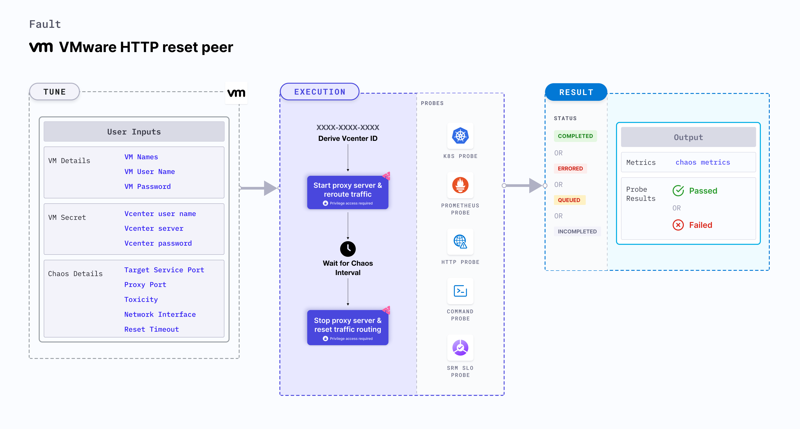

VMware HTTP reset peer injects HTTP reset chaos that stops the outgoing HTTP requests by resetting the TCP connection for the requests.
- The service whose port is affected is specified using the `TARGET_SERVICE_PORT` environment variable. 
- It tests the application's resilience to lossy (or flaky) HTTP connections.




## Use cases

- VMware HTTP reset peer determines the resilience of an application to unexpected halts in the outgoing HTTP requests. 
- It determines how quickly and efficiently an application recovers from these unexpected halts. 
- It simulates premature connection loss, such as firewall issues, between microservices by verifying connection timeouts.
- It simulates connection resets due to resource limitations on the server side, such as running out of memory, killing processes, or overloading the server due to high amounts of traffic.

:::note
- Kubernetes >= 1.17 is required to execute this fault.
- Appropriate vCenter permissions should be provided to start and stop the VMs.
- The VM should be in a healthy state before and after injecting chaos.
- Kubernetes secret has to be created that has the Vcenter credentials in the `CHAOS_NAMESPACE`. VM credentials can be passed as secrets or as a `ChaosEngine` environment variable. Below is a sample secret file:

```yaml
apiVersion: v1
kind: Secret
metadata:
    name: vcenter-secret
    namespace: litmus
type: Opaque
stringData:
    VCENTERSERVER: XXXXXXXXXXX
    VCENTERUSER: XXXXXXXXXXXXX
    VCENTERPASS: XXXXXXXXXXXXX
```
:::

## Fault tunables

   <h3>Mandatory fields</h3>
    <table>
        <tr>
            <th> Variables </th>
            <th> Description </th>
            <th> Notes </th>
        </tr>
        <tr>
            <td> VM_NAME </td>
            <td> Name of the VMware VM. </td>
            <td> For example, <code>test-vm</code>. </td>
        </tr>
       <tr>
            <td> VM_USER_NAME </td>
            <td> Username with sudo privileges.</td>
            <td> For example, <code>vm-user</code>. </td>
        </tr>
        <tr>
            <td> VM_PASSWORD </td>
            <td> User password. </td>
            <td> For example, <code>1234</code>. </td>
        </tr>
        <tr>
            <td> RESET_TIMEOUT  </td>
            <td> It specifies the duration after which the connect is reset. </td>
            <td> Defaults to 0. For more information, go to <a href="https://developer.harness.io/docs/chaos-engineering/chaos-faults/vmware/VMware-http-reset-peer#reset-timeout"> reset timeout.</a></td>
        </tr>
        <tr>
            <td> TARGET_SERVICE_PORT </td>
            <td> Service port to target </td>
            <td> Defaults to port 80. For more information, go to <a href="https://developer.harness.io/docs/chaos-engineering/chaos-faults/vmware/VMware-http-reset-peer#target-service-port"> target service port.</a></td>
        </tr>
    </table>
    <h3>Optional fields</h3>
    <table>
        <tr>
            <th> Variables </th>
            <th> Description </th>
            <th> Notes </th>
        </tr>
        <tr>
            <td> TOTAL_CHAOS_DURATION </td>
            <td> Duration that you specify, through which chaos is injected into the target resource (in seconds). </td>
            <td> Defaults to 30s. For more information, go to <a href="https://developer.harness.io/docs/chaos-engineering/chaos-faults/common-tunables-for-all-faults#duration-of-the-chaos"> duration of the chaos. </a></td>
        </tr>
        <tr>
            <td> CHAOS_INTERVAL </td>
            <td> Time interval between two successive instance terminations (in seconds). </td>
            <td> Defaults to 30s. For more information, go to <a href="https://developer.harness.io/docs/chaos-engineering/chaos-faults/common-tunables-for-all-faults#chaos-interval"> chaos interval. </a></td>
        </tr>
        <tr>
            <td> SEQUENCE </td>
            <td> Sequence of chaos execution for multiple instances. </td>
        <td> Defaults to parallel. Supports serial sequence as well. For more information, go to <a href="https://developer.harness.io/docs/chaos-engineering/chaos-faults/common-tunables-for-all-faults#sequence-of-chaos-execution"> sequence of chaos execution.</a></td>
        </tr>
        <tr>
            <td> RAMP_TIME </td>
        <td> Period to wait before and after injecting chaos (in seconds). </td>
            <td> For example, 30s. For more information, go to <a href="https://developer.harness.io/docs/chaos-engineering/chaos-faults/common-tunables-for-all-faults#ramp-time"> ramp time.</a></td>
        </tr>
        <tr>
            <td> INSTALL_DEPENDENCY </td>
            <td> Specify whether you wish to install the dependency to run the experiment. </td>
            <td> Defaults to true. If the dependency already exists, you can turn it off. </td>
        </tr>
        <tr>
            <td> PROXY_PORT  </td>
            <td> Port where the proxy listens for requests.</td>
            <td> Defaults to 20000. For more information, go to <a href="https://developer.harness.io/docs/chaos-engineering/chaos-faults/vmware/VMware-http-reset-peer#proxy-port"> proxy port.</a></td>
        </tr>
        <tr>
            <td> TOXICITY </td>
            <td> Percentage of HTTP requests that are affected. </td>
            <td> Defaults to 100. For more information, go to <a href="https://developer.harness.io/docs/chaos-engineering/chaos-faults/vmware/VMware-http-reset-peer#toxicity"> toxicity.</a></td>
        </tr>
        <tr>
          <td> NETWORK_INTERFACE  </td>
          <td> Network interface used for the proxy. </td>
          <td> Defaults to eth0. For more information, go to <a href="https://developer.harness.io/docs/chaos-engineering/chaos-faults/vmware/VMware-http-reset-peer#network-interface"> network interface.</a></td>
        </tr>
    </table>


### Target service port

It specifies the port of the target service. Tune it by using the `TARGET_SERVICE_PORT` environment variable.

Use the following example to tune it:

[embedmd]:# (./static/manifests/http-reset-peer/target-service-port.yaml yaml)
```yaml
## provide the port of the targeted service
apiVersion: litmuschaos.io/v1alpha1
kind: ChaosEngine
metadata:
  name: engine-nginx
spec:
  engineState: "active"
  chaosServiceAccount: litmus-admin
  experiments:
  - name: VMware-http-reset-peer
    spec:
      components:
        env:
        # provide the port of the targeted service
        - name: TARGET_SERVICE_PORT
          value: "80"
```

### Proxy port

It specifies the port where proxy server listens for requests. Tune it by using the `PROXY_PORT` environment variable.

Use the following example to tune it:

[embedmd]:# (./static/manifests/http-reset-peer/proxy-port.yaml yaml)
```yaml
# provide the port for proxy server
apiVersion: litmuschaos.io/v1alpha1
kind: ChaosEngine
metadata:
  name: engine-nginx
spec:
  engineState: "active"
  chaosServiceAccount: litmus-admin
  experiments:
  - name: VMware-http-reset-peer
    spec:
      components:
        env:
        # provide the port for proxy server
        - name: PROXY_PORT
          value: '8080'
        # provide the port of the targeted service
        - name: TARGET_SERVICE_PORT
          value: "80"
```

### Reset timeout

It specifies the reset timeout value that is added to the HTTP request. Tune it by using the `RESET_TIMEOUT` environment variable.

Use the following example to tune it:

[embedmd]:# (./static/manifests/http-reset-peer/reset-timeout.yaml yaml)
```yaml
## provide the reset timeout value
apiVersion: litmuschaos.io/v1alpha1
kind: ChaosEngine
metadata:
  name: engine-nginx
spec:
  engineState: "active"
  chaosServiceAccount: litmus-admin
  experiments:
  - name: VMware-http-reset-peer
    spec:
      components:
        env:
        # reset timeout specifies after how much duration to reset the connection
        - name: RESET_TIMEOUT #in ms
          value: '2000'
        # provide the port of the targeted service
        - name: TARGET_SERVICE_PORT
          value: "80"
```

### Toxicity

It specifies the toxicity value, that is, the percentage of the total number of HTTP requests that are affected. Tune it by using the `TOXICITY` environment variable.

Use the following example to tune it:

[embedmd]:# (./static/manifests/http-reset-peer/toxicity.yaml yaml)
```yaml
## provide the toxicity
apiVersion: litmuschaos.io/v1alpha1
kind: ChaosEngine
metadata:
  name: engine-nginx
spec:
  engineState: "active"
  chaosServiceAccount: litmus-admin
  experiments:
  - name: VMware-http-reset-peer
    spec:
      components:
        env:
        # toxicity is the probability of the request to be affected
        # provide the percentage value in the range of 0-100
        # 0 means no request will be affected and 100 means all request will be affected
        - name: TOXICITY
          value: "100"
        # provide the port of the targeted service
        - name: TARGET_SERVICE_PORT
          value: "80"
```

### Network interface

It specifies the network interface that is used for the proxy. Tune it by using the `NETWORK_INTERFACE` environment variable.

Use the following example to tune it:

[embedmd]:# (./static/manifests/http-reset-peer/network-interface.yaml yaml)
```yaml
## provide the network interface for proxy
apiVersion: litmuschaos.io/v1alpha1
kind: ChaosEngine
metadata:
  name: engine-nginx
spec:
  engineState: "active"
  chaosServiceAccount: litmus-admin
  experiments:
  - name: VMware-http-reset-peer
    spec:
      components:
        env:
        # provide the network interface for proxy
        - name: NETWORK_INTERFACE
          value: "eth0"
        # provide the port of the targeted service
        - name: TARGET_SERVICE_PORT
          value: '80'
```
