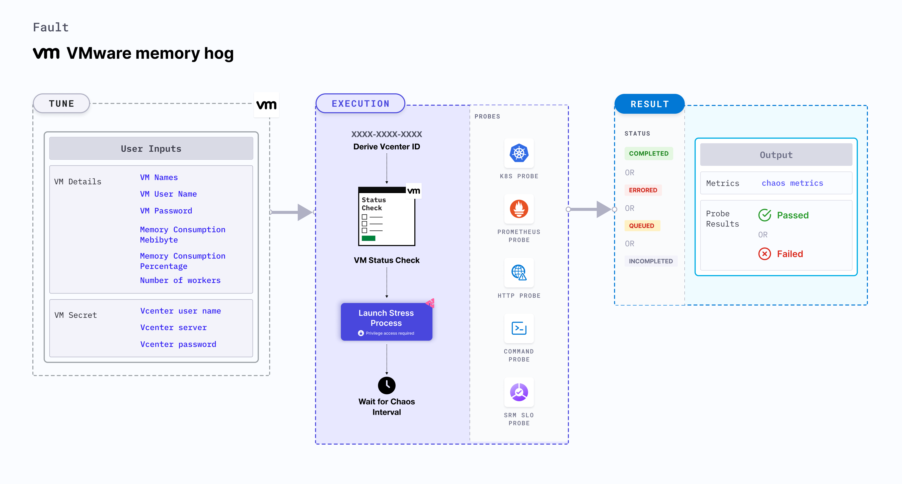

VMware memory hog fault consumes excessive memory resources on Linux OS based VMware VMs. It determines the performance of the application running on the VMware VMs.



## Use cases

- VMware memory hog determines the resilience of an application to unexpected consumption of excessive memory by application resources.
- It simulates the situation of memory leaks in the deployment of microservices.
- It simulates application slowness due to memory starvation.
- It also simulates noisy neighbour problems due to hogging. 
- It verifies pod priority and QoS setting for eviction purposes. 
- It also verifies application restarts on OOM (out of memory) kills. 

:::note
- Kubernetes > 1.16 is required to execute this fault.
- Execution plane should be connected to vCenter and host vCenter on port 443.
- The VM should be in a healthy state before and after injecting chaos.
- VMware tool should be installed on the target VM with remote execution enabled.
- Appropriate vCenter permissions should be provided to access the hosts and the VMs.
- Kubernetes secret has to be created that has the Vcenter credentials in the `CHAOS_NAMESPACE`. VM credentials can be passed as secrets or as a `ChaosEngine` environment variable. Below is a sample secret file:

```yaml
apiVersion: v1
kind: Secret
metadata:
  name: vcenter-secret
  namespace: litmus
type: Opaque
stringData:
    VCENTERSERVER: XXXXXXXXXXX
    VCENTERUSER: XXXXXXXXXXXXX
    VCENTERPASS: XXXXXXXXXXXXX
```
:::

## Fault tunables

  <h3>Mandatory fields</h3>
    <table>
      <tr>
        <th> Variables </th>
        <th> Description </th>
        <th> Notes </th>
      </tr>
      <tr>
        <td> VM_NAME </td>
        <td> Name of the target VM. </td>
        <td> For example, <code>ubuntu-vm-1</code>. </td>
      </tr>
    </table>
    <h3>Optional fields</h3>
    <table>
      <tr>
        <th> Variables </th>
        <th> Description </th>
        <th> Notes </th>
      </tr>
     <tr>
        <td> MEMORY_CONSUMPTION_MEBIBYTES </td>
        <td> Amount of memory consumed by VMware VMs (in MiB). </td>
        <td> For example, <code>4024</code>. For more information, go to <a href="https://developer.harness.io/docs/chaos-engineering/chaos-faults/vmware/VMware-memory-hog#memory-consumption-in-mebibytes"> memory consumption in mebibytes. </a></td>
      </tr>
      <tr>
        <td> MEMORY_CONSUMPTION_PERCENTAGE </td>
        <td> Amount of total memory to be consumed (in percentage). </td>
        <td> Default to 100. For more information, go to <a href="https://developer.harness.io/docs/chaos-engineering/chaos-faults/vmware/VMware-memory-hog#memory-consumption-in-percentage"> memory consumption in percentage. </a></td>
      </tr>
      <tr>
        <td> NUMBER_OF_WORKERS </td>
        <td> Number of workers used to run the stress process. </td>
        <td> Defaults to 4. For more information, go to <a href="https://developer.harness.io/docs/chaos-engineering/chaos-faults/vmware/VMware-memory-hog#workers-for-stress"> workers for stress. </a></td>
      </tr>
      <tr>
        <td> TOTAL_CHAOS_DURATION </td>
        <td> Duration that you specify, through which chaos is injected into the target resource (in seconds). </td>
        <td> Defaults to 30s. For more information, go to <a href="https://developer.harness.io/docs/chaos-engineering/chaos-faults/common-tunables-for-all-faults#duration-of-the-chaos"> duration of the chaos. </a></td>
      </tr>
      <tr>
        <td> CHAOS_INTERVAL </td>
        <td> Time interval between two successive instance terminations (in seconds). </td>
        <td> Defaults to 30s. For more information, go to <a href="https://developer.harness.io/docs/chaos-engineering/chaos-faults/common-tunables-for-all-faults#chaos-interval"> chaos interval. </a></td>
      </tr>
      <tr>
        <td> SEQUENCE </td>
        <td> Sequence of chaos execution for multiple instances. </td>
        <td> Defaults to parallel. Supports serial sequence as well. For more information, go to <a href="https://developer.harness.io/docs/chaos-engineering/chaos-faults/common-tunables-for-all-faults#sequence-of-chaos-execution"> sequence of chaos execution.</a></td>
      </tr>
      <tr>
        <td> RAMP_TIME </td>
        <td> Period to wait before and after injecting chaos (in seconds). </td>
        <td> For example, 30s. For more information, go to <a href="https://developer.harness.io/docs/chaos-engineering/chaos-faults/common-tunables-for-all-faults#ramp-time"> ramp time. </a></td>
      </tr>
    </table>

### Memory consumption in percentage
It specifies the memory consumed by the target VM (in percentage). Tune it by using the `MEMORY_CONSUMPTION_PERCENTAGE` environment variable.

Use the following example to tune it:

[embedmd]:# (./static/manifests/vmware-memory-hog/vm-memory-hog-memconsumptionperc.yaml yaml)
```yaml
# Memory hog in the VMware VM
apiVersion: litmuschaos.io/v1alpha1
kind: ChaosEngine
metadata:
  name: engine-nginx
spec:
  engineState: "active"
  chaosServiceAccount: litmus-admin
  experiments:
    - name: VMware-memory-hog
      spec:
        components:
          env:
            # Name of the VM
            - name: VM_NAME
              value: 'test-vm-01'
            # memory consumption value
            - name: MEMORY_CONSUMPTION_PERCENTAGE
              value: '50'
```

### Memory consumption in mebibytes
It specifies the memory consumed by the target VM in mebibytes (MiB). Tune it by using the `MEMORY_CONSUMPTION_MEBIBYTES` environment variable.

Use the following example to tune it:

[embedmd]:# (./static/manifests/vmware-memory-hog/vm-memory-hog-memoryconsumption.yaml yaml)
```yaml
# Memory hog in the VMware VM
apiVersion: litmuschaos.io/v1alpha1
kind: ChaosEngine
metadata:
  name: engine-nginx
spec:
  engineState: "active"
  chaosServiceAccount: litmus-admin
  experiments:
    - name: VMware-memory-hog
      spec:
        components:
          env:
            # Name of the VM
            - name: VM_NAME
              value: 'test-vm-01'
            # memory consumption value
            - name: MEMORY_CONSUMPTION_MEBIBYTES
              value: '500'
```

### Workers for stress
It specifies the worker's count for stress. Tune it by using the `NUMBER_OF_WORKERS` environment variable.

Use the following example to tune it:

[embedmd]:# (./static/manifests/vmware-memory-hog/vm-memory-hog-worker.yaml yaml)
```yaml
# Memory hog in the VMware VM
apiVersion: litmuschaos.io/v1alpha1
kind: ChaosEngine
metadata:
  name: engine-nginx
spec:
  engineState: "active"
  chaosServiceAccount: litmus-admin
  experiments:
    - name: VMware-memory-hog
      spec:
        components:
          env:
            # Name of the VM
            - name: VM_NAME
              value: 'test-vm-01'
            # Number of workers for stress
            - name: NUMBER_OF_WORKERS
              value: '4'
```
