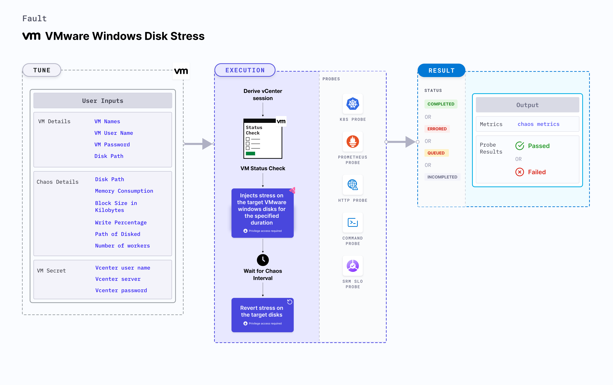

VMware Windows Disk Stress applies stress on the disk resources on Windows OS based VMware VM.
- It checks the performance of the application running on the VMware Windows VMs under disk stress conditions.



## Use cases

- VMware Windows Disk Stress determines the resilience of an application when stress is applied on the disk resources of a VMware Windows virtual machine.
- VMware Windows Disk Stress simulates the situation of high disk usage for processes running on the application, which degrades their performance. 
- It also helps verify the application's ability to handle disk failures and its failover mechanisms. 

:::note
- Kubernetes > 1.16 is required to execute this fault.
- Execution plane should be connected to vCenter and host vCenter on port 443. 
- VMware tool should be installed on the target VM with remote execution enabled.
- Adequate vCenter permissions should be provided to access the hosts and the VMs.
- The VM should be in a healthy state before and after injecting chaos.
- Kubernetes secret has to be created that has the Vcenter credentials in the `CHAOS_NAMESPACE`. 
- VM credentials can be passed as secrets or as a chaos enginer environment variable.

```yaml
apiVersion: v1
kind: Secret
metadata:
  name: vcenter-secret
  namespace: litmus
type: Opaque
stringData:
    VCENTERSERVER: XXXXXXXXXXX
    VCENTERUSER: XXXXXXXXXXXXX
    VCENTERPASS: XXXXXXXXXXXXX
```

:::

## Fault tunables

   <h3>Mandatory fields</h3>
    <table>
      <tr>
        <th> Variables </th>
        <th> Description </th>
        <th> Notes </th>
      </tr>
      <tr>
        <td> VM_NAME </td>
        <td> Name of the target VM. </td>
        <td> For example, <code>win-vm-1</code> </td>
      </tr>
    </table>
    <h3>Optional fields</h3>
    <table>
      <tr>
        <th> Variables </th>
        <th> Description </th>
        <th> Notes </th>
      </tr>
      <tr>
        <td> MEMORY_CONSUMPTION </td>
        <td> Amount of Memory to consume in MB. </td>
        <td> Default: 1024. </td>
      </tr>
      <tr>
        <td> BLOCK_SIZE_IN_KILOBYTES </td>
        <td> Block size for disk write in KB. </td>
        <td> Default: 128. </td>
      </tr>
      <tr>
        <td> WRITE_PERCENTAGE </td>
        <td> Percentage of total disk write. </td>
        <td> Default: 100. </td>
      </tr>
      <tr>
        <td> NUMBER_OF_WORKERS </td>
        <td> Number of workers involved in disk write. </td>
        <td> Default: 2. </td>
      </tr>
      <tr>
        <td> DISK_PATH </td>
        <td> Path of disk to apply stress. </td>
        <td> For example, <code>C:\\</code> </td>
      </tr>
      <tr>
        <td> PATH_OF_DISKSPD </td>
        <td> Path of the Diskspd binary in the VM. </td>
        <td> For example, <code>C:\\Program Files\\Diskspd\\</code> </td>
      </tr>
      <tr>
        <td> TOTAL_CHAOS_DURATION </td>
        <td> Duration that you specify, through which chaos is injected into the target resource (in seconds).</td>
        <td> Default: 60s. </td>
      </tr>
      <tr>
        <td> RAMP_TIME </td>
        <td> Period to wait before and after injecting chaos (in seconds). </td>
        <td> Default: 0s. </td>
      </tr>
      <tr>
        <td> SEQUENCE </td>
        <td> Sequence of chaos execution for multiple instances. </td>
        <td> Default: parallel. Supports serial sequence as well. </td>
      </tr>
    </table>

### Memory Consumption

The `MEMORY_CONSUMPTION` environment variable applies stress on the target Windows VM for a specific duration.

Use the following example to specify Memory consumption:

[embedmd]:# (./static/manifests/vmware-windows-disk-stress/vm-disk-stress-memory-consumption.yaml yaml)

```yaml
apiVersion: litmuschaos.io/v1alpha1
kind: ChaosEngine
metadata:
  name: engine-nginx
spec:
  engineState: "active"
  chaosServiceAccount: litmus-admin
  experiments:
  - name: vmware-windows-disk-stress
    spec:
      components:
        env:
        # Name of the VM
        - name: VM_NAME
          value: 'test-vm-01'
       # Memory consumption in MB
        - name: MEMORY_CONSUMPTION 
          value: '1024'
```

### Block Size

The `BLOCK_SIZE_IN_KILOBYTES` environment variable specifies the block size for disk write in KB.

Use the following example to specify block size:

[embedmd]:# (./static/manifests/vmware-windows-disk-stress/vm-disk-stress-block-size.yaml yaml)

```yaml
apiVersion: litmuschaos.io/v1alpha1
kind: ChaosEngine
metadata:
  name: engine-nginx
spec:
  engineState: "active"
  chaosServiceAccount: litmus-admin
  experiments:
  - name: vmware-windows-disk-stress
    spec:
      components:
        env:
        # Name of the VM
        - name: VM_NAME
          value: 'test-vm-01'
       # Block size for disk write in KB
        - name: BLOCK_SIZE_IN_KILOBYTES 
          value: '128'
```

### Write Percentage

The `WRITE_PERCENTAGE` environment variable specifies the percentage of total disk write.

Use the following example to specify write percentage:

[embedmd]:# (./static/manifests/vmware-windows-disk-stress/vm-disk-stress-write-percentage.yaml yaml)

```yaml
apiVersion: litmuschaos.io/v1alpha1
kind: ChaosEngine
metadata:
  name: engine-nginx
spec:
  engineState: "active"
  chaosServiceAccount: litmus-admin
  experiments:
  - name: vmware-windows-disk-stress
    spec:
      components:
        env:
        # Name of the VM
        - name: VM_NAME
          value: 'test-vm-01'
       # Percentage of total disk write
        - name: WRITE_PERCENTAGE 
          value: '100'
```

### Number of Workers

The `NUMBER_OF_WORKERS` environment variable specifies the number of workers involved in disk write.

Use the following example to specify the number of workers:

[embedmd]:# (./static/manifests/vmware-windows-disk-stress/vm-disk-stress-number-of-workers.yaml yaml)
```yaml
apiVersion: litmuschaos.io/v1alpha1
kind: ChaosEngine
metadata:
  name: engine-nginx
spec:
  engineState: "active"
  chaosServiceAccount: litmus-admin
  experiments:
  - name: vmware-windows-disk-stress
    spec:
      components:
        env:
        # Name of the VM
        - name: VM_NAME
          value: 'test-vm-01'
       # Number of workers involved in disk write
        - name: NUMBER_OF_WORKERS 
          value: '2'
```

### Disk Path

The `DISK_PATH` environment variable specifies the path of disk to apply stress.

Use the following example to specify the disk path:

[embedmd]:# (./static/manifests/vmware-windows-disk-stress/vm-disk-stress-disk-path.yaml yaml)
```yaml
apiVersion: litmuschaos.io/v1alpha1
kind: ChaosEngine
metadata:
  name: engine-nginx
spec:
  engineState: "active"
  chaosServiceAccount: litmus-admin
  experiments:
  - name: vmware-windows-disk-stress
    spec:
      components:
        env:
        # Name of the VM
        - name: VM_NAME
          value: 'test-vm-01'
       # Path of disk to apply stress
        - name: DISK_PATH 
          value: 'C:\\'
```

### Path of Diskspd

The `PATH_OF_DISKSPD` environment variable specifies the path of the Diskspd tool in the VM.

Use the following example to specify the path of Diskspd:

[embedmd]:# (./static/manifests/vmware-windows-disk-stress/vm-disk-stress-path-of-diskspd.yaml yaml)
```yaml
apiVersion: litmuschaos.io/v1alpha1
kind: ChaosEngine
metadata:
  name: engine-nginx
spec:
  engineState: "active"
  chaosServiceAccount: litmus-admin
  experiments:
  - name: vmware-windows-disk-stress
    spec:
      components:
        env:
        # Name of the VM
        - name: VM_NAME
          value: 'test-vm-01'
       # Path of the Diskspd tool in the VM
        - name: PATH_OF_DISKSPD 
          value: 'C:\\Program Files\\Diskspd\\'
```
