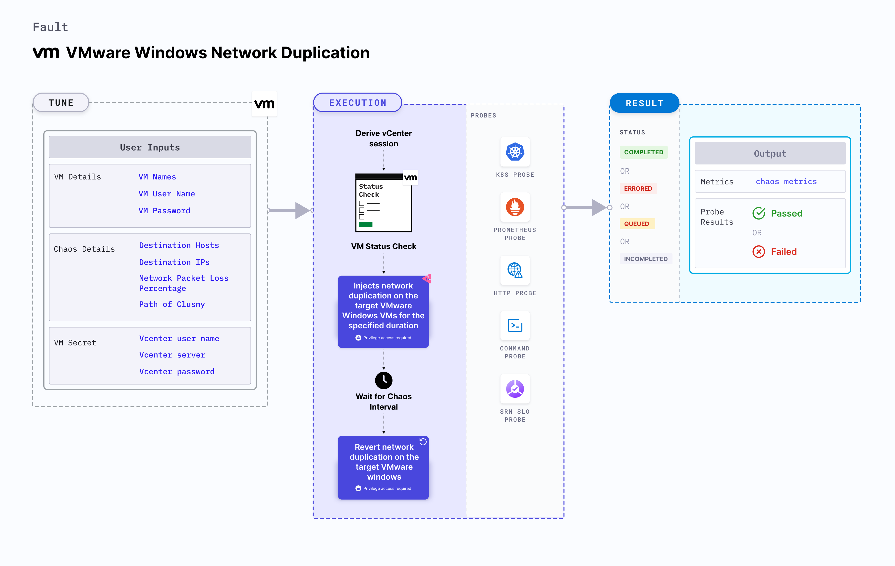

VMware Windows Network Duplication simulates a network duplication scenario on Windows OS based VMware VM.
- It checks the performance of the application running on the VMware Windows VMs under network duplication conditions.



## Use cases

- VMware Windows Network Duplication determines the resilience of an application when a network duplication scenario is simulated on a VMware Windows virtual machine.
- VMware Windows Network Duplication simulates the situation of network duplication on the application, which degrades their performance. 
- It also helps verify the application's ability to handle network failures and its failover mechanisms. 

:::note
- Kubernetes > 1.16 is required to execute this fault.
- Execution plane should be connected to vCenter and host vCenter on port 443. 
- VMware tool should be installed on the target VM with remote execution enabled.
- Adequate vCenter permissions should be provided to access the hosts and the VMs.
- The VM should be in a healthy state before and after injecting chaos.
- Kubernetes secret has to be created that has the Vcenter credentials in the `CHAOS_NAMESPACE`. 
- VM credentials can be passed as secrets or as a chaos enginer environment variable.
```yaml
apiVersion: v1
kind: Secret
metadata:
  name: vcenter-secret
  namespace: litmus
type: Opaque
stringData:
    VCENTERSERVER: XXXXXXXXXXX
    VCENTERUSER: XXXXXXXXXXXXX
    VCENTERPASS: XXXXXXXXXXXXX
```
:::

## Fault tunables

   <h3>Mandatory fields</h3>
    <table>
      <tr>
        <th> Variables </th>
        <th> Description </th>
        <th> Notes </th>
      </tr>
      <tr>
        <td> VM_NAME </td>
        <td> Name of the target VM. </td>
        <td> For example, <code>win-vm-1</code> </td>
      </tr>
    </table>
    <h3>Optional fields</h3>
    <table>
      <tr>
        <th> Variables </th>
        <th> Description </th>
        <th> Notes </th>
      </tr>
      <tr>
        <td> DESTINATION_HOSTS </td>
        <td> Comma separated list of destination hosts to duplicate. </td>
        <td> For example, <code>github.com,harness.io</code> </td>
      </tr>
      <tr>
        <td> DESTINATION_IPS </td>
        <td> Comma separated list of destination IPs to duplicate. </td>
        <td> For example, <code>10.0.0.1,10.0.0.2</code> </td>
      </tr>
      <tr>
        <td> NETWORK_PACKET_DUPLICATION_PERCENTAGE </td>
        <td> Percentage of network packets to duplicate. </td>
        <td> Default: 100. </td>
      </tr>
      <tr>
        <td> PATH_OF_CLUMSY </td>
        <td> Path of the Clumsy tool in the VM. </td>
        <td> For example, <code>C:\\Program Files\\Clumsy\\</code> </td>
      </tr>
      <tr>
        <td> TOTAL_CHAOS_DURATION </td>
        <td> Duration that you specify, through which chaos is injected into the target resource (in seconds).</td>
        <td> Default: 60s. </td>
      </tr>
      <tr>
        <td> RAMP_TIME </td>
        <td> Period to wait before and after injecting chaos (in seconds). </td>
        <td> Default: 0s. </td>
      </tr>
      <tr>
        <td> SEQUENCE </td>
        <td> Sequence of chaos execution for multiple instances. </td>
        <td> Default: parallel. Supports serial sequence as well. </td>
      </tr>
    </table>

### Destination Hosts

The `DESTINATION_HOSTS` environment variable specifies the destination hosts to duplicate on the target Windows VM.

Use the following example to specify destination hosts:

[embedmd]:# (./static/manifests/vmware-windows-network-duplication/vm-network-duplication-destination-hosts.yaml yaml)
```yaml
apiVersion: litmuschaos.io/v1alpha1
kind: ChaosEngine
metadata:
  name: engine-nginx
spec:
  engineState: "active"
  chaosServiceAccount: litmus-admin
  experiments:
  - name: vmware-windows-network-duplication
    spec:
      components:
        env:
        # Name of the VM
        - name: VM_NAME
          value: 'test-vm-01'
       # Destination hosts to duplicate
        - name: DESTINATION_HOSTS 
          value: 'github.com'
```

### Destination IPs

The `DESTINATION_IPS` environment variable specifies the destination IPs to duplicate on the target Windows VM.

Use the following example to specify destination IPs:

[embedmd]:# (./static/manifests/vmware-windows-network-duplication/vm-network-duplication-destination-ips.yaml yaml)
```yaml
apiVersion: litmuschaos.io/v1alpha1
kind: ChaosEngine
metadata:
  name: engine-nginx
spec:
  engineState: "active"
  chaosServiceAccount: litmus-admin
  experiments:
  - name: vmware-windows-network-duplication
    spec:
      components:
        env:
        # Name of the VM
        - name: VM_NAME
          value: 'test-vm-01'
       # Destination IPs to duplicate
        - name: DESTINATION_IPS 
          value: '10.0.0.1,10.0.0.2'
```

### Network Packet Duplication Percentage

The `NETWORK_PACKET_DUPLICATION_PERCENTAGE` environment variable specifies the percentage of network packets to duplicate.

Use the following example to specify network packet duplication percentage:

[embedmd]:# (./static/manifests/vmware-windows-network-duplication/vm-network-duplication-percentage.yaml yaml)
```yaml
apiVersion: litmuschaos.io/v1alpha1
kind: ChaosEngine
metadata:
  name: engine-nginx
spec:
  engineState: "active"
  chaosServiceAccount: litmus-admin
  experiments:
  - name: vmware-windows-network-duplication
    spec:
      components:
        env:
        # Name of the VM
        - name: VM_NAME
          value: 'test-vm-01'
       # Percentage of network packets to duplicate
        - name: NETWORK_PACKET_DUPLICATION_PERCENTAGE 
          value: '100'
```

### Path of Clumsy
The `PATH_OF_CLUMSY` environment variable specifies the path of the Clumsy tool in the VM.

Use the following example to specify the path of Clumsy:

[embedmd]:# (./static/manifests/vmware-windows-network-duplication/vm-network-duplication-path-of-clumsy.yaml yaml)
```yaml
apiVersion: litmuschaos.io/v1alpha1
kind: ChaosEngine
metadata:
  name: engine-nginx
spec:
  engineState: "active"
  chaosServiceAccount: litmus-admin
  experiments:
  - name: vmware-windows-network-duplication
    spec:
      components:
        env:
        # Name of the VM
        - name: VM_NAME
          value: 'test-vm-01'
       # Path of the Clumsy tool in the VM
        - name: PATH_OF_CLUMSY 
          value: 'C:\\Program Files\\Clumsy\\'
```